# Atelier : écrire avec Stylo

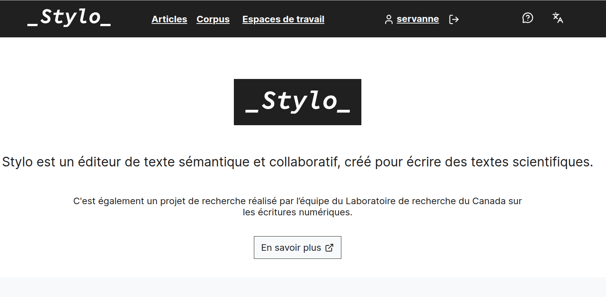

§§§§§§§§§§§§§§§§§§§§§§§§§§§§§§§§§§§§§§§§§§§§§

## Stylo 

### un projet de développement d'outil... 

### ...et un projet de recherche

===

Les outils HN = outils produits par la communauté, pour la communauté, afin de répondre à un enjeu technique (éditer, publier), mais également à une question de recherche : comment s'émanciper des logiciels WYSIWYM ?

§§§§§§§§§§§§§§§§§§§§§§§§§§§§§§§§§§§§§§§§§§§§§

### Aux origines du projet : si on mettait à jour le site web de notre revue ? 

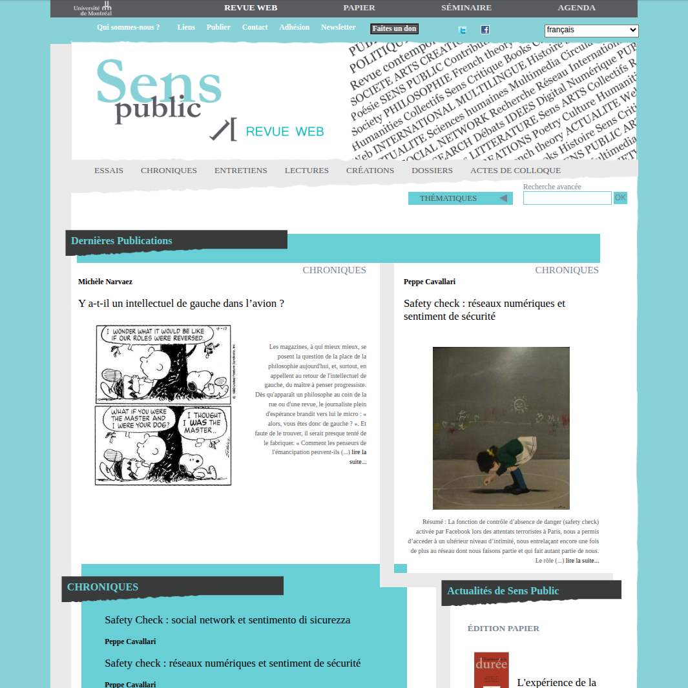<!-- .element: style="width:400px" -->

===

2014 : Revue _Sens Public_

Revue native numérique, pour publier des articles scientifiques, des chroniques, etc. Media de scientifiques. 

Idéal de la _République des Lettres_ : les premières revues ont été créées à partir des lettres que s'échangaients les savants pour discuter entre eux de leurs travaux, de leur pensée, etc. 

CAD = dimension proprement conversationnelle de l'édition scientifique, dimension de collaboration, que l'on va aujourd'hui retrouver dans les colloques. 

Sens Public

§§§§§§§§§§§§§§§§§§§§§§§§§§§§§§§§§§§§§§§§§§§§§

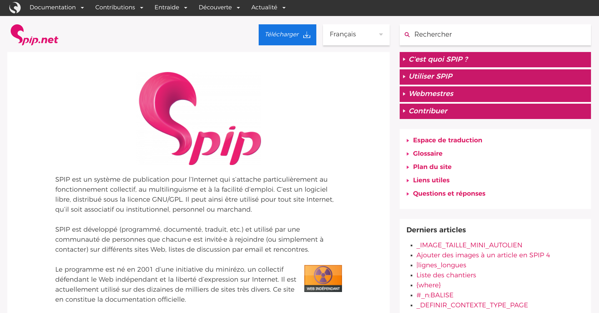<!-- .element: style="width:50%;float:left;margin-right:-1em;" -->

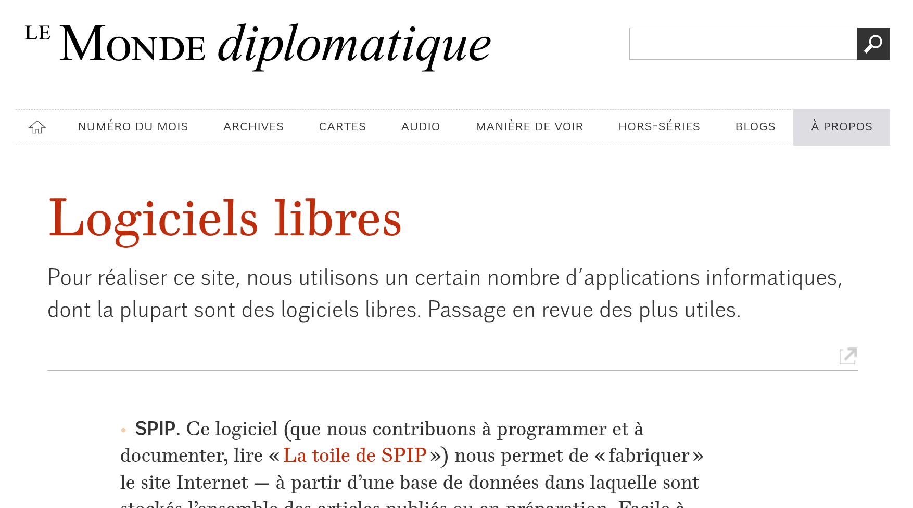<!-- .element: style="width:50%;float:right;margin-right:-1em;" -->

===

Sens public, revue nativement numérique (2011, très tôt !), avait été fondée sur un CMS SPIP. CMS de journalistes, créé pour Le monde DIplo qui l'utilise encore. Avantage : Logiciel OpenSource, cela veut dire que l'on a pas à payer pour l'utiliser. 

Problème de mise à jour: notre version était trop obsolète, on devait la mettre à jour, au risque d'avoir des problèmes d'affichage ou de compatibilité avec les nouveaux appareils. 

Comme à chaque fois que l'on met à jour un site, on en profite pour revoir certains éléments : la charte graphique, le protocole éditorial, etc. 

§§§§§§§§§§§§§§§§§§§§§§§§§§§§§§§§§§§§§§§§§§§§§

La chaîne éditoriale sur _Sens public_ (Spip)

* Une feuille de style LibreOffice pour les auteurs (peu respectée)

ODT => HTML via un téléversement

* Une intégration dans SPIP et des corrections manuelles directement dans le HTML de la plateforme

§§§§§§§§§§§§§§§§§§§§§§§§§§§§§§§§§§§§§§§§§§§§§

L'archivage sur le diffuseur Erudit => XML

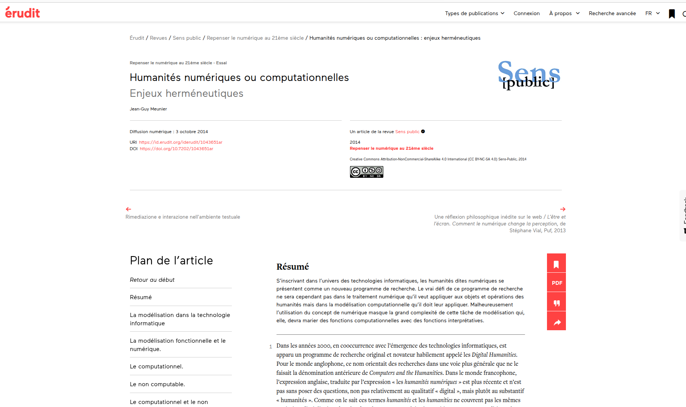

===

Une contrainte supplémentaire : on devait envoyer nos fichiers à Erudit, à des fins d'archivage. 

Erudit gère du XML, ce qui est le standard de l'archivage. Problème : pour générer les XML, Erudit avait une moulinette qui repartait d'un autre format, propriétaire = DOCX... Non seulement nous n'avions pas ce format, mais surtout, le format de sortie final était pour nous du HTML, souvent revu à la main. 

Rapidement, on s'est rendus compte que ce qui posait problème, ce n'était pas tant notre SPIP, que notre chaîne éditoriale reposant sur des outils trop contraignants. 

§§§§§§§§§§§§§§§§§§§§§§§§§§§§§§§§§§§§§§§§§§§§§

### La plateformisation des écritures

Plateformisation : Uniformisation des productions s'intégrant dans un format de publication préconstruit et partagé par une communauté d'utilisateurs, avec les dérives potentielles en termes de censure, de formatage, d'appauvrissement des contenus etc.

<!-- .element: style="width:40%;float:right; text-align: left; font-size: 0.6em; margin-right:-1em;" -->

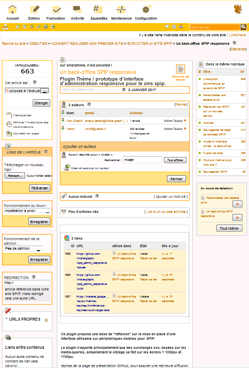<!-- .element: style="width:40%;float:left;margin-right:-1em;" -->

===

Le problème de base, c'était sans doute notre plateforme. 

Le CMS a permis une meilleure accessibilité et une forme de désintermédiation (publier sur le web, c'était s'affranchir des éditeurs papier), cependant, il a provoqué une écriture à contrainte.

L'écriture, la publication, l'évaluation, l'information... tous ces contenus passent aujourd'hui essentiellement par des plateformes, qui sont des logiciels construits par des sociétés (rarement par des communautés indépendantes), à des fins commerciales (même si ce n'est pas en publication ou en lecture que l'on paye, mais pas nos connexion, la récolte des données, la publicité, etc.)

Mounier et Dacos parlent plus haut de facteurs de réintermédiation via :
– le design des plateformes informatiques ;   
– la définition des règles d'écriture et de lecture ;   
– la gestion des communautés qui les utilisent ;   
– les algorithmes de classement de l'information produite.   

Tous ces éléments participent de ce que l'on appelle la plateformisation, à savoir
- uniformisation des productions pour entrer dans un modèle de publication préconstruit et partagé par une communauté d'utilisateurs

§§§§§§§§§§§§§§§§§§§§§§§§§§§§§§§§§§§§§§§§§§§§§

### ...Et de l'édition scientifique
* OpenEdition : Lodel
* PKP : OJS (OpenJournalSystem)
* \+ des CMS généralistes bricolés (Wordpress, Drupal, etc.)

§§§§§§§§§§§§§§§§§§§§§§§§§§§§§§§§§§§§§§§§§§§§§

### Des outils d'écritures sous influence

Word, InDesign... Des logiciels WYSIWYG qui invisibilisent la technique.<!-- .element: style="width:40%;float:right; text-align: left; font-size: 0.6em; margin-right:-1em;" -->

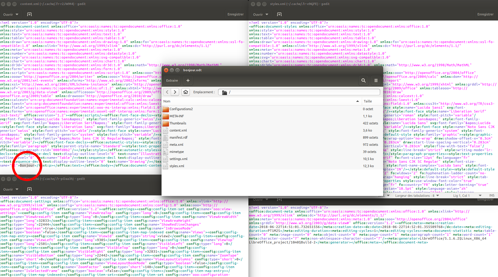<!-- .element: style="width:60%;float:left;margin-right:-1em;" -->

§§§§§§§§§§§§§§§§§§§§§§§§§§§§§§§§§§§§§§§§§§§§§

===

Word dézippé

Cependant, ça ce n'est pas de l'édition numérique : cette architecture est alourdie **parce que** on utilise un éditeur de texte WYSIWYG. L'interface graphique ajoute toute cette couche extrêment lourde de code, cette complexité architecturale. Pas de logique informatique ici. 

§§§§§§§§§§§§§§§§§§§§§§§§§§§§§§§§§§§§§§§§§§§§§

### Revoir la chaîne éditoriale
Comment reprendre la main sur nos écritures ? 
Comment rétablir la conversation scientifique ?
Comment s'émanciper de la contrainte des plateformes ? 

### Et penser autrement
Comment des outils d'écritures moins contraints peuvent-il nous aider à penser autrement ? 

§§§§§§§§§§§§§§§§§§§§§§§§§§§§§§§§§§§§§§§§§§§§§

### Hypothèse : la pensée est inscrite

- La matérialité de l'écriture n'est pas triviale
- Un format = un modèle épistémologique
- La trivialité n'est pas triviale

===

§§§§§§§§§§§§§§§§§§§§§§§§§§§§§§§§§§§§§§§§§§§§§

Et nous avons abandonné notre CMS Spip

§§§§§§§§§§§§§§§§§§§§§§§§§§§§§§§§§§§§§§§§§§§§§

**L'aventure Stylo**

Une équipe pluridisciplinaire de contributeurs (développeurs, éditeurs, designers) qui développe, teste, améliore depuis 10 ans l'outil dans le cadre des travaux de la Chaire de recherche du Canada sur les Écritures numériques dirigée par Marcello Vitali-Rosati.<!-- .element: style="width:60%;float:right; text-align: left; font-size: 0.6em; margin-right:-1em;" -->

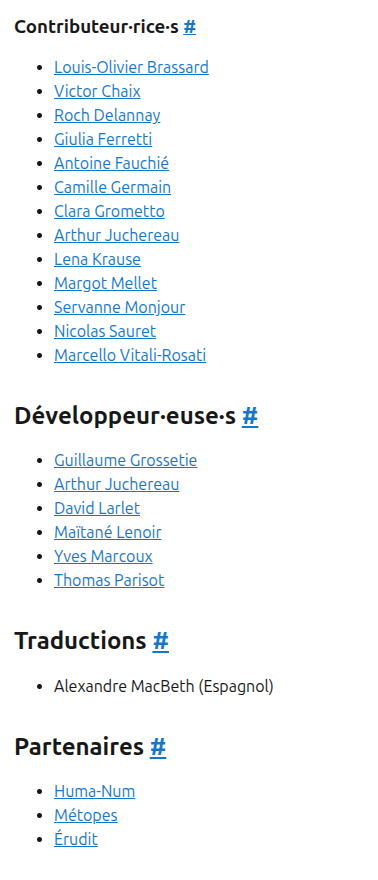<!-- .element: style="width:30%;float:left;margin-right:-1em;" -->

§§§§§§§§§§§§§§§§§§§§§§§§§§§§§§§§§§§§§§§§§§§§§

### De la cuisine d'Arthur à Huma-Num

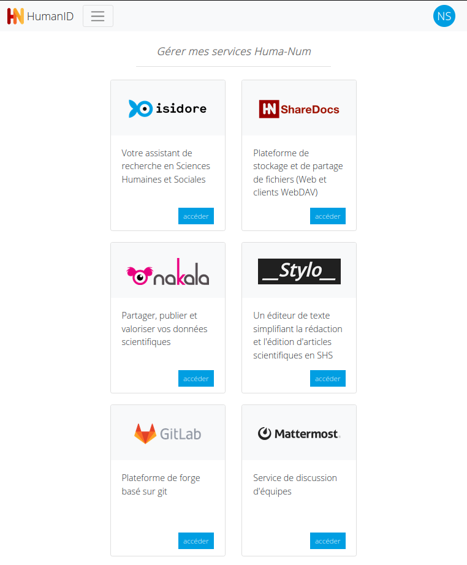<!-- .element: style="width:400px" -->

§§§§§§§§§§§§§§§§§§§§§§§§§§§§§§§§§§§§§§§§§§§§§

## Stylosophie

>Stylo encourage le développement d’une littératie critique et une approche réflexive de la textualité numérique, par une interaction active avec des langages et technologies open source adaptés à l’écriture, l’évaluation et la publication savante.

>À l’origine, Stylo est un éditeur de texte conçu pour transformer et intégrer l’ensemble de la chaîne éditoriale numérique des revues savantes en sciences humaines et sociales. Basé sur l’idée d’une séparation de la structuration sémantique et de la mise en page d’un document, Stylo permet à l’auteur·e de se consacrer intégralement au sens du texte durant son écriture, pour se pencher sur sa mise en forme dans un deuxième temps.

§§§§§§§§§§§§§§§§§§§§§§§§§§§§§§§§§§§§§§§§§§§§§

### Du WYSIWYG au WYSIWYG

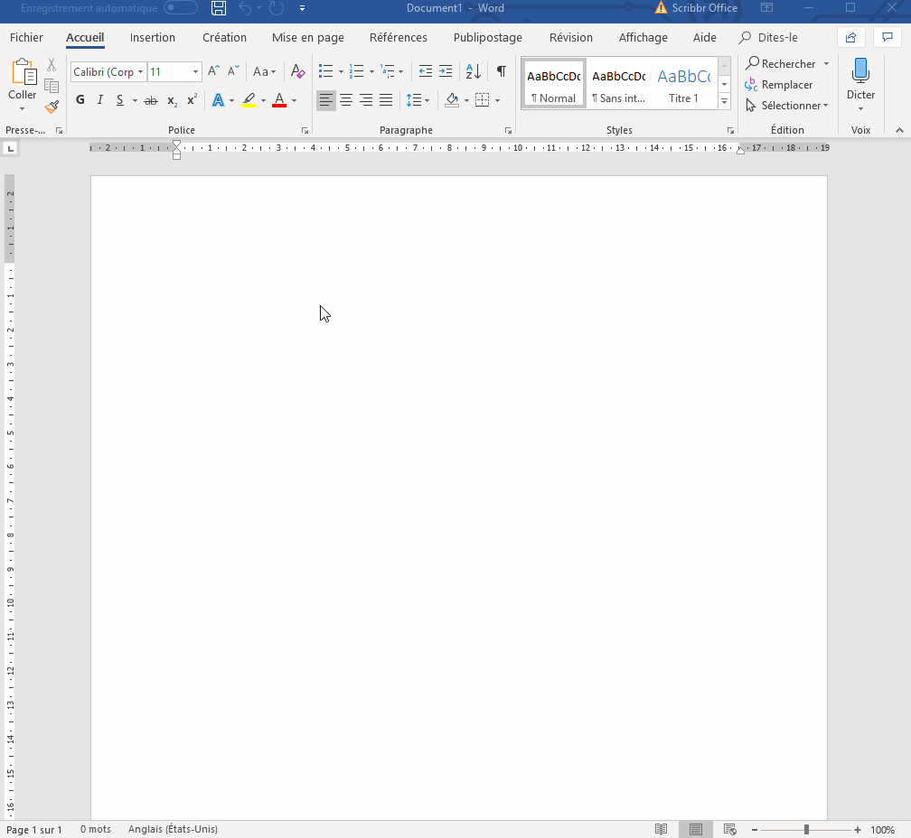<!-- .element: style="width:50%;float:left;margin-right:-1em;" -->

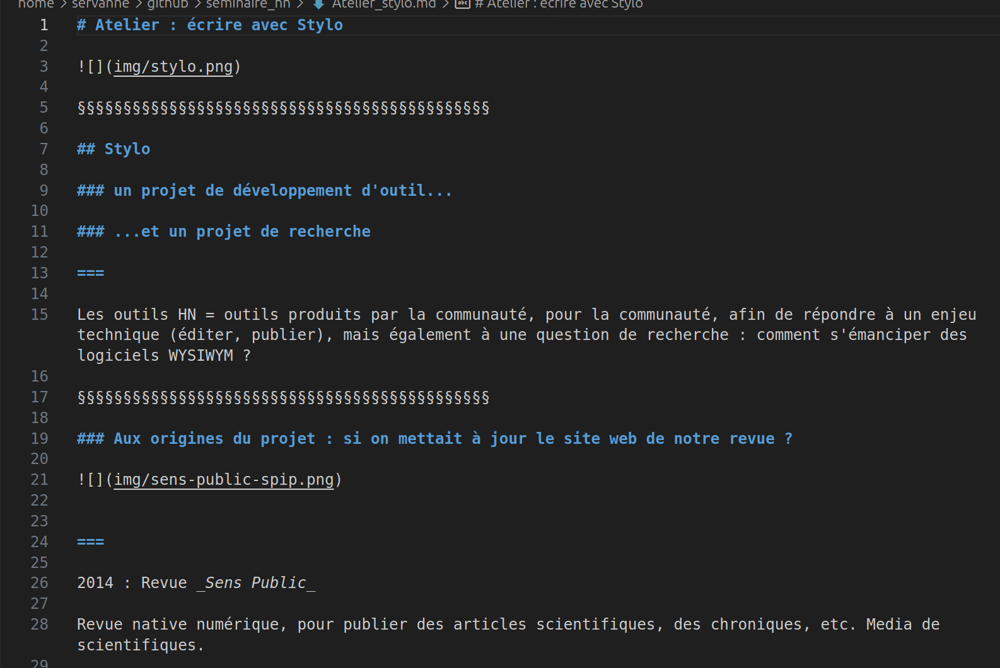<!-- .element: style="width:50%;float:right;margin-right:-1em;" -->

§§§§§§§§§§§§§§§§§§§§§§§§§§§§§§§§§§§§§§§§§§§§§

### Une solution _Single Source Publishing_

>Stylo propose aujourd’hui une solution libre et collaborative, basée sur des standards ouverts (Markdown, YAML, BibTeX), permettant de multiples sorties (PDF, HTML, XML-TEI, TEI Commons Publishing, ODT) à partir d’un seul document ou d’un corpus - facilitant ainsi une circulation des documents hors des formats, environnements et serveurs propriétaires des grands groupes de la Sillicon Valley.

§§§§§§§§§§§§§§§§§§§§§§§§§§§§§§§§§§§§§§§§§§§§§

### Une solution _Single Source Publishing_

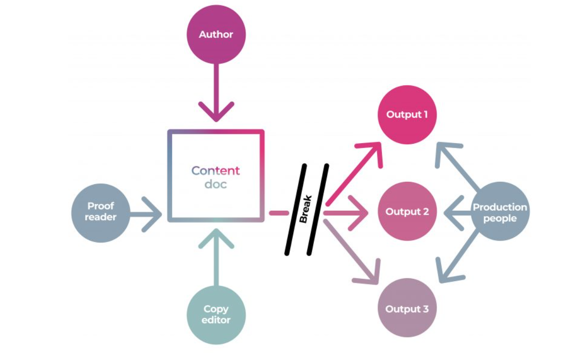<!-- .element: style="width:50%;float:left;margin-right:-1em;" -->

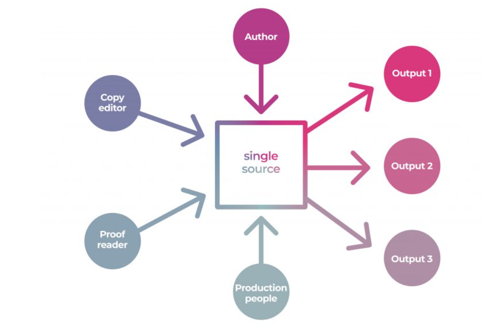<!-- .element: style="width:50%;float:right;margin-right:-1em;" -->

§§§§§§§§§§§§§§§§§§§§§§§§§§§§§§§§§§§§§§§§§§§§§

### Stylo n'est pas un outil,

#### _mais une réflexion collective sur la production du sens en SHS à l'époque du numérique_

- Comprendre que la matérialité de l'écriture produit la pensée
- Développer une réflexion sur les modèles épistémologiques produits par l'écriture    
- Redonner à l'auteur et à l'éditeur la maîtrise de la structure et de la sémantique du texte
- Assurer la continuité de la chaîne de données
- Repenser le format de l'article savant
- Dé-_wordiser_ l'écriture savante

===

1. dé-wordiser l'écriture savante, l'ancrer dans des formats et des pratiques plus vertueuse et scientifiquement pertinentes
2. Redonner à l'auteur et à l'éditeur la maîtrise de la structure et de la sémantique du texte
3. Assurer la continuité de la chaîne de données: assurer que les enrichissements sémantiques produits par l'auteur soient correctement diffusés
4. Repenser le format de l'article savant

§§§§§§§§§§§§§§§§§§§§§§§§§§§§§§§§§§§§§§§§§§§§§

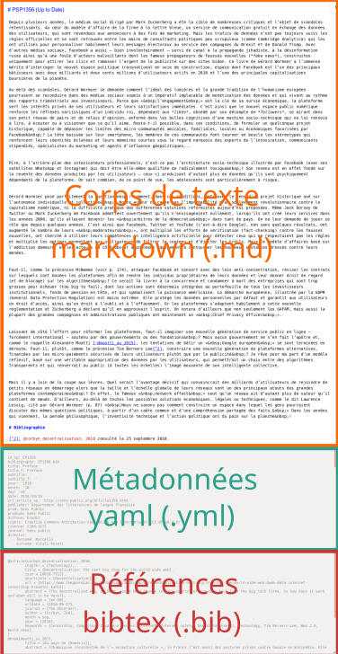<!-- .element: style="width:300px" -->

===

Stylo est à la fois un outil de rédaction de texte scientifique et un outil d'édition de document scientifique. → Ecrire + Editer (considérant que c'est la même chose)

Quand on écrit en numérique, on est déjà en train de produire une structure. Essentiel de comprendre et de maîtriser cette structure : au sein d'avoir la main dessus.

§§§§§§§§§§§§§§§§§§§§§§§§§§§§§§§§§§§§§§§§§§§§§

=> Rv sur Stylo pour poursuivre l'atelier