## Séminaire méthodologique en humanités numériques 

Littératures, études littéraires et IAG

<!-- .element: style="width:400px" -->

===

Ce séminaire propose une exploration critique des intelligences artificielles génératives, envisagées selon une triple perspective historique et théorique, mais surtout littéraire.

§§§§§§§§§§§§§§§§§§§§§§§§§§§§§§§§§§§§§§§§§§§§§

* Que devient la littérature quand des outils peuvent générer des textes en quelques secondes ?
* Que deviennent les études littéraires lorsque des outils "répondent" à toutes les questions que l'on se pose ?

===

Il s'agit de réfléchir à ce que devient notre objet d'étude, la litt, mais aussi ce que devient notre métier : les études littéraires ? 

§§§§§§§§§§§§§§§§§§§§§§§§§§§§§§§§§§§§§§§§§§§§§

### Les questions que l'on peut se poser... 

<!-- .element: style="width:600px" -->

===

Polémique de la rentrée

§§§§§§§§§§§§§§§§§§§§§§§§§§§§§§§§§§§§§§§§§§§§§

* L'outil Pangram est-il fiable ? Transparence du LLM -> quelle langue ?
* Utiliser une IA pour dénoncer l'usage d'une IA&nbsp;? Paradoxe... 
* L'auteur est-il encore un auteur lorsqu'il écrit avec une IA ?
* Quel pacte de lecture ? 
* À qui profite le crime ? 

<!-- .element: style="width:45%;float:left;margin-left:-1em; font-size:1.4rem; text-align:justify" -->

<!-- .element: style="width:45%;float:right;margin-right:-1em;" -->

===

- l'outil de détection est-il fiable ? Selon l'état actuel de mes connaissances, je ne sais pas. Vos collègues semblent avoir tranché. Je lis sur France Info : Pangram est considéré comme l'un des détecteurs d'intelligence artificielle les plus fiables du marché. Sa fiabilité a été évaluée par une étude scientifique en juin dernier. 160 textes universitaires rédigés par des humains lui ont été soumis. Pangram les a considérés comme humains dans 100 % des cas. Ensuite, 40 textes générés à 100 % par ChatGPT lui ont été soumis. Pangram a identifié l'IA dans 39 cas. Il peut donc se tromper même si c'est extrêmement rare. 
En ce qui me concerne, cette assertion me semble douteuse : considéré par qui ? Des scientifiques ? Sur une seule étude (qui, si j'en crois celle que j'ai trouvée moi-même puisque vos collègues n'ont pas sourcé l'article, n'a pas été évaluée par les pairs) ? Cela me semble un peu juste. Surtout, j'ai l'impression qu'il y a ici pénétration d'un discours très promotionnel (99% de taux de réussite), qui renvoie à une présentation très "comptable" de la performance d'un outil qui est lui-même conçu à partir de LLM, et qui repose donc sur un principe probabiliste et qui plus est biaisé. Tout LLM a ses propres biais : je me demande ici si Pangram, conçu par une société américaine ayant certainement privilégié un modèle basé sur des données textuelles en anglais aurait le même taux de "succès" si on réalisait le test sur des textes en Français : il faudrait ici interroger quelqu'un de plus compétent que moi, mais les articles abondent. 
Bref, sur la méthode, je me méfie toujours de l'argument qui consiste à dire que l'on a utilisé une IA pour détecter et dénoncer l'usage d'une autre IA... Cela revient à déléguer à un outil visiblement mal compris par la plupart des gens (le LLM) le contrôle qualité de contenus dont on craint qu'ils ont été produits par un autre LLM. Paradoxal. 

- l'auteur a-t-il vraiment utilisé une IA ou pas ? Cette question soulève deux problèmes : le statut des outils basés sur des LLM, qui ont clairement pillé des œuvres encore sous le coup de la propriété intellectuelle. Mais si on condamne Thélyson Orélien pour cela, alors il faut tout bonnement interdire l'usage des IA génératives d'images et de texte à tout le monde. Dans le cas présent, il y a soupçon de contrefaçon, et cela fait écho au statut particulier de l'auteur littéraire : pourquoi est-ce que le recours à une IA choque le lecteur ? Parce qu'il rompt le pacte de lecture qui se tisse entre l'auteur et son public : ce que l'on attend, en particulier dans le cas de Thélyson Orélien, c'est le récit d'une expérience authentique, car le récit est vendu comme tel. Dans l'absolu, il n'est pas interdit (encore) d'utiliser des IAG pour produire ses textes, tout comme de nombreux auteurs ont eu recours à des ghostwriters. Comme on en a discuté au téléphone, certains écrivains font même de ce recours aux LLM le coeur de leur expérience esthétique. 

- quelle est la part de responsabilité de l'éditeur ? quoiqu'on en dise, l'éditeur est le garant de la qualité des textes qu'il publie. Il faudrait savoir si Grasset, ou Boréal (la maison d'édition québécoise qui a publié le livre) a utilisé des détecteurs, ou pas, et pourquoi ils en ont utilisé, ou pas. 

- à qui profite le crime ? Visiblement, aux médias et influenceurs de droite voire d'extrême droite. Chaque rentrée littéraire a sa polémique, et il y a deux ans c'était celle autour des lecteurs sensibles mobilisé pour le livre d'Ève Lambert (publié sous le nom de Kev Lambert) : ici aussi, c'étaient surtout les médias de droite qui avaient surfé sur la polémique pour dénoncer la "cancel culture". 

§§§§§§§§§§§§§§§§§§§§§§§§§§§§§§§§§§§§§§§§§§§§§

### [I]Apocalypse now ?

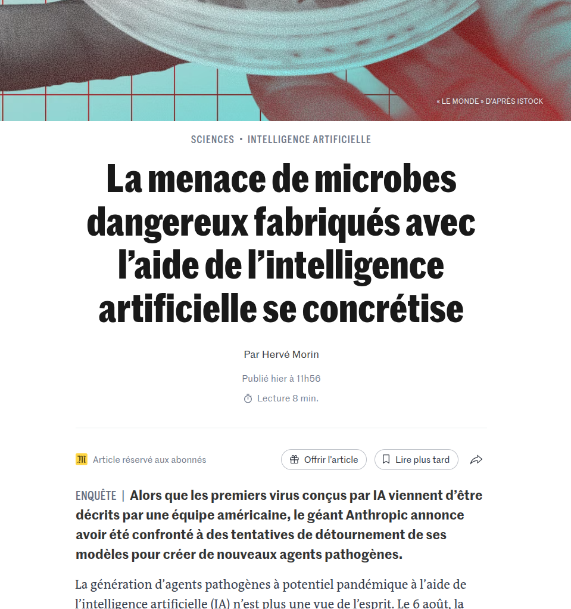<!-- .element: style="width:50%;float:right;margin-left:-1em; font-size:1.4rem; text-align:justify" -->

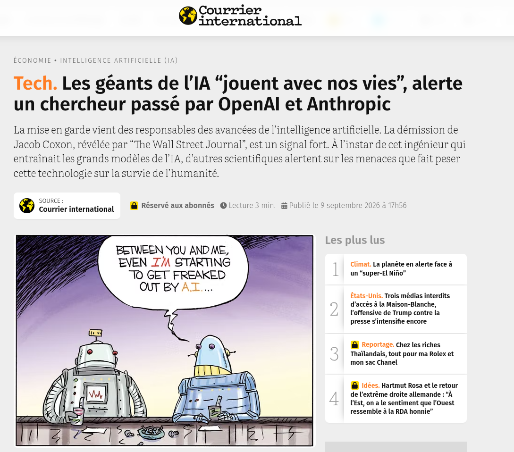<!-- .element: style="width:50%;float:left;margin-left:-1em; font-size:1.4rem; text-align:justify" -->

===

§§§§§§§§§§§§§§§§§§§§§§§§§§§§§§§§§§§§§§§§§§§§§

#### (Provocation)  L'IA générative est-elle l'aboutissement d'une logique productiviste qui touche les métiers de la création et du savoir, ou marque-t-elle son point de rupture ?

Dans quelle mesure l'intelligence artificielle générative ne fait-elle qu'accélérer des logiques productivistes voire industrielles qui sont à l'oeuvre depuis déjà plusieurs années dans le monde de la recherche et de la culture ? Ces derniers sont en effet soumis à des impératifs toujours plus prégnants de productivité. La légitimation des créateurs et des intellectuels s'effectue depuis déjà longtemps en fonction de critères quantitatifs plutôt que qualitatifs.

<!-- .element: style="font-size:1.5rem; text-align:justify" -->

===

(Provocation) L'IA générative est-elle l'aboutissement d'une logique productiviste qui touche également les métiers de la création (littéeture, culture) et de la production de connaissances (recherche, enseignement), ou marque-t-elle son point de rupture ?

Dans quelle mesure l'intelligence artificielle générative ne fait-elle qu'accélérer des logiques productivistes voire industrielles qui sont à l'oeuvre depuis déjà plusieurs années dans le monde de la recherche et de la culture ? Ces derniers sont en effet soumis à des impératifs toujours plus prégnants de productivité. La légitimation des créateurs et des intellectuels s'effectue depuis déjà longtemps en fonction de critères quantitatifs plutôt que qualitatifs.

§§§§§§§§§§§§§§§§§§§§§§§§§§§§§§§§§§§§§§§§§§§§§

#### Une problématique esthétique : auctorialité/créativité

<!-- .element: style="width:45%;float:right;margin-right:-1em;" -->

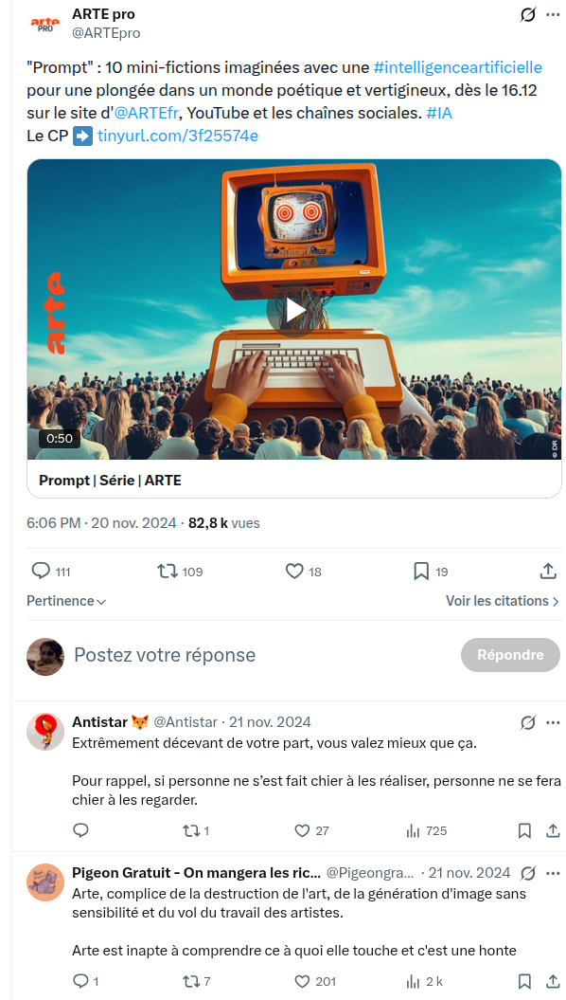<!-- .element: style="width:38%;float:left;margin-right:-1em;" -->

===

1) L'intervention d'une IA peut-elle être tolérée dans le champs de la création: créer avec une IA, est-ce créer ?

- menace pour la création, c'est d'abord un questionnement philosophique et esthétique : mythe déjà ancien d'un artiste qui serait remplacé par la machine. Le principe même de la création, qui serait un trait caractéristique des humains, et qui renvoie à l'inspiration, à la sacralisation de l'artiste, est ainsi en jeu. De ce point de vue d'ailleurs, la communauté est divisée : certains créateurs, en littérature, en audiovisuel, en musique, en arts plastiques, ont embrassé les techno IA. Avec comme argument que l'IA est un outil de création comme un autre, une voie de plus dans l'automatisation, par exemple (comme qd on est passé du manuscrit à la machine à écrire, puis au logiciel de traitement de texte).

En 2023, l’agrégé de lettres français Raphaël Doan publie une uchronie, Si Rome n’avait pas chuté (Passés composés), dont le bandeau donne le ton : « Le premier livre d’histoire écrit et illustré avec une intelligence artificielle. »

- Arte a produit la série prompt de Jocelyn Collages, dont les images et une partie du scénario sont générés avec des outils d'IA : MidJourney, GPT, etc. 
Grande polémique. Alors, où est-ce que ça coince ? « La communication », répondent en chœur les syndicats d’auteurs (syndicats unis de scénaristes, auteurs et réalisateurs). « Tout est parti d’un tweet d’Arte », explique la SACD. Sur le compte X d’Arte, une publication fait ainsi la promotion de Prompt : « 10 mini-fictions imaginées avec une #intelligenceartificielle pour une plongée dans un monde poétique et vertigineux […] ». La formulation n’a pas manqué de faire bondir : Sous le tweet, quelque cent trente commentaires échaudés témoignent de l’émoi que cette communication lacunaire a suscité, relayé ensuite par les syndicats dans une lettre adressée au président d’Arte, Bruno Patino. Dans leur communiqué de presse, ils demandent une clarification quant à la responsabilité de la chaîne « dans l’effacement du travail créatif des scénaristes, des graphistes, des réalisatrices et des réalisateurs et la dévalorisation de leurs compétences ».

Le phénomène inquiète les artistes. S’ils reconnaissent que, derrière l’IA, il y a toujours la demande d’un homme ou d’une femme, la part humaine de cette œuvre, qu’il s’agisse d’une image, d’un roman ou d’un morceau de musique, semble se réduire à un « prompt », c’est-à-dire à la simple commande adressée à la machine. Si le geste artistique se limite à écrire un projet en quelques phrases à destination de l’IA, qui de l’humain ou de la machine est artiste ?

§§§§§§§§§§§§§§§§§§§§§§§§§§§§§§§§§§§§§§§§§§§§§

#### Une problématique juridique : droit d'auteur

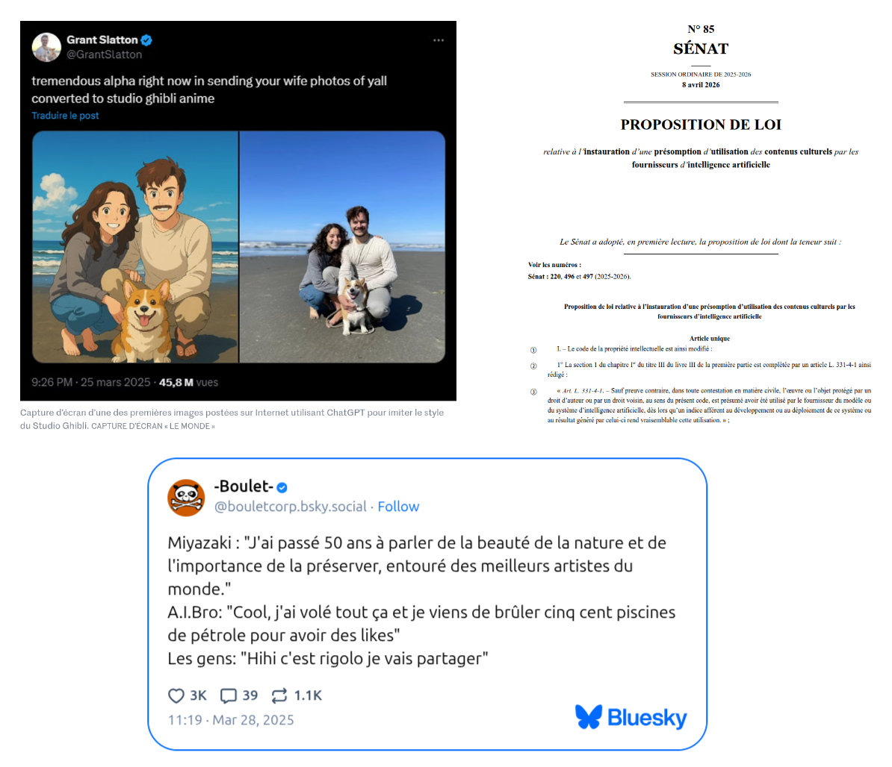<!-- .element: style="width:700px" -->

===

Polémique Myazaki + proposition de cadre légal.

2) IA et droit d'auteur : les IA sont des technologies qui reposent sur des LLM ou des VLM : ces modèles de données intègrent les oeuvres du passé, y compris celles qui sont encore sous le coup du droit. 

La problématique des données&nbsp;: sur quelles données les IA s'appuient-elles&nbsp;? Sont-elles fiables, transparentes, respectueuses du droit (auteur, etc.)&nbsp;?

§§§§§§§§§§§§§§§§§§§§§§§§§§§§§§§§§§§§§§§§§§§§§

#### Une problématique "éthique"/métier : automatisation/optimisation du travail créatif et intellectuel

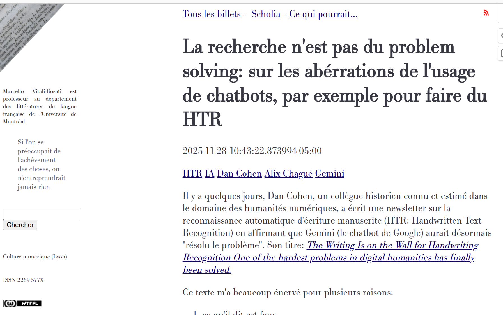<!-- .element: style="width:50%;float:left;margin-left:-1em; font-size:1.4rem; text-align:justify" -->

Mais le pus gros problème du texte de Dan est un autre: il mécomprend complètement ce qu'est la recherche en la considérant comme une sorte de problem solving. Mais la recherche n'est pas une solution de problèmes! Au contraire! La recherche est la capacité de poser des questions et donc, si l'on veut, non pas de résoudre, mais plutôt de créer des problèmes!

<!-- .element: style="width:50%;float:right;margin-left:-1em; font-size:1.4rem; text-align:justify" -->

===

Théorie du remplacement... 

* La problématique de l'usage&nbsp;: l'IA va-t-elle faire disparaître certains métiers&nbsp;? Menace-t-elle le travail des créateurs et des cadres&nbsp;? Utiliser l'IA, est-ce "tricher"&nbsp;? Certaines compétences vont-elles devenir obsolètes&nbsp;?

Qu'est-ce que c'est que la recherche ? 

§§§§§§§§§§§§§§§§§§§§§§§§§§§§§§§§§§§§§§§§§§§§§

#### Une problématique ontologique : fake, deep fake, hallucination 

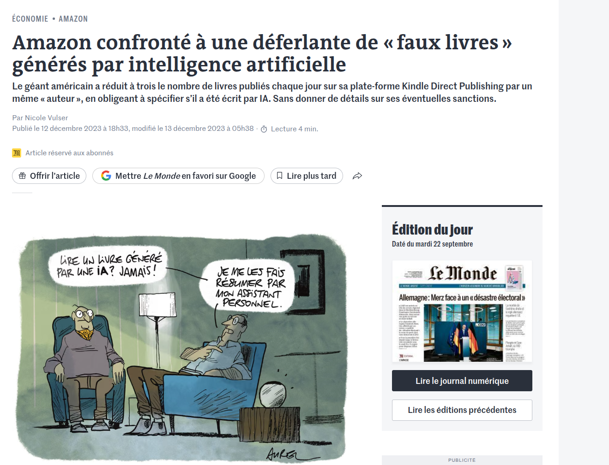<!-- .element: style="width:700px" -->

===

La problématique des contenus générés : comment évaluer la fiabilité des contenus produits par les IA (fausses images avec MidJourney, contenus erronés avec Chat GPT, usurpation de voix, etc.)&nbsp;? quel est le statut des productions IA (qui en est l'auteur)&nbsp;?  

Numérique et plateformisation : avec l'essor du livre numérique, de l'autoédition (Amazon KDP) et maintenant de l'IA générative — sujet qu'on discutait à l'instant —, l'édition se rapproche des dynamiques de plateforme caractéristiques des industries créatives numériques, ce qui relance le débat sur sa catégorisation.

Emmerdification d'une plateforme

§§§§§§§§§§§§§§§§§§§§§§§§§§§§§§§§§§§§§§§§§§§§§
<!-- .slide: data-background-video="img/chloeTimeTravel.mp4" data-background-size="contain" -->

===

Problème de la rigueur des contenus et de la responsabilité des créateurs. Cas d'hallucinations. 

§§§§§§§§§§§§§§§§§§§§§§§§§§§§§§§§§§§§§§§§§§§§§

Par-delà le monde intellectuel et culturel, les intelligences artificielles suscitent un débat de société face à un changement paradigmatique majeur

* Coût sociétal (remplacement des travailleurs)
* Coût culturel (pillage de la propriété intellectuelle)
* Coût financier (accès aux fonctionnalités avancées des outils, tokenisation)
* Coût écologique (eau, _data center_, hardware)

 

### Une technologie hors de contrôle ?

===

Concrètement, ces questionnements renvoient à une inquiétude plus générale et relayée dans le monde entier : avons-nous trouvé là une technologie qui serait sur le point de nous engloutir ? 

Il faut dire que l'état du débat n'est pas très rassurant.

§§§§§§§§§§§§§§§§§§§§§§§§§§§§§§§§§§§§§§§§§§§§§

### Débats sur les IA : la bataille des pionniers

<!-- .element: style="width:50%;float:left;margin-right:-1em;" -->

<!-- .element: style="width:50%;float:right;margin-right:-1em;" -->

===

Point d'orgue : la signature en janvier 2023 d'une pétition pour stopper pdt 6 mois le développement de l'IA. Avec de grands signataires, dont Elon Musk ou encore Joshua Bengio.

L'accélération des progrès de l'IA, incarnés par quelques outils fortement médiatisés comme Chat GPT, a lancé un véritable débat public, entre experts et moins experts, entre concepteurs de l'IA et population, travailleurs impactés par l'IA. 
L'iA est devenue un enjeu de société. Avec des désaccords profonds y compris au sein de la communauté des chercheurs.
Dans *Le Monde*, publication de 2 entretiens totalement contradictoires entre Le Cun et Bengio.

Yan LeCun"Scientifique en chef" de l'IA chez Meta

Yoshua Bengio : Directeur scientifique du MILA (Institut québécois d’intelligence artificielle)

§§§§§§§§§§§§§§§§§§§§§§§§§§§§§§§§§§§§§§§§§§§§§

<!-- .element: style="width:400px" -->

===

Bengio et Lecun sont, avec Geoffrey Hinton, Co-auteurs de l'article scientifique le plus cité dans le domaine de l'IA.

§§§§§§§§§§§§§§§§§§§§§§§§§§§§§§§§§§§§§§§§§§§§§

<!-- .element: style="width:400px" -->

===

Geoffrey Hinton, prix nobel de physique 2024 pour ses travaux sur l'apprentissage automatique

§§§§§§§§§§§§§§§§§§§§§§§§§§§§§§§§§§§§§§§§§§§§§

>"Les résultats restent imprévisibles, et nous ne comprenons pas parfaitement le fonctionnement de ce processus très complexe. Cela pose des questions de sécurité, de transparence, de fiabilité. On s’aperçoit très vite que ces systèmes inventent parfois des réponses, qu’ils peuvent aller dans une direction que n’ont pas choisie les programmeurs. La seule façon de les réorienter, c’est de les récompenser lorsque la réponse est pertinente. Depuis des mois, les concepteurs de ChatGPT travaillent à parer les coups, mais ce n’est pas suffisant."

<!-- .element: style="width:45%;float:left;margin-left:-1em; font-size:1.4rem; text-align:justify" -->

<!-- .element: style="width:45%;float:right;margin-right:-1em;" -->

===

Pour Bengio : le pb est celui de notre manque de compréhension de la façon dont fonctionne l'IA.
Technologie non maîtrisée = prise de risque.

Pour lui, c'est donc une question éthique.

§§§§§§§§§§§§§§§§§§§§§§§§§§§§§§§§§§§§§§§§§§§§§

>"Ces capacités donnent l’impression que le système est intelligent, mais en fait elles restent superficielles. ChatGPT n’est pas intelligent comme peut l’être un humain. C’est un outil de prédiction, qui associe entre eux des mots apparaissant de façon la plus probable dans le corpus qui a servi à l’entraîner, afin de continuer un texte. [...] Ce sont des outils très utiles pour accélérer l’écriture de textes, en particulier de code informatique. Ils peuvent améliorer la productivité de nombreux professionnels, comme les programmeurs, ou les médecins qui veulent rédiger plus vite leurs comptes rendus de consultations. Il faut seulement informer les utilisateurs des limites de l’application : on ne peut pas s’en servir comme moteurs de recherche, ni se reposer sur les informations qu’elle produit sans les vérifier."

<!-- .element: style="width:45%;float:left;margin-left:-1em; font-size:1.4rem; text-align:justify" -->

<!-- .element: style="width:45%;float:right;margin-right:-1em;" -->

§§§§§§§§§§§§§§§§§§§§§§§§§§§§§§§§§§§§§§§§§§§§§

>Je fais partie de ceux qui pensent que le progrès, qu’il soit scientifique ou social, dépend étroitement de l’intelligence. Plus les gens sont éduqués, instruits, capables de raisonner et d’anticiper ce qui va se produire, plus ils peuvent prendre des décisions bénéfiques à long terme. Avec l’aide de l’IA, l’intelligence humaine va être amplifiée, non seulement celle de l’humanité entière, mais aussi l’intelligence et la créativité de tout un chacun. **Cela peut conduire à une renaissance de l’humanité, un nouveau siècle des Lumières**.

<!-- .element: style="font-size:1.9rem; text-align:justify" -->

>Yan LeCun

<!-- .element: style="font-size:1.9rem; text-align:right" -->

§§§§§§§§§§§§§§§§§§§§§§§§§§§§§§§§§§§§§§§§§§§§§

#### Le projet culturel des intelligences artificielles

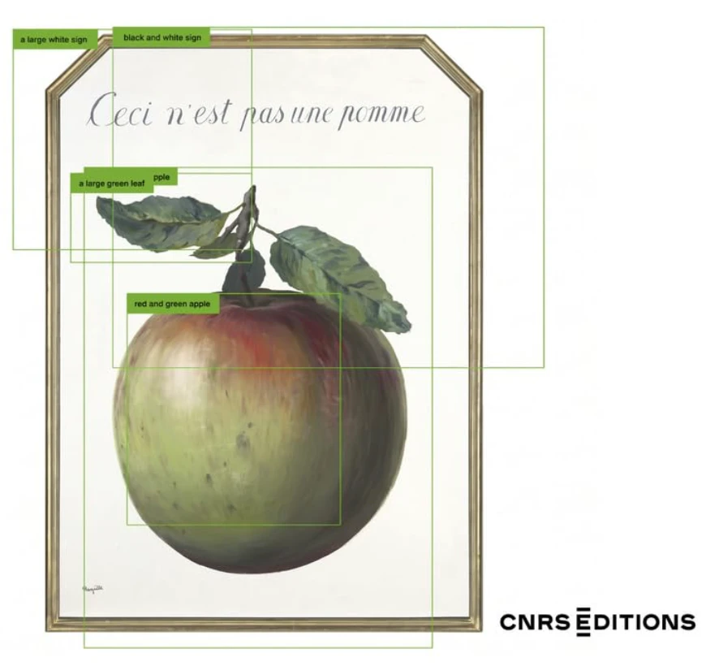<!-- .element: style="width:45%;float:right;margin-right:-1em;" -->

>Or l'IA n'est pas seulement une technologie. Elle repose sur un projet intellectuel ancien, un imaginaire culturel puissant, un objet esthétique récurrent et un opérateur symbolique majeur de la modernité.  [Alexandre Gefen]

<!-- .element: style="width:45%;float:left;margin-left:-1em; font-size:1.4rem; text-align:justify" -->

=== 

La question des Lumières soulevées par LeCun est intéressante, quoique provocante. Je ne sais pas si nous sommes sur le point d'entrer dans de nouvelles "Lumières", mais cette parole dit quelque chose d'un changement de paradigme profond, qui touche également notre imaginaire et notre culture. 

L'IA, en ce sens, n'est pas qu'une "révolution technologique" qui serait tout à coup venue donner un coup de pied dans la fourmilière et boulerser nos manières de produire, de lire, de penser, de travailler... bref, de vivre. 

Dans l'ouvrage collectif récent "Histoire culturelle de l'IA" dir. Gefen, ce dernier souligne que l'IA participe d'une culture partagée. 
>Or l'IA n'est pas seulement une technologie. Elle repose sur un projet intellectuel ancien, un imaginaire culturel puissant, un objet esthétique récurrent et un opérateur symbolique majeur de la modernité. 

Une généalogie de l'idée d'IA est alors possible et même nécessaire, pour comprendre comment,très tôt, l'humanité a tenté de formaliser l'intelligence, la pensée, et tout simplement a tenté de se formaliser elle-même. De ce point de vue, ce que questionne l'IA, c'est d'abord l'Humain et l'Humanité. Ce questionnement s'opère à travers des machines qui reproduisent de manière toujours plus performante et spectaculaire des comportements dont nous pensions qu'ils nous étaient propres, qu'ils n'étaient réservés qu'à nous, humains. 

Je ne suis pas certaine, à cet égard, que les IA marquent l'avènement de nouvelles Lumières, mais ce que l'on peut dire, c'est qu'ils questionnent à la fois l'humanisme (en tant que courant philo et culturel visant l'épanouissement de l'humain) et les humanités (en tant que champ disciplinaire qui vise l'étude de l'Homme). 

§§§§§§§§§§§§§§§§§§§§§§§§§§§§§§§§§§§§§§§§§§§§§

De nouvelles "Lumières" ? Ou des "Lumières sombres"?

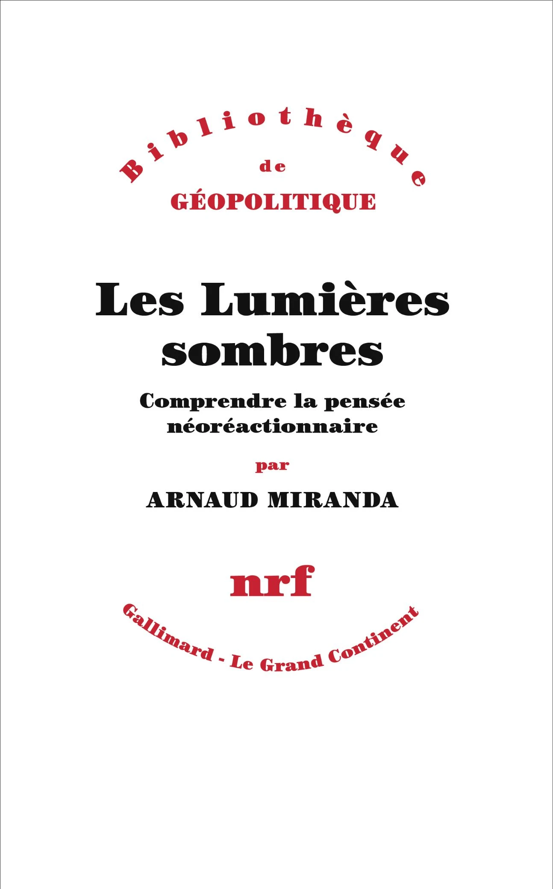<!-- .element: style="width:35%;float:right;margin-right:-1em;" -->

Vectofascisme : Néologisme désignant une forme contemporaine de fascisme qui s’adapte aux moyens de communication et aux structures sociales de l’ère numérique, caractérisée par la vectorisation (direction, intensité, propagation) de l’information et du pouvoir à l’ère de l’IA.  [Grégory Chatonsky]

<!-- .element: style="width:45%;float:left;margin-left:-1em; font-size:1.4rem; text-align:justify" -->

===

Si ce que l'on appelle aujourd'hui de manière large et floue "les IA" sont aujourd'hui partie prenante d'une reconfiguration de notre champ culturel, il est important de remonter à la source de cette reconfiguration : l'IA est aujourd'hui implémentée, produite, diffusée par de grandes entreprises, dont le projet culturel est également un projet économique, capitaliste et politique. 

Le bien être de l'humanité n'est pas forcément aligné avec le projet culturel, et même politique à l'oeuvre derrière ces ambitions peut s'avérer dangereux.

Publication d'Arnaud Miranda : Lumières sombres. 
Au cours des années 2010 et 2020, aux États-Unis, une nouvelle contre-culture de droite radicale s’est développée sur internet. Ses figures centrales, comme Curtis Yarvin ou Nick Land, écrivent le plus souvent sous pseudonymes, sur des blogs et sur les réseaux sociaux. Ils ont donné à ce mouvement son nom, la « néoréaction », ou encore les « Lumières sombres ». Les idées qu’ils défendent sont à la fois anciennes et hypermodernes : détruire la démocratie, établir une monarchie, diriger l’État comme une entreprise, rétablir les inégalités entre hommes et femmes, affirmer les différences entre patrimoines génétiques…

D’abord marginaux, ils ont peu à peu obtenu le soutien de certains milliardaires de la Silicon Valley, et leur audience n’a cessé de s’élargir depuis. Avec la victoire de Donald Trump en novembre 2024, ils estiment avoir désormais les mains libres pour faire de l’Amérique le laboratoire de leurs voeux les plus fous.

Notion de vectofacisme : Les appareils nous programment désormais autant que nous ne les programmons.

Vectofascisme : Néologisme désignant une forme contemporaine de fascisme qui s’adapte aux moyens de communication et aux structures sociales de l’ère numérique, caractérisée par la vectorisation (direction, intensité, propagation) de l’information et du pouvoir à l’ère de l’IA.

§§§§§§§§§§§§§§§§§§§§§§§§§§§§§§§§§§§§§§§§§§§§§

### Des imaginaires en tension 

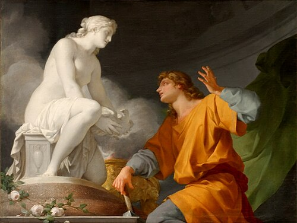<!-- .element: style="width:50%;float:left;margin-right:-1em;" -->

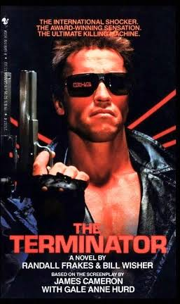<!-- .element: style="width:35%;float:right;margin-right:-1em;" -->

§§§§§§§§§§§§§§§§§§§§§§§§§§§§§§§§§§§§§§§§§§§§§
<!-- .slide: data-background-video="img/HAL 9000_ _I'm sorry Dave" data-background-size="contain" -->

===

Fantasme qui fait lui-même écho à une problématique philosophique qui prend en fait racine dès l'Antiquité : la relation qui unit l'homme à la machine, et plus largement à la technique. 

imaginaire : la fiction a créé des personnage d'IA qui ont tendance à s'avérer maléfiques. 

Exemple le plus connu est HAL, l'IA créée par Stanley Kubrick dans 2001 l'Odyssée de l'espace:

>HAL 9000 (traduit en CARL 500 en version française) est un personnage de fiction, un supercalculateur doté d'intelligence artificielle. Il a été conçu pour gérer de manière autonome les fonctions vitales du vaisseau spatial Discovery One, en mission dans l'espace vers la planète Jupiter. (WIKIPÉDIA)

Dans le film, HAL, dont la mission est d'assurer la réussite d'une mission scientifique d'exploration, va tenter d'assassiner l'ensemble de l'équipage de son vaisseau, après avoir estimé que les humains mettaient en péril la dite mission. 

À la fin, un dernier astronaute survivant parvient à déconnecter certaines fonctionnalités de HAL qui redevient une machine standard. On assiste alors à la "mort" de l'IA 

>Régressant au fur et à mesure que les barrettes-mémoires sont déconnectées, HAL affirme à Dave : « J'ai peur », et semble être conscient de l'évaporation de sa conscience : « Mon esprit s'en va, je le sens… »

Il s'agit là d'un des premiers exemples, sans doute les plus marquant, d'IA maléfique. Le cinéma contemporain en a produit bcp d'autres. Plus récemment, le Marvel Universe a repris JARVIS, l'IA créée par Iron Man.

Ces fictions ont participé autant à relayer qu'à entretenir, voir créer une angoisse collective autour du pouvoir que l'on va conférer aux machines supposées pallier à nos propres besoins, et réaliser des tâches fastidieuses ou aliénantes à notre place. Mais justement, jusqu'à quel point ces machines peuvent-elles prendre notre place ? 

§§§§§§§§§§§§§§§§§§§§§§§§§§§§§§§§§§§§§§§§§§§§§

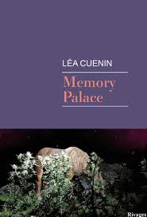<!-- .element: style="width:45%;float:right;margin-right:-1em;" -->

Rencontre avec Léa Cuenin en décembre.

<!-- .element: style="width:45%;float:left;margin-right:-1em;" -->

===

Léa Cuenin

§§§§§§§§§§§§§§§§§§§§§§§§§§§§§§§§§§§§§§§§§§§§§

### Humanités numériques ?

>L’utilisation de l’informatique en sciences humaines et sociales est pratiquée depuis maintenant plus de quarante ans. Plusieurs voies ont été explorées au cours de cette déjà assez longue histoire. La plus récente, qui prend le nom de digital humanities, désigne une intégration intense et à plu­sieurs niveaux des technologies numériques dans tous les processus de recherche, depuis la collecte de données jusqu’à la publication. 

>Pierre Mounier, *Manifeste des Humanités numériques*, 2010.

===

Il ne vous aura pas échappé que dans l'expression HN se trouve deux termes, Humanités et numériques, qui sont deux concepts autonomes que nous avons cherché à adjoindre. 
Le principe d'un concept, c'est d'exprimer une idée générale. Un concept est une représentation abstraite d'un objet ou d'un ensemble d'objets ayant des caractères communs.
De fait, les concepts font l'objet de définitions souvent discutées, discutables et évolutives. Les concepts sont déterminés par des facteurs multiples : ils sont déterminés par des disciplines, par des institutions, par des pratiques et des usages. Bref, ils sont toujours en négociation. Concept d'amour, concept de genre, concept de littérature. 

En tant que concepts, les Humanités d'une part et le numérique d'autre part, renvoient à des réalités historiques mais également institutionnelles et pratiques complexes. 

Dans le monde francophone, italien, espagnol, les humanités désignent généralement plus une tradition intellectuelle et même éthique de type humaniste d’inspiration érasmienne qu’un champ disciplinaire universitaire. Les humanités, ainsi, renvoient d'abord à un ensemble de courants de pensées et de disciplines : les lettres, la philo, les langues, l'histoire, l'histoire de l'art.

>Depuis plusieurs années, [ces disciplines] semblent en perte de vitesse dans un monde davantage dominé par les sciences et les techniques : disparition des heures d’enseignement consacrées aux langues anciennes et dévalorisation des filières littéraires dans l’enseignement secondaire, diminution des crédits de recherche pour les disciplines des sciences humaines et sociales, forte chute des ventes d’ouvrages de recherche en librairie ; les signes d’une désaffection pour la culture humaniste se sont multipliés.

Sarkozy en 2007 : « Vous avez le droit de faire littérature ancienne, mais le contribuable n'a pas forcément à payer vos études de littérature ancienne. »

D'un autre côté, nous avons donc l'adjectif "numérique", concept s'il en faut encore plus nébuleux, dans la mesure où il se réfère avant tout à une réalité technique très complexe et plurielle, mais également depuis 20 ans à une réalité culturelle (nous appartenons à une culture numérique) dont nous n'avons pas toujours bien conscience. 

Partant de là, à quoi renvoie l'expression humanités numériques ? 

Une définition un peu simpliste pourrait être de dire : on utilise l'informatique pour faire de la recherche, de manière plus rapide, plus efficace qu'avant car on va être informatiser, cad automatisé. 

Pourtant, les HN encouragent à dépasser la dimension strictement applicative des technologies numériques pour interroger la fonction et l’effet de l’outil dans ses différents champs d’application.

§§§§§§§§§§§§§§§§§§§§§§§§§§§§§§§§§§§§§§§§§§§§§

<!-- .element: style="width:50%;float:left;margin-left:-1em; font-size:1.4rem; text-align:justify" -->

<!-- .element: style="width:50%;float:right;margin-left:-1em; font-size:1.4rem; text-align:justify" -->

===

Humanistica / ADHO

§§§§§§§§§§§§§§§§§§§§§§§§§§§§§§§§§§§§§§§§§§§§§

===

Revue HN

§§§§§§§§§§§§§§§§§§§§§§§§§§§§§§§§§§§§§§§§§§§§§

#### Manifeste des humanités numériques (2010)

1. Le tournant numérique pris par la société modifie et interroge les conditions de production et de diffusion des savoirs.

2. Pour nous, les digital humanities concernent l’ensemble des Sciences humaines et sociales, des Arts et des Lettres. Les digital humanities ne font pas table rase du passé. Elles s’appuient, au contraire, sur l’ensemble des paradigmes, savoir-faire et connais­sances propres à ces disciplines, tout en mobilisant les outils et les perspectives singulières du champ du numérique.

3. Les digital humanities désignent une transdiscipline, porteuse des méthodes, des dispositifs et des perspectives heuristiques liés au numérique dans le domaine des Sciences humaines et sociales.

<!-- .element: style="width:50%;float:right; text-align: left; font-size: 0.6em; margin-right:-1em;" -->

<!-- .element: style="width:40%;float:left;margin-left:-1em; font-size:1.4rem; text-align:justify" -->

===

En 2010, un collectif de chercheur s'est réuni dans afin de rédiger un "Manifeste des humanités numériques", qui a fait l'objet de nombreuses traductions en plusieurs langues. 

Je voudrais lire avec vous la première partie du manifeste qui définit en 3 points le concept de HN. 

§§§§§§§§§§§§§§§§§§§§§§§§§§§§§§§§§§§§§§§§§§§§§

* Un questionnement épistémologique

>Le tournant numérique pris par la société modifie et interroge les conditions de production et de diffusion des savoirs.

>(Manifeste des humanités numériques, 2010)

===

La plus importante définition des humanités numériques est la première. "Le tournant numérique pris par la société modifie et interroge les conditions de production et de diffusion des savoirs." Faires des HN, c'est faire de l'épistémologie. 

Épistémologie = science des sciences. Comment construit-on la connaissance aujourd'hui, en régime numérique ? 

§§§§§§§§§§§§§§§§§§§§§§§§§§§§§§§§§§§§§§§§§§§§§

Un modèle épistémique désigne un semble de règles par lesquelles notre connaissance se construit, se transmet, et obtient une légitimité. Un modèle épistémique, c'est donc un modèle de connaissance : plus précisément, c'est la façon dont on conçoit ce qu'est la connaissance (ce que le mot "connaissance" veut dire, le statut que l'on accorde à la connaissance, qui a le droit, qui est digne de cette connaissance, etc.).

===

Nos technologies et notre culture numérique accompagnent une transformation épistémique. 

Un modèle épistémique désigne un semble de règles par lesquelles notre connaissance se construit, se transmet, et obtient une légitimité. Un modèle épistémique, c'est donc un modèle de connaissance : plus précisément, c'est la façon dont on conçoit ce qu'est la connaissance -- ce que le mot "connaissance" veut dire, le statut que l'on accorde à la connaissance, qui a le droit, qui est digne de cette connaissance, etc.

- la façon de produire des savoirs change
- la façon de transmettre ces savoir change également
- la valeur conceptuelle, symbolique, économique des savoir change à son tour
- la Science évolue, et avec elle notre conception même de la science.

Mener une réflexion épistémologique, c'est considérer que notre travail de recherche va plus loin que la production d'un mémoire, d'un article ou d'un ouvrage. Le "livrable" de la recherche n'est pas une fin en soi, c'est un élément parmis d'autres d'un engagement : engagement "philosophique", éthique, social et sociétal, voire politique ? Il n'est pas de bon ton de parler d'engagement politique aujourd'hui dans un contexte où l'on demande de plus en plus aux chercheur de ne pas s'engager (devoir de neutralité, contre lequel s'érige une notion de liberté académique). 

Pourtant, il serait naïf de croire que nous ne portons pas un engagement, que nous ne sous situons par lorsque nous faisons de la recherche ! Cela ne signifie pas pour autant que nous militons (= chercher absolument à convaincre). Mais nous adoptons une posture critique vis-à-vis des doxas établies. 

La recherche, c'est toujours cette ligne de crète entre scepticisme (chercher à déconstruire, à recouper/vérifier 10 fois, à nuancer) et inventer, imaginer ou idéaliser une idée qui n'est pas encore admise.   

§§§§§§§§§§§§§§§§§§§§§§§§§§§§§§§§§§§§§§§§§§§§§

## Les défis des humanités numériques 
### (et des études littéraires & SHS en général)

>Le premier défi est celui du rapport à la technique. L’informatique est en effet un objet ambigu, à la fois discipline scientifique (c’est un sous-domaine des mathématiques) et technologie relevant de l’ingénierie. C’est pour l’essentiel sous ce dernier aspect qu’elle est mobilisée au sein des humanités : historiens, philologues, géographes et linguistes se mettent à utiliser des machines pour effectuer différentes opérations de calcul sur leur objet d’étude. [...] Mais l’objectif de ces opérations est-il simplement d’obtenir des résultats plus rapides, plus étendus, plus fiables ? 

[Pierre Mounier, *Les humanités numériques*, Éditions de le maison des sciences de l'homme, 2018](https://books.openedition.org/editionsmsh/12030)

===

De ce point de vue, les HN comprennent un certain nombre de risque épistémologiques, ou du moins de défis épistémologiques. 

Selon Mounier, 

>Le premier défi est celui du rapport à la technique. L’informatique est en effet un objet ambigu, à la fois discipline scientifique (c’est un sous-domaine des mathématiques) et technologie relevant de l’ingénierie. C’est pour l’essentiel sous ce dernier aspect qu’elle est mobilisée au sein des humanités : historiens, philologues, géographes et linguistes se mettent à utiliser des machines pour effectuer différentes opérations de calcul sur leur objet d’étude. [...] Mais l’objectif de ces opérations est-il simplement d’obtenir des résultats plus rapides, plus étendus, plus fiables ? 

La question du rapport à la technique est essentiel : pourquoi avoir recours à des techniques informatiques ?

§§§§§§§§§§§§§§§§§§§§§§§§§§§§§§§§§§§§§§§§§§§§§

Informatique ?

Information + automatique

Informatique = un calcul complexe dont l'exécution est délégué à une machine   
Ordinateur = machine à calculer

<!-- .element: style="font-size:1.7rem; text-align:center" -->

===

Mais n'allons pas trop vite en besogne et revenons aux bases : l'informatique. 

Informatique est un mot-valise = Information + Automatique

L’informatique, pour le dire simplement, est un calcul
que nous confions à une machine. Votre ordinateur est, de ce point de vue, une calculette hyper puissante. Sa langue est celle du bit : fondamentalement, elle ne comprend rien d'autre que des 1 et des 0. Elle ne "parle" pas ou ne "lit" pas le langage naturel, qui est notre langue. Elle réalise des calculs à partir de notre système de langue encodé en 0 et 1 pour être appréhendable par l'ordinateur. 

§§§§§§§§§§§§§§§§§§§§§§§§§§§§§§§§§§§§§§§§§§§§§

### Calcul 
- quelle unité de mesure ? 
- peut-on tout calculer ?

### Machine 
- quels outils ? 
- comment mécaniser et automatiser ? 

===

Cette définition liminaire nous pose déjà deux nouveux concepts : 
- la notion de calcul : avec quoi, quelle unité de mesure, va-t-on calculer? 
- qu'est-ce qui est calculable ? PB de la modélisation en informatique, et aujourd'hui de l'intelligence artificielle (comment calcule-t-on le langage)

La notion de machine :
- renvoie à la question des outils mobilisés, et tout d'abord à la question du hardware.

§§§§§§§§§§§§§§§§§§§§§§§§§§§§§§§§§§§§§§§§§§§§§

### Le calcul...

<!-- .element: style="width:60%;float:left;margin-right:-1em;" -->

L'informatique est une technologie basée sur des micros signaux électriques On/Off, que l'on interprète comme des 0 et 1. Ces 0/1 peuvent être combinés pour exprimer des symboles, typiquement un alphabet. Cet alphabet nous permet d'écrire en langage naturel ou en langage informatique, des suites de symboles que l'ordinateur saura interpréter en 0/1, et ainsi saura manipuler (calculer), stocker (dans des disques, ou des cartes mémoires), et bien-sûr afficher en retour sur un écran pour les rendre lisibles à l'humain.<!-- .element: style="width:40%;float:right; text-align: left; font-size: 0.6em; margin-right:-1em;" -->

===

Qu'est-ce que la machine calcule exactement ? L'informatique est une technologie basée sur des micros signaux électriques On/Off, que l'on interprète comme des 0 et 1.

Ces 0/1 peuvent être combinés pour exprimer des symboles, typiquement un alphabet.

Cet alphabet nous permet d'écrire en langage naturel ou en langage informatique, des suites de symboles que l'ordinateur (ou en fait toute technologie numérique) saura interpréter en 0/1, et ainsi saura manipuler (calculer), stocker (dans des disques, ou des cartes mémoires), et bien-sûr afficher en retour sur un écran pour les rendre lisibles à l'humain.

Donc l'enjeu ici, vous le comprenez, c'est que les inscriptions deviennent manipulables, parfois calculable, réplicable à l'identique. Et cela change évidemment tout. L'écriture devient numérique !

À retenir : à la base de l'informatique, il y a donc une série de signaux électriques qui sont le résultat d'un phénomène physique, qui relève de ce que l'on appelle le "hardware".

§§§§§§§§§§§§§§§§§§§§§§§§§§§§§§§§§§§§§§§§§§§§§

### ... et la machine

* des constructions de l'esprit (histoire conceptuelle autant que technique)
* des réalisations industrielles (processus de mécanisation et d'automatisation)
* des produits de consommation courante (à défaut d'une consommation "raisonnée")

===

Première leçon : l'histoire des techniques est d'abord une histoire conceptuelle, et pas seulement une histoire des machines. 
Les premières machines informatiques sont des créations de l'esprit, avant d'être des objets manipulables. Les grandes inventions techniques, y compris informatiques, y compris des technologies qui nous semblent contemporaines, ont d'abord été modélisés dans des textes.

Que vous songiez à Léonard de Vinci : un artiste, un philosophe, et un inventeur.

C'est un peu pareil chez les pionniers de l'informatique : l'ordinateur, les hypertexte, les IA, sont d'abord des constructions théoriques qui ont été dans un second temps mises en application -- avec parfois des variantes, des ajustements. Ainsi l'IA est-elle encore loin des modèles théoriques qui l'ont conceptualisées dans les années 50-60. 

La deuxième chose, c'est que nos machines sont des produits industriels, qui s'inscrivent en cela dans une longue histoire de la mécanication et de l'automatisation progressives de certaines tâches, notamment des tâches de calcul, mais également de production de données -- dont l'invention de l'imprimerie, par exemple, relève également.

Cet ancrage industriel implique une certaine orientation dans les développements techniques : des états ont financé la recherche et l'innovation pour répondre à des besoins bien spécifiques, surtout pour garantir une certaine puissance voire un contrôle :
    - développement amélioration des communications
    - applications militaire

Mais ce que cet état "industriel" suppose surtout, c'est l'importance croissante, et aujourd'hui problématique, d'industries, donc de compagnies privées, qui ont peu à peu construit un monopole d'abord autour de la production matérielle informatique, mais également logicielle. Dans le domaine de l,édition et de la transmission des contenus littéraires, cette question est particulièrement sensible.

Enfin, les produits hardware sont devenus des objets de consommation courante, et à cet égard d'une consommation souvent peu réfléchie et encore moins raisonnée.

§§§§§§§§§§§§§§§§§§§§§§§§§§§§§§§§§§§§§§§§§§§§§

### Des machines de modélisation

>« Computers are essentially modeling machines, not knowledge jukeboxes »

(Mc Carthy, 2008 : chap. 19, p. 2).

===

Ce que nous pouvons retenir ici, c'est qu'il ne s'agit pas seulement de dire "comment on peut être plus efficaces avec des ordinateurs". Ce type de raisonnement masqurait totalement le rôle effectif de l’ordinateur. Rôle qui ne réside pas dans des opérations numériques mais bien dans une médiation épistémique, à savoir : être une machine modélisante qui intervient entre un sujet cognitif et le monde :

« Computers are essentially modeling machines, not knowledge jukeboxes »

 L’ordinateur devient un outil de perception et un instrument de pensée.

§§§§§§§§§§§§§§§§§§§§§§§§§§§§§§§§§§§§§§§§§§§§§

>Le second défi est directement politique : le développement des humanités numériques s’accompagne de transformations très profondes dans la manière d'organiser la vie académique. [...] Alors que le monde du travail a globalement basculé dans des modes d’organisation post-tayloriens, y compris au sein d’administrations publiques soumises aux règles du *new public management*, le champ académique des études en humanités, assis sur les traditions longues de l’Université, a largement maintenu jusqu’ici sa spécificité et son autonomie en marge du mouvement global. Les humanités numériques portent avec elles de nouveaux modèles d’organisation de la recherche qui mettent à mal cette tradition. Jusqu’à un certain point, elles proposent un contre-modèle académique qui n’est pas sans rapport avec les mouvements de contre-culture dont l’émergence est historiquement et géographiquement située en Californie.

[Pierre Mounier, *Les humanités numériques*, Éditions de le maison des sciences de l'homme, 2018](https://books.openedition.org/editionsmsh/12030)

===

D'où un second défi.

Travail en HN = travailler avec des équipes pluridisciplinaires, dans lesquelles figurent des ingénieurs. 
Question du partage du travail. 

Idéalement, les HN ne doivent pas donner lieu à une hiérarchisation ni à un dispatch du travail entre les "scientifiques" et les "techniciens". Importance de monter en compétence, mais également de travailler avec des outils que l'on maîtrise déjà. 

Les HN doivent également proposer une réflexion sur l'éthique de la recherche : comment pensons-nous ? Avec qui? Pourquoi ? 

§§§§§§§§§§§§§§§§§§§§§§§§§§§§§§§§§§§§§§§§§§§§§

### Des humanités numériques "littéraires"

Dans le champ des études littéraires, les humanités numériques couvrent des pratiques variées : 
- édition de textes anciens
- visualisation et analyse de corpus (*distant reading*, etc.)
- collecte et constitution de corpus numériques
- llm (modèles de langage)
- réflexion théorique sur l'impact de la culture numérique

===

nos concepts : corpus, oeuvre, auteur

introduction de nouvelles methodologies pour analyser et etudier les textes. 

§§§§§§§§§§§§§§§§§§§§§§§§§§§§§§§§§§§§§§§§§§§§§

### Le risque du technicisme
Comment articuler pratique informatique et réflexion théorique et épistémologie ? Le malentendu des humanités numériques consiste à faire passer avant toute chose le résultat (d'une édition, d'une visualisation de données, bref, du calcul). Alors que le plus important réside dans le processus de modélisation informatique qui nous permet de problématiser nos objets. 

§§§§§§§§§§§§§§§§§§§§§§§§§§§§§§§§§§§§§§§§§§§§§

### Le malentendu des IAG

Les IAG produisent un effet de fascination, qui tend à faire passer les outils grand public pour des "oracles". Comme le poète antique, les IAG produiraient des textes de manière magique. Au contraire, les générateurs de texte, depuis la combinatoire pionnière jusqu'aux IAG comme ChatGPT, reposent entièrement sur un principe de _modélisation_ et de calcul. C'est-à-dire sur l'idée que le langage, et plus encore certaines applications du langage (écrire une lettre d'amour, par exemple), peuvent être décomposés en un ensemble de règles précises, reproductibles à l'infini. Étudier les principes modélisants devient de fait un enjeu épistémologique et esthétique majeur. 

<!-- .element: style="font-size:1.9rem; text-align:justify" -->

===

Modélisation : tout algorithme, tout programme informatique a une fonction précise. Par exemple, si vous utilisez une application de rencontre amoureuse, les dév de cette application devront avoir modélisé et décomposé l'ensemble des étapes et des critères nécessaires à l'accomplissement d'un objectif = trouver 1 partenaire. 

Cela peut-être : ouvrir l'application, renseigner des critères de recherche préalable (et donc envisager les différentes variables possibles : est-ce qu'on est plutôt intéressés par les coordonnées géographiques, ou le physique, etc.)

§§§§§§§§§§§§§§§§§§§§§§§§§§§§§§§§§§§§§§§§§§§§§

### Modélisation 

La modélisation désigne l'opération qui consiste à construire une représentation simplifiée et opératoire d'un objet, d'un phénomène ou d'un système, de façon à pouvoir l'étudier, le manipuler, le prévoir ou le reproduire. Le modèle n'est pas la chose elle-même : il en retient certains traits jugés pertinents et en écarte d'autres. C'est cette sélection, orientée par un but, qui fait sa force et sa limite.

<!-- .element: style="width:45%;float:left;margin-left:-1em; font-size:1.4rem; text-align:justify" -->

<!-- .element: style="width:45%;float:right;margin-right:-1em;" -->

===

Modélisation dans le cadre de la théorie des systèmes de connaissance : La modélisation désigne l'opération qui consiste à construire une représentation simplifiée et opératoire d'un objet, d'un phénomène ou d'un système, de façon à pouvoir l'étudier, le manipuler, le prévoir ou le reproduire. Le modèle n'est pas la chose elle-même : il en retient certains traits jugés pertinents et en écarte d'autres. C'est cette sélection, orientée par un but, qui fait sa force et sa limite.

Jean-Louis Le Moigne, dans la lignée de Herbert Simon et de la « science des systèmes », en fait un pilier de l'épistémologie constructiviste : modéliser, c'est construire intentionnellement une représentation d'une situation complexe, plutôt que la « refléter ». La formule de Korzybski, « la carte n'est pas le territoire », résume le principe, et la remarque attribuée à George Box (« tous les modèles sont faux, mais certains sont utiles ») en tire la conséquence pragmatique.

§§§§§§§§§§§§§§§§§§§§§§§§§§§§§§§§§§§§§§§§§§§§§

Un même objet, différents modèles, des épistémologies totalement différentes

<!-- .element: style="width:45%;float:left;margin-right:-1em;" -->

<!-- .element: style="width:45%;float:right;margin-right:-1em;" -->

===

Modèle de Mac Arthur pour éviter la dichotomie Nord/Sud. 1979.

Un même objet, différents modèles, des épistémologies totalement différentes... et donc différentes façons de l'habiter, le vivre, de reproduire des biais et des inégalités.

§§§§§§§§§§§§§§§§§§§§§§§§§§§§§§§§§§§§§§§§§§§§§

En informatique, la modélisation y prend un sens plus technique : il s'agit de formaliser un domaine de manière suffisamment explicite pour qu'un traitement automatique soit possible. On modélise des données, des processus, des connaissances (ontologies, graphes de connaissances) ou des documents (le balisage de la TEI est un cas typique en humanités numériques). Willard McCarty a fait de la modélisation le cœur de la méthode des humanités numériques : construire un modèle, c'est expliciter ses hypothèses, et l'écart entre le modèle et l'objet devient lui-même source de connaissance. **La modélisation informatique impose de choisir ce qui est calculable, donc de discrétiser, de catégoriser et de formaliser, ce qui n'est jamais neutre.**

<!-- .element: style="width:45%;float:left;margin-left:-1em; font-size:1.4rem; text-align:justify" -->

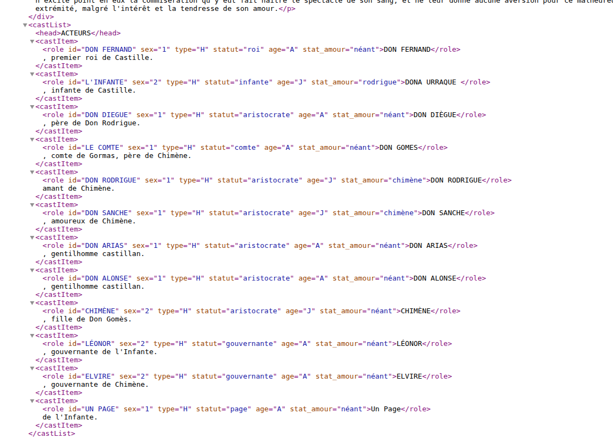<!-- .element: style="width:45%;float:right;margin-right:-1em;" -->

===

En informatique, la modélisation y prend un sens plus technique : il s'agit de formaliser un domaine de manière suffisamment explicite pour qu'un traitement automatique soit possible. On modélise des données, des processus, des connaissances (ontologies, graphes de connaissances) ou des documents (le balisage de la TEI est un cas typique en humanités numériques). Willard McCarty a fait de la modélisation le cœur de la méthode des humanités numériques : construire un modèle, c'est expliciter ses hypothèses, et l'écart entre le modèle et l'objet devient lui-même source de connaissance. 

La modélisation informatique impose de choisir ce qui est calculable, donc de discrétiser, de catégoriser et de formaliser, ce qui n'est jamais neutre.

§§§§§§§§§§§§§§§§§§§§§§§§§§§§§§§§§§§§§§§§§§§§§

Modélisation TEI des personnages du *Cid* de Corneille

<!-- .element: style="width:600px" -->

===

Ici on voit les questions de recherche autour de l'étude des personnages.

La modélisation consiste donc à décomposer un problème en une succession d'étape, de variables ou de scénarios possibles, afin de produire un pogramme fonctionnel pour remplir une tâche précise. 

Ce qu'il faut comprendre, c'est que la modélisation implique :
- un travail conceptuel majeur : il faut bien comprendre les phénomènes pour être capable de les décrire et de les décomposer étape par étape. 
- un travail forcément biaisé : on tente d'objectiver un phénomène. On voit bien le problème avec l'applicationd de rencontre. Il est question là de désir, d'amour... est-ce que ces émotions sont calculables et modélisables ?

Les nouvelles générations d'IA reposent sur un système que l'on va qualifier de probabiliste. C'est-à-dire que lorsque vous poser une question à un chatbot, la réponse ne se base pas sur un raisonnement modélisé en amont, mais sur la probabilité de la réponse. Cela ne veut pas dire que les IAG n'ont pas de modèle, mais que le modèle se trouve ailleurs, dans les LLM, les vastes modèles de données entraînées, des modèles de langage. La modélisation est moins évidente, moins contrôlée et plus difficile à maîtriser ou discuter.

§§§§§§§§§§§§§§§§§§§§§§§§§§§§§§§§§§§§§§§§§§§§§

#### Des modèles, des questions de recherche

>« Computers are essentially modeling machines, not knowledge jukeboxes »

(Mc Carthy, 2008 : chap. 19, p. 2).

§§§§§§§§§§§§§§§§§§§§§§§§§§§§§§§§§§§§§§§§§§§§§

La problématique des humanités numériques littéraires : peut-on modéliser la littérature, soit l'usage littéraire du langage ? Et si oui, comment ? Comment ces modélisations nous permettent-elles de produire une théorie du fait littéraire ?

§§§§§§§§§§§§§§§§§§§§§§§§§§§§§§§§§§§§§§§§§§§§§

### Brainstorm collectif : modélisons ensemble une méthodologie de la recherche en études littéraires

Quelles sont les compétences que vous allez devoir mobiliser afin de réaliser votre mémoire de recherche ? 

§§§§§§§§§§§§§§§§§§§§§§§§§§§§§§§§§§§§§§§§§§§§§

Parmi ces compétences/tâches, lesquelles seraient selon vous automatisables ? 
Lesquelles souhaitez-vous automatiser ? Lesquelles ne souhaitez-vous surtout pas automatiser ? 