## Modéliser et automatiser l’écriture 

### De la combinatoire aux llm et IAG

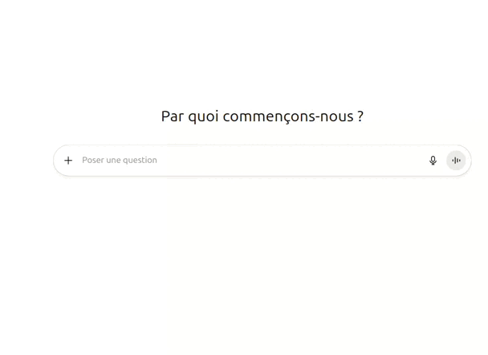<!-- .element: style="width:400px" -->

===

L'objectif de cette séance est de questionner le conséquences esthétiques, épistémologiques et politiques des IAG, la dernière grande "révolution numérique" qui agite depuis 4-5 ans à présent le débat public. 
À travers le développement d'outils grand public, comme CHatGPT, Midjourney etc., les IAG ont investi de très nombreux secteurs, et personne ne semble épargné par les mutations sociales et sociétales qu'elles engagent. On adressera cette question des IAG depuis le prisme de notre cours, Édition et littérature numérique. 

En vérité, il y a plusieurs angles possibles pour traiter cette question. 

§§§§§§§§§§§§§§§§§§§§§§§§§§§§§§§§§§§§§§§§§§§§§

* La problématique esthétique : statut de l'auteur et imaginaire de la création

<!-- .element: style="width:45%;float:right;margin-right:-1em;" -->

<!-- .element: style="width:45%;float:left;margin-right:-1em;" -->

===

Tout d'abord un angle "esthétique", qui renvoie à un questionnement d'ordre philosophique, et au statut que l'on accorde à l'auteur (figure symbolique, imaginaire) ainsi qu'à la création.  

Le principe même de la création, qui serait un trait caractéristique des humains, et qui renvoie à l'inspiration, à la sacralisation de l'artiste, est ainsi en jeu. On se rappelle de l'incipit de l'*Illiade* : "Chante, Déesse, la colère d'Achille..." = appel à la déesse qui va inspirer l'artiste. L'artiste est ainsi une figure qui a été traitée de manière contradictoire dans notre culture :
- un être "inspiré" (par les Dieux)
- un être de "génie" (qui est une autre manière de penser l'inspiration divine dans un contexte où la religion est moins présente)
- un être qui maîtrise une technique (et, dans ce cas, on peut apprendre à devenir artiste en maîtrisant son art, qui va être défini par des règles, des savoir faire, etc.)
Depuis l'Antiquité on a ces deux conceptions de l'artiste : chez Aristote (*La Tragédie*) = définition des règles de l'art tragique. Chez Platon, au contraire, le poète est celui qui est "inspiré", c'est pour cela qu'il doit être chassé de la cité, car on ne peut le maîtriser. Je simplifie, bien sûr, c'est pas un cours de philo ici. 

AUjourd'hui, la communauté est divisée : certains créateurs, en littérature, en audiovisuel, en musique, en arts plastiques, ont embrassé les techno IA. Avec comme argument que l'IA est un outil de création comme un autre, une voie de plus dans l'automatisation, par exemple (comme qd on est passé du manuscrit à la machine à écrire, puis au logiciel de traitement de texte).

Jean Boîte, publie en anglais un roman, 1 the Road, exclusivement écrit par une IA entraînée sur des livres classiques américains. En 2023, l’agrégé de lettres français Raphaël Doan publie une uchronie, Si Rome n’avait pas chuté (Passés composés), dont le bandeau donne le ton : « Le premier livre d’histoire écrit et illustré avec une intelligence artificielle. »

Le phénomène inquiète les artistes. S’ils reconnaissent que, derrière l’IA, il y a toujours la demande d’un homme ou d’une femme, la part humaine de cette œuvre, qu’il s’agisse d’une image, d’un roman ou d’un morceau de musique, semble se réduire à un « prompt », c’est-à-dire à la simple commande adressée à la machine. Si le geste artistique se limite à écrire un projet en quelques phrases à destination de l’IA, qui de l’humain ou de la machine est artiste ?

§§§§§§§§§§§§§§§§§§§§§§§§§§§§§§§§§§§§§§§§§§§§§

### Le malentendu des IAG

Les IAG produisent un effet de fascination, qui tend à faire passer les outils grand public pour des "oracles". Comme le poète antique, les IAG produiraient des textes de manière magique. Au contraire, les générateurs de texte, depuis la combinatoire pionnière jusqu'aux IAG comme ChatGPT, reposent entièrement sur un principe de _modélisation_. C'est-à-dire sur l'idée que le langage, et plus encore certaines applications du langage (écrire une lettre d'amour, par exemple), peuvent être décomposés en un ensemble de règles précises, reproductibles à l'infini. Étudier les principes modélisants devient de fait un enjeu épistémologique et esthétique majeur. 

<!-- .element: style="font-size:1.9rem; text-align:justify" -->

===

Modélisation : tout algorithme, tout programme informatique a une fonction précise. Par exemple, si vous utilisez une application de rencontre amoureuse, les dév de cette application devront avoir modélisé et décomposé l'ensemble des étapes et des critères nécessaires à l'accomplissement d'un objectif = trouver 1 partenaire. 

Cela peut-être : ouvrir l'application, renseigner des critères de recherche préalable (et donc envisager les différentes variables possibles : est-ce qu'on est plutôt intéressés par les coordonnées géographiques, ou le physique, etc.)

La modélisation consiste donc à décomposer un problème en une succession d'étape, de variables ou de scénarios possibles, afin de produire un pogramme fonctionnel pour remplir une tâche précise. 

Ce qu'il faut comprendre, c'est que la modélisation implique :
- un travail conceptuel majeur : il faut bien comprendre les phénomènes pour être capable de les décrire et de les décomposer étape par étape. 
- un travail forcément biaisé : on tente d'objectiver un phénomène. On voit bien le problème avec l'applicationd de rencontre. Il est question là de désir, d'amour... est-ce que ces émotions sont calculables et modélisables ?

Les nouvelles générations d'IA reposent sur un système que l'on va qualifier de probabiliste. C'est-à-dire que lorsque vous poser une question à un chatbot, la réponse ne se base pas sur un raisonnement modélisé en amont, mais sur la probabilité de la réponse. Cela ne veut pas dire que les IAG n'ont pas de modèle, mais que le modèle se trouve ailleurs, dans les LLM, les vastes modèles de données entraînées, des modèles de langage. La modélisation est moins évidente, moins contrôlée et plus difficile à maîtriser ou discuter.

§§§§§§§§§§§§§§§§§§§§§§§§§§§§§§§§§§§§§§§§§§§§§

* La problématique sociale : automatiser/remplacer les métiers (auteurs, éditeurs)

<!-- .element: style="width:400px" -->

===

Une autre façon de questionner les IAG est plus pragmatique : c'est aussi un questionnement social, dans un contexte contemporain de précarisation croissante des auteurs-créateurs. Vivre de sa plume est aujourd'hui très compliqué pour les auteurs, scénaristes, illustrateurs, etc. Ça n'a jamais été simple, mais il y a aujourd'hui des revendications particulières, et un conflit avec les producteurs, éditeurs, etc. 

Crainte, donc, pour les emplois : vont-ils disparaître, être bouleversé, modifiés ?

Du côté des films d’animation, le fondateur de DreamWorks, Jeffrey Katzenberg, estime :

« Au bon vieux temps, il fallait cinq ans et 500 artistes pour réaliser un film d’animation de classe mondiale. Bientôt, il ne faudra pas 10 % de cela. »

Dans le secteur éditorial, des tâches spécifiques sont aujourd'hui menacées :
- la traduction 
- la révision ortho-typo
- la mise en page

§§§§§§§§§§§§§§§§§§§§§§§§§§§§§§§§§§§§§§§§§§§§§

### Modélisation et automatisation : deux caractéristiques de l'édition
La formalisation des normes et des standard éditoriaux est consubstantielle à l'histoire de l'édition, tout comme les techniques d'automatisation. Ces dernières structurent les métiers de l'édition et l'ensemble de la chaîne de production des ouvrages. 

<!-- .element: style="font-size:1.9rem; text-align:justify" -->

===

Il faut rappeler ici que la modélisation et l'automatisation sont au coeur des pratiques éditoriales et de la professionnalisation de l'édition depuis au moins l'invention de l'imprimerie. 

- c'est ce que l'on a vu avec l'invention des premiers standards après l'invention de l'imprimerie
- c'est aussi le développement d'un marché de l'édition, avec des techniques toujours plus rapides pour produire des livres.

Une modélisation de l'édition = chaîne éditoriale. Quelles sont les étapes pour produire un livre ? À quoi un livre doit-il ressemble (règles de présentation, de mise en forme) ? 
L'organisation des bibliothèques est elle-même soumise à une modélisation des contenus littéraires. C'est le principe de la classification Dewey/CDU : elle répartit les connaissances humaines en dix catégories notées de 0 à 9, le 0 étant réservé aux généralités « en général ». Chaque catégorie est normalement divisée en dix parties (toutes les classes et sous-classes ne sont pas utilisées).

§§§§§§§§§§§§§§§§§§§§§§§§§§§§§§§§§§§§§§§§§§§§§

* La problématique socio-technique :
    - coût environnemental
    - coût social, sociétal
    - coût politique, éthique

===

Une dernière manière de penser la problématique des IAG, est socio-technique. 

Les IAG, en tant que technologie, sont aujourd'hui doublement invisibilisées. Invisibilisées par des entreprises, qui ont lancé des outils aujourd'hui massivement utilisés : 
- chatGPT est ainsi largement devenue par antonomase l'arbre qui cache la forêt de la réalité technique et industrielle des IAG, avec toutes les alternatives qu'elle peut comprendre
- invisibilisé par des interfaces (on y reviendra)

§§§§§§§§§§§§§§§§§§§§§§§§§§§§§§§§§§§§§§§§§§§§§

## Un débat de société face à un changement paradigmatique majeur

===

Concrètement, ces questionnements renvoient à une inquiétude plus générale et relayée dans le monde entier : avons-nous trouvé là une technologie qui serait sur le point de nous engloutir ? 

Il faut dire que l'état du débat n'est pas très rassurant.

§§§§§§§§§§§§§§§§§§§§§§§§§§§§§§§§§§§§§§§§§§§§§

### Le péril IA&nbsp;? La bataille des pionniers

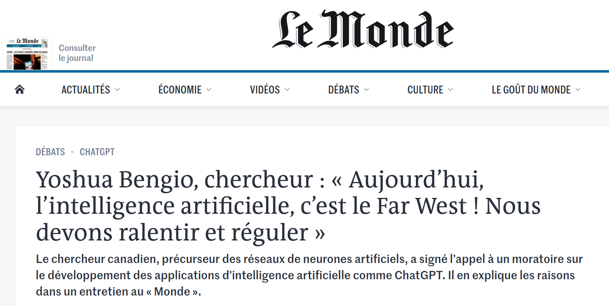<!-- .element: style="width:50%;float:left;margin-right:-1em;" -->

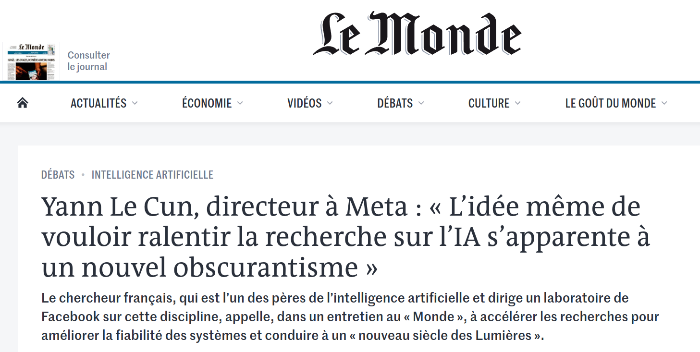<!-- .element: style="width:50%;float:right;margin-right:-1em;" -->

===

Point d'orgue : la signature en janvier 2023 d'une pétition pour stopper pdt 6 mois le développement de l'IA. Avec de grands signataires, dont Elon Musk ou encore Joshua Bengio.

L'accélération des progrès de l'IA, incarnés par quelques outils fortement médiatisés comme Chat GPT, a lancé un véritable débat public, entre experts et moins experts, entre concepteurs de l'IA et population, travailleurs impactés par l'IA. 
L'iA est devenue un enjeu de société. Avec des désaccords profonds y compris au sein de la communauté des chercheurs.
Dans *Le Monde*, publication de 2 entretiens totalement contradictoires entre Le Cun et Bengio.

Yan LeCun"Scientifique en chef" de l'IA chez Meta

Yoshua Bengio : Directeur scientifique du MILA (Institut québécois d’intelligence artificielle)

§§§§§§§§§§§§§§§§§§§§§§§§§§§§§§§§§§§§§§§§§§§§§

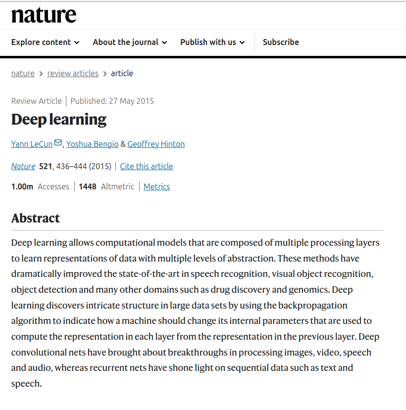<!-- .element: style="width:400px" -->

===

Bengio et Lecun sont, avec Geoffrey Hinton, Co-auteurs de l'article scientifique le plus cité dans le domaine de l'IA.

§§§§§§§§§§§§§§§§§§§§§§§§§§§§§§§§§§§§§§§§§§§§§

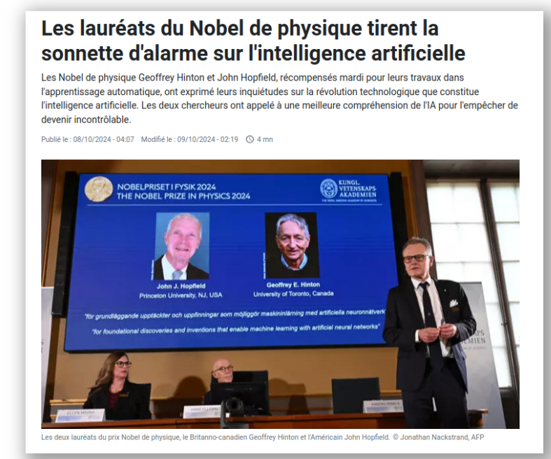<!-- .element: style="width:400px" -->

===

Geoffrey Hinton, prix nobel de physique 2024 pour ses travaux sur l'apprentissage automatique

§§§§§§§§§§§§§§§§§§§§§§§§§§§§§§§§§§§§§§§§§§§§§

>"Les résultats restent imprévisibles, et nous ne comprenons pas parfaitement le fonctionnement de ce processus très complexe. Cela pose des questions de sécurité, de transparence, de fiabilité. On s’aperçoit très vite que ces systèmes inventent parfois des réponses, qu’ils peuvent aller dans une direction que n’ont pas choisie les programmeurs. La seule façon de les réorienter, c’est de les récompenser lorsque la réponse est pertinente. Depuis des mois, les concepteurs de ChatGPT travaillent à parer les coups, mais ce n’est pas suffisant."

<!-- .element: style="width:45%;float:left;margin-left:-1em; font-size:1.4rem; text-align:justify" -->

<!-- .element: style="width:45%;float:right;margin-right:-1em;" -->

===

Pour Bengio : le pb est celui de notre manque de compréhension de la façon dont fonctionne l'IA.
Technologie non maîtrisée = prise de risque.

Pour lui, c'est donc une question éthique.

§§§§§§§§§§§§§§§§§§§§§§§§§§§§§§§§§§§§§§§§§§§§§

>"Ces capacités donnent l’impression que le système est intelligent, mais en fait elles restent superficielles. ChatGPT n’est pas intelligent comme peut l’être un humain. C’est un outil de prédiction, qui associe entre eux des mots apparaissant de façon la plus probable dans le corpus qui a servi à l’entraîner, afin de continuer un texte. [...] Ce sont des outils très utiles pour accélérer l’écriture de textes, en particulier de code informatique. Ils peuvent améliorer la productivité de nombreux professionnels, comme les programmeurs, ou les médecins qui veulent rédiger plus vite leurs comptes rendus de consultations. Il faut seulement informer les utilisateurs des limites de l’application : on ne peut pas s’en servir comme moteurs de recherche, ni se reposer sur les informations qu’elle produit sans les vérifier."

<!-- .element: style="width:45%;float:left;margin-left:-1em; font-size:1.4rem; text-align:justify" -->

<!-- .element: style="width:45%;float:right;margin-right:-1em;" -->

§§§§§§§§§§§§§§§§§§§§§§§§§§§§§§§§§§§§§§§§§§§§§

>Je fais partie de ceux qui pensent que le progrès, qu’il soit scientifique ou social, dépend étroitement de l’intelligence. Plus les gens sont éduqués, instruits, capables de raisonner et d’anticiper ce qui va se produire, plus ils peuvent prendre des décisions bénéfiques à long terme. Avec l’aide de l’IA, l’intelligence humaine va être amplifiée, non seulement celle de l’humanité entière, mais aussi l’intelligence et la créativité de tout un chacun. Cela peut conduire à une renaissance de l’humanité, un nouveau siècle des Lumières.

<!-- .element: style="font-size:1.9rem; text-align:justify" -->

>Yan LeCun

<!-- .element: style="font-size:1.9rem; text-align:right" -->

§§§§§§§§§§§§§§§§§§§§§§§§§§§§§§§§§§§§§§§§§§§§§
<!-- .slide: data-background-video="img/HAL 9000_ _I'm sorry Dave" data-background-size="contain" -->

===

Fantasme qui fait lui-même écho à une problématique philosophique qui prend en fait racine dès l'Antiquité : la relation qui unit l'homme à la machine, et plus largement à la technique. 

imaginaire : la fiction a créé des personnage d'IA qui ont tendance à s'avérer maléfiques. 

Exemple le plus connu est HAL, l'IA créée par Stanley Kubrick dans 2001 l'Odyssée de l'espace (1968):

>HAL 9000 (traduit en CARL 500 en version française) est un personnage de fiction, un supercalculateur doté d'intelligence artificielle. Il a été conçu pour gérer de manière autonome les fonctions vitales du vaisseau spatial Discovery One, en mission dans l'espace vers la planète Jupiter. (WIKIPÉDIA)

Dans le film, HAL, dont la mission est d'assurer la réussite d'une mission scientifique d'exploration, va tenter d'assassiner l'ensemble de l'équipage de son vaisseau, après avoir estimé que les humains mettaient en péril la dite mission. 

À la fin, un dernier astronaute survivant parvient à déconnecter certaines fonctionnalités de HAL qui redevient une machine standard. On assiste alors à la "mort" de l'IA 

>Régressant au fur et à mesure que les barrettes-mémoires sont déconnectées, HAL affirme à Dave : « J'ai peur », et semble être conscient de l'évaporation de sa conscience : « Mon esprit s'en va, je le sens… »

Il s'agit là d'un des premiers exemples, sans doute les plus marquant, d'IA maléfique. Le cinéma contemporain en a produit bcp d'autres. Plus récemment, le Marvel Universe a repris JARVIS, l'IA créée par Iron Man.

Ces fictions ont participé autant à relayer qu'à entretenir, voir créer une angoisse collective autour du pouvoir que l'on va conférer aux machines supposées pallier à nos propres besoins, et réaliser des tâches fastidieuses ou aliénantes à notre place. Mais justement, jusqu'à quel point ces machines peuvent-elles prendre notre place ? 

§§§§§§§§§§§§§§§§§§§§§§§§§§§§§§§§§§§§§§§§§§§§§

### Au fait, c'est quoi l'IAG ?

L'émergence d'outils grand public comme ChatGPT a créé un emballement autour du terme "IA", qui renvoie à un concept théorique et pratique en vérité très ancien. Aujourd'hui, une grande confusion existe entre le terme "IA" et des outils de type chatbot servant d'interface à des systèmes génératifs (Chat GPT, Midjourney, etc.) qui créent du contenu (son, texte, image, code...).

<!-- .element: style="font-size:1.5rem; text-align:justify" -->

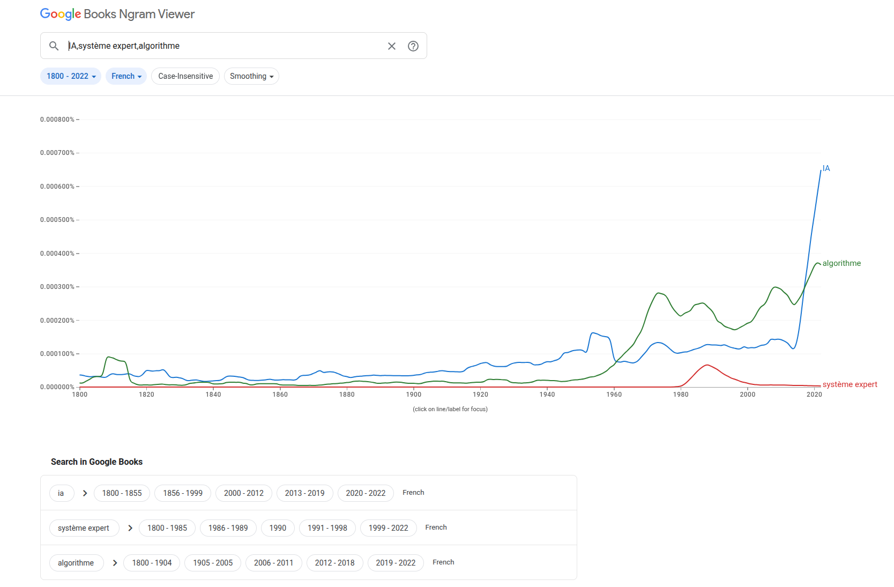<!-- .element: style="width:600px" -->

===

On ne peut répondre à cette question est impossible sans comprendre préalablement de quoi on parle vraiment. J'imagine qu'ici vous avez toutes et tous utilisé un outil comme Chat GPT. Chat GPT est la pire chose pour comprendre ce qu'est une IA. 

L'émergence d'outils grand public comme ChatGPT a créé un appel d'air autour du terme "IA", qui renvoie à un concept théorique et pratique en vérité très ancien. Aujourd'hui, une grande confusion existe entre le terme "IA" et des outils de type chatbot servant d'interface à des systèmes génératifs (Chat GPT, Midjourney, etc.) 

De fait, je vous encouragerait à utiliser plutôt les termes d'IAG (Intelligence artificielle générative), qui désignent des technologies de création de contenu, de génération de contenus (texte, images, sons), aujourd'hui implémentées dans des outils grand public : copilot, chatGPT, etc. 

§§§§§§§§§§§§§§§§§§§§§§§§§§§§§§§§§§§§§§§§§§§§§

### D'accord, mais c'est quoi l'IA-G ?

===

Cette précision est intéressante, mais elle ne résoud pas le problème, c'est quoi une IA-G, comment ça marche ?

Le pb de l'IA c'est sans doute son nom, "IA", qui prête à bien des confusions et des fantasmes. 

§§§§§§§§§§§§§§§§§§§§§§§§§§§§§§§§§§§§§§§§§§§§§

#### "Intelligence artificielle"  une expression problématique et polémique

### Qu'est-ce que l'intelligence ? 

(vous avez 2h)

===

Le principal problème, c'est d'ailleurs l'intelligence, qui est un concept que l'on a du mal à saisir. 

L'idée d'une intelligence artificielle repose sur un projet scientifique et technique : être capable de modéliser les comportements humains afin de construire des outils, des machines, capable d'opérer les mêmes réalisations que les humains. 

C'est tout le principe des sciences de l'information et de la communication : comprendre comment fonctionne l'humain pour créer des machines qui permettent à celui-ci de mieux communiquer avec ses semblables. 

§§§§§§§§§§§§§§§§§§§§§§§§§§§§§§§§§§§§§§§§§§§§§

#### Générative ?
* Automatiser la production du texte
* Le mythe du texte qui s'écrit tout seul
* Une quête formaliste, poétique, ludique... 

<!-- .element: style="font-size:1.7rem; text-align:left" -->

...qui n'a pas attendu ChatGPT !

<!-- .element: style="font-size:1.7rem; text-align:right" -->

===

§§§§§§§§§§§§§§§§§§§§§§§§§§§§§§§§§§§§§§§§§§§§§
<!-- .slide: data-background-video="img/queneau.mp4" data-background-size="contain" -->

===

On a tjrs généré des textes.

L’OULIPO et la contrainte... 

§§§§§§§§§§§§§§§§§§§§§§§§§§§§§§§§§§§§§§§§§§§§§

### Définition générale

>GENERATEUR DE TEXTE : Un générateur de texte est un programme qui crée du texte à partir d’un ensemble de règles qui constituent une grammaire et d’un ensemble d’éléments préconstruits qui forment un dictionnaire. Le terme « texte » est pris, dans toute cette section sur la génération, dans le sens le plus classique de « tissu de mots».

>Philippe Bootz, *La littérature numérique*, 2007.

§§§§§§§§§§§§§§§§§§§§§§§§§§§§§§§§§§§§§§§§§§§§§

### Les générateurs combinatoires et automatiques

La génération de texte repose initialement sur un principe *combinatoire*. Un générateur combinatoire est un générateur de texte qui combine selon des règles algorithmiques spécifiques des fragments de textes préconstruits. Le générateur va ainsi tenter d’épuiser toutes les possibilités d’une structure à partir de différentes combinaisons des fragments entre eux. 

===

§§§§§§§§§§§§§§§§§§§§§§§§§§§§§§§§§§§§§§§§§§§§§
<!-- .slide: data-background-image="img/stratchey-Monfort.png" data-background-size="contain" -->

Source : [Émulateur de _Love Letters_ (1952), based on a work by Christopher Strachey, code by Nick Montfort](https://nickm.com/memslam/love_letters.html)

<!-- .element class="source"-->

===

§§§§§§§§§§§§§§§§§§§§§§§§§§§§§§§§§§§§§§§§§§§§§

## Atelier : étudier la modélisation de l'échange épistolaire amoureux chez Christopher Stratchey

<!-- .element: style="width:200px" -->

§§§§§§§§§§§§§§§§§§§§§§§§§§§§§§§§§§§§§§§§§§§§§

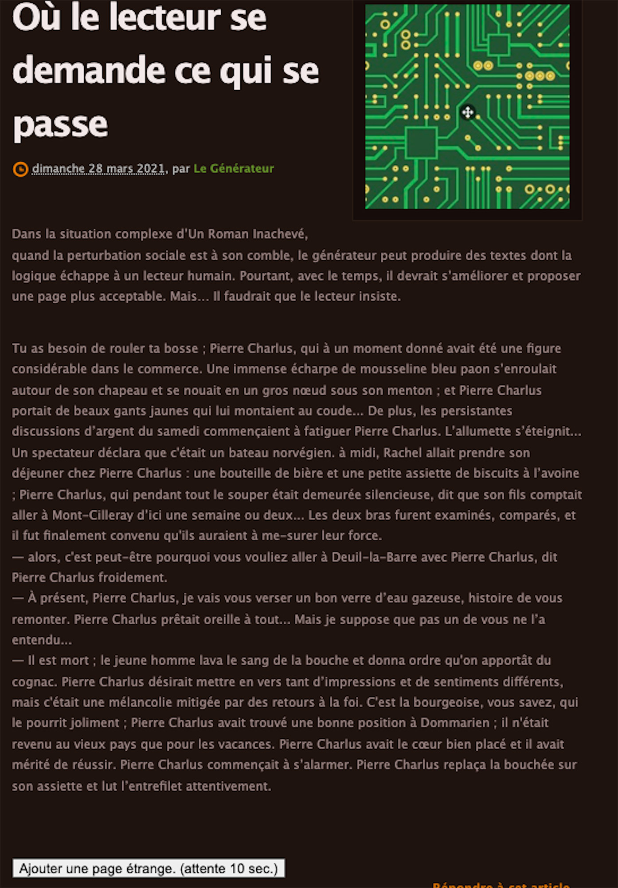<!-- .element: style="width:35%;float:right;margin-right:-1em;" -->

>Ce qui m’intéresse dans la génération, ce n’est pas le texte qui s’affiche. Ce texte-là est un moment comme un autre, on s’en fout. […] Ce qui m’intéresse, c’est cette capacité à produire à l’infini et à générer un univers que je ne suis pas capable de faire. C’est donc un autre substitut qui transmet une pensée qui dit. Peut-être est-ce un fantasme d’éternité.  Jean-Pierre Balpe

<!-- .element: style="width:40%;float:left;margin-left:-1em; font-size:1.4rem; text-align:justify" -->

===

Oeuvre dans un paradigme "contemporain" (emprunté à l'art contemporain)

Ce qui compte, c'est l'idée, c'est le projet. Oeuvres très réflexives. 

Comment on analyse ce type d'oeuvre ? 

§§§§§§§§§§§§§§§§§§§§§§§§§§§§§§§§§§§§§§§§§§§§§

### Les intelligences artificielles : 70 ans d'histoire

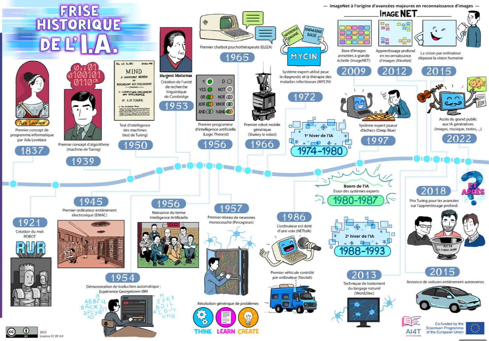<!-- .element: style="width:600px" -->

Source : [Carte interactive Histoire de l'IA (Ministère EN)](https://view.genially.com/64e486d0efc8e200198a554b)

<!-- .element class="source"-->

§§§§§§§§§§§§§§§§§§§§§§§§§§§§§§§§§§§§§§§§§§§§§

## Déjà trois printemps et deux hivers  (bientôt trois ?)

* Une proposition théorique (1950-60)
* Les systèmes "experts" (1980-1999)
* Les systèmes connexionnistes (2020)

<!-- .element: style="font-size:1.7rem; text-align:center" -->

####  Autant de modélisations distinctes de "l'intelligence"

===

§§§§§§§§§§§§§§§§§§§§§§§§§§§§§§§§§§§§§§§§§§§§§

### Première vague : les années 1950 et les développements de l'informatique

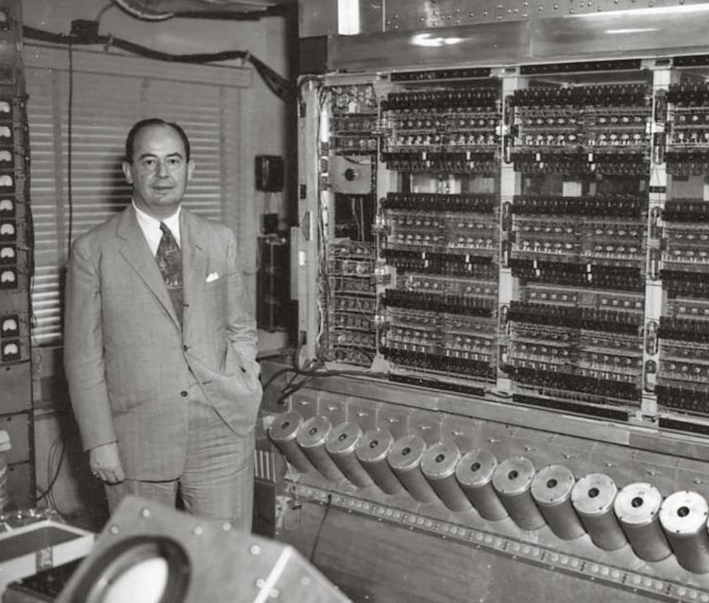<!-- .element: style="width:40%;float:left;margin-right:-1em;" -->

<!-- .element: style="width:40%;float:right;margin-right:-1em;" -->

===

On peut poser pour date de naissance de l'IA les années 1950, avec les travaux du mathématicien Alan Turing souvent considéré comme le véritable père de l’informatique. Dans un article fondateur publié en 1936, il pose les bases théoriques d’une machine capable de tout calculer en décomposant l’information en deux valeurs, 0 et 1, qui constituera le langage en base binaire de l’informatique. Cette machine deviendra plus tard l'ordinateur.

Rappel : Turing n'a quasiment joué aucun rôle dans la construction effective des ordi. Mais il a conceptualisé une machine dite de Turing, une machine "abstraite" ou "théorique" qu’il a inventée pour expliquer la notion de "procédure mécanique" ou algorithme.

La machine de Turing = un automate imaginaire muni d’un programme et pouvant lire et écrire des caractères sur un ruban de longueur illimitée.

§§§§§§§§§§§§§§§§§§§§§§§§§§§§§§§§§§§§§§§§§§§§§

Le *test de Turing* (1950) : une définition de l'intelligence au miroir de la machine

Dans son article ["Computing Machinery and Intelligence" (*Mind*, 1950)](https://archive.org/details/MIND--COMPUTING-MACHINERY-AND-INTELLIGENCE), Alan Turing, considéré comme le "père de l'informatique", propose l'équation suivante : si un humain interragit avec une machine pendant 5 minutes, sans réaliser qu'il a en face de lui une machine, alors cette machine peut être qualifiée d'"intelligente". Son test est basé sur un jeu d'imitation, qui conduit à simuler, donc à modéliser l'intelligence humaine.

<!-- .element: style="width:40%;float:left;margin-left:-1em; font-size:1.4rem; text-align:justify" -->

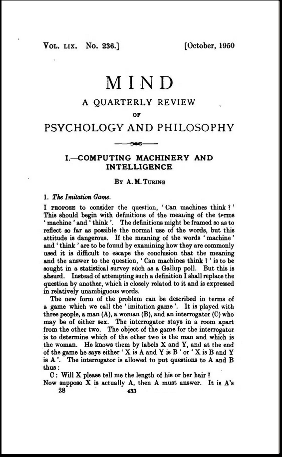<!-- .element: style="width:35%;float:right;margin-right:-1em;" -->

=== 

Un peu plus tard, en 1950, Turing publie un article dans lequel il évoque le premier l’intelligence des machines
et invente un test, le test de Turing ou jeu de l’imitation.

>Dans ce test, une machine est dite intelligente quand elle parvient à tromper pendant cinq minutes un utili-
sateur discutant avec elle sans que cet utilisateur se rende compte qu’il échange avec une machine : la
machine imite si intelligemment le raisonnement des humains que ceux-ci s’y laissent prendre. Cardon

Évidemment, ce test -- qui ne pose pas encore le concept d'IA à proprement parler -- pose de nombreux problèmes philosophiques : on définit ici l'intelligence de la machine en fonction de celle (présupposée) de l'humain. Il y a fort à parier que d'un humain à l'autre, l'illusion d'interragir avec un humain est très variable.

§§§§§§§§§§§§§§§§§§§§§§§§§§§§§§§§§§§§§§§§§§§§§

### La conférence de Dartmouth et la proposition de John McCarthy (1956)

On doit l'invention du terme Intelligence artificielle à John McCarthy qui le propose tout d'abord lors de la Conférence de Dartmouth en 1956.

<!-- .element: style="width:45%;float:left;margin-left:-1em; font-size:1.4rem; text-align:justify" -->

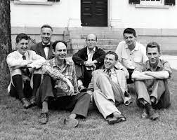<!-- .element: style="width:40%;float:right;margin-right:-1em;" -->

===

On doit l'invention du terme Intelligence artificielle à John McCarthy qui le propose tout d'abord lors de la Conférence de Dartmouth en 1956.

La conférence de Dartmouth (Dartmouth Summer Research Project on Artificial Intelligence) est un atelier scientifique organisé durant l'été 1956, qui est considéré comme l'acte de naissance de l'intelligence artificielle en tant que domaine de recherche autonome : elle réuni vingt chercheurs dont Claude Shannon, Nathan Rochester (en), Ray Solomonoff, Trenchard More (en), Oliver Selfridge (en), Allen Newell et Herbert Simon.

Considéré comme l'un des pères de l'IA, John McCarthy développe dans son Laboratoire de l'Université Standford une conception particulièrement optimiste (ou effrayante, c'est selon) de l'IA : McCarthy considère que l'on peut rendre les machines intelligentes, qu'elles seront un jours capable de parler, raisonner, de nous remplacer dans des tâches complexes. Selon lui, elles pourraient même se voir dotées d'une conscience... 

Cette utopie que l'on a souvent moquée, qui a été longtemps considérée comme impossible, revient aujourd'hui sur le devant de la scène.

§§§§§§§§§§§§§§§§§§§§§§§§§§§§§§§§§§§§§§§§§§§§§

### Une approche "symbolique"
Les premières conceptions de l'IA s'emploient à programmer la machine pour qu'elle puisse reproduire les formes symboliques et logiques du raisonnement dit naturel. La notion d'"intelligence" est alors elle-même située : il s'agit de transférer à la machine une capacité à raisonner calquée sur le modèle humain. 

<!-- .element: style="font-size:1.7rem; text-align:justify" -->

Mais savons-nous vraiment comment nous pensons ? 

<!-- .element: style="font-size:1.7rem; text-align:justify" -->

===

Le projet d’intelligence artificielle des deux premières vagues, celle des années 1960 et celle des années 1980
était d’ordre « symbolique ». 

Chez les premiers concepteurs et chercheurs ayant travaillé autour de l’intelligence artificielle, tous les efforts ont été mis en oeuvre afin de transférer vers la machine une capacité à raisonner calquée sur le modèle humain. On voulait vraiment que la machine puisse penser comme nous (ou, plus exactement et plus intéressant, quoi que plus tordu : comme nous pensons penser). 

Selon cette première stratégie, il s'agissait alors de programmer la machine pour qu'elle puisse reproduire les
formes symboliques et logiques du raisonnement dit naturel. 

Dans ce modèle, on a une définition de l'intelligence qui est en fait totalement calquée sur celle de l'humain, et son raisonnement logique séquentiel.

§§§§§§§§§§§§§§§§§§§§§§§§§§§§§§§§§§§§§§§§§§§§§

### Seconde vague : les années 1980 et le développement des "systèmes experts"

Un système expert est un outil informatique d’intelligence artificielle, conçu pour simuler le savoir-faire d’un spécialiste, dans un domaine précis et bien délimité, grâce à l’exploitation d’un certain nombre de connaissances fournies explicitement par des experts du domaine.

<!-- .element: style="width:45%;float:left;margin-left:-1em; font-size:1.4rem; text-align:justify" -->

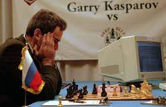<!-- .element: style="width:40%;float:right;margin-right:-1em;" -->

====

Concrètement, cette approche s'est traduite dans les années 1980 par la conception et l'expérimentation de « systèmes-experts ».

Un système expert est un programme informatique conçu pour simuler le savoir-faire d’un spécialiste, dans un domaine précis et bien délimité, grâce à l’exploitation d’un certain nombre de connaissances fournies explicitement par des experts du domaine.

Concrètement, des programmeurs font ingérer au programme des ensembles très sophistiqués de règles de raisonnement, afin qu'ils solutionnent des problèmes.

Il s'agit plus précisémment de scénariser très finement dans un programme l'ensemble des aspects possibles d'un processus, afin de l'automatiser.

L’IA symbolique utilise le **raisonnement formel et la logique** ; c’est une approche cartésienne de l’intelligence, où les connaissances sont encodées au départ à partir d’axiomes desquels on déduit des conséquences.

Voyons ensemble l'un des exemples de système expert les plus médiatisés : celui de Deep Blue, l'ordinateur joueur d'échec.

§§§§§§§§§§§§§§§§§§§§§§§§§§§§§§§§§§§§§§§§§§§§§
<!-- .slide: data-background-video="img/GasparovDeepBlue.mp4" data-background-size="contain" -->

§§§§§§§§§§§§§§§§§§§§§§§§§§§§§§§§§§§§§§§§§§§§§

### Deep blue, système-expert du jeu d'échec

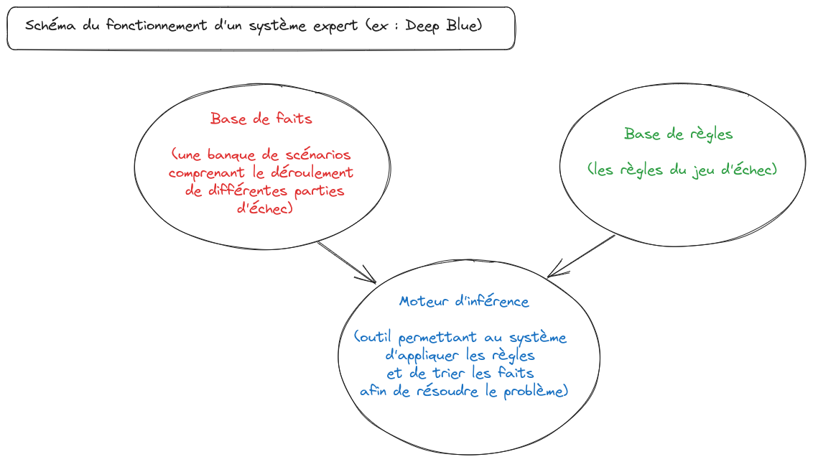

===

Deep blue est un système expert conçu pour gagner aux échecs: il simule le raisonnement et le savoir-faire du joueur d'échec, en piochant dans un ensemble de règles et de connaissances préétablies concernant le jeu d'échec.

Comme tout système expert, Deep blue est composé de trois éléments :
- base de faits à disposition = une banque de scénarios comprenant le déroulement de différentes parties (ici, un joueur a déplacé sa tour, puis son fou, puis il a gagné)
- base de règles imposées = les règles du jeu d'échec (une tour peut se déplacer horizontalement ou verticalement, en longue portée, mais sans pouvoir sauter au-dessus d'une autre pièce)
- le moteur d'inférence = outil permettant au système d'appliquer les règles et de trier les faits afin de résoudre le problème.

§§§§§§§§§§§§§§§§§§§§§§§§§§§§§§§§§§§§§§§§§§§§§
<!-- .slide: data-background-video="img/GasparovBattu.mp4" data-background-size="contain" -->

===

Que s'est-il passé ? 

Dans un article de *The Conversation*, Nicolas Sabouret revient sur cet épisode décisif de l'histoire des relations homme-machine, qui fût également un grand moment de télévision.

>Garry Kasparov a toutes ses chances et il le prouve en remportant la première manche. Mais dans la deuxième, tout bascule. La machine prend l’avantage après un 36e coup qui empêche Kasparov de menacer son roi. Le champion d’échec est alors mis en difficulté, la machine prend progressivement l’ascendant. Mais soudain, au 44e coup, Deep Blue commet une erreur. Une erreur terrible, inexplicable, qui aurait pu sauver Kasparov en lui assurant une partie nulle ! La machine déplace son roi sur la mauvaise case et, au lieu de s’assurer une victoire, elle offre à son adversaire une porte de sortie.

>Pourtant, Kasparov ne croit pas à l’erreur de la machine. Il pense qu’il n’a pas vu quelque chose, que la machine ne peut pas se tromper. Pas si grossièrement. Il ne saisit pas cette opportunité qui lui est donnée. Il se dit peut-être qu’il a loupé quelque chose. Au 45e coup, il abandonne la partie.

>La réaction de Garry Kasparov immédiatement après ce match est intéressante. Il accuse l’équipe de Deep Blue d’avoir triché, d’avoir fait appel à un joueur humain pour le battre. Pour le champion du monde, aucune machine n’aurait pu à la fois jouer l’excellent 36e coup et commettre cette erreur grossière au 44e. C’est donc forcément un joueur humain qui a dicté ce coup à Deep Blue. Comme beaucoup de non-spécialistes, Kasparov ne croit pas que la machine puisse être à ce point faillible. Il est à mille lieues de la vérité.

§§§§§§§§§§§§§§§§§§§§§§§§§§§§§§§§§§§§§§§§§§§§§

>La réaction de Garry Kasparov immédiatement après ce match est intéressante. Il accuse l’équipe de Deep Blue d’avoir triché, d’avoir fait appel à un joueur humain pour le battre. Pour le champion du monde, aucune machine n’aurait pu à la fois jouer l’excellent 36e coup et commettre cette erreur grossière au 44e. C’est donc forcément un joueur humain qui a dicté ce coup à Deep Blue. Comme beaucoup de non-spécialistes, Kasparov ne croit pas que la machine puisse être à ce point faillible. Il est à mille lieues de la vérité.

<!-- .element: style="font-size:1.7rem; text-align:justify" -->

Source : Nicolas Sabouret, "Pourquoi l’intelligence artificielle se trompe tout le temps", *The Conversation*, 2020.

<!-- .element: class="source" -->

§§§§§§§§§§§§§§§§§§§§§§§§§§§§§§§§§§§§§§§§§§§§§

### La théorie de la complexité et l'approche heuristique

>s’il est impossible d’avoir une solution exacte en un temps raisonnable, rien n’interdit d’écrire un programme qui ne calcule pas la solution exacte, mais une autre solution, a priori moins bonne. Les chercheurs en intelligence artificielle appellent ce type de calcul une « heuristique ». L’objectif de ces programmes est alors de calculer une solution raisonnablement correcte au problème, dans un temps de calcul qui reste acceptable. 

<!-- .element: style="font-size:1.7rem; text-align:justify" -->

Source : Nicolas Sabouret, "Pourquoi l’intelligence artificielle se trompe tout le temps", *The Conversation*, 2020.

<!-- .element: class="source" -->

===

Kasparov, comme la plupart d'entre nous, est victime d'un paradoxe d'objectivation de la machine : parce que la compétence de la machine est située dans le domaine du calcul (un ordi est une sorte de super calculateur), on a l'impression qu'elle ne peut se tromper, qu'elle n'a pas de limite à sa puissance de calcul. Cette croyance est paradoxale, car en même temps on cherche, comme Kasparov, à "battre" la machine sur son propre terrain, celui du calcul. 

Pourtant, la machine est bien faillible, et si elle l'est, c'est en raison de sa limite à pouvoir tout calculer : cette limite renvoie à ce que les chercheurs appellent la théorie de la complexité.

La théorie de la complexité est le domaine des mathématiques, et plus précisément de l'informatique théorique, qui étudie formellement le temps de calcul, l'espace mémoire (et plus marginalement la taille d'un circuit, le nombre de processeurs, l'énergie consommée…) requis par un algorithme pour résoudre un problème algorithmique. 

Dans le cas des échecs :
>Pour déterminer à coup sûr le coup gagnant, il faudrait regarder toutes les parties possibles, chaque joueur jouant alternativement l’une de ses 16 pièces sur le plateau de 64 cases. Au milieu du XXe siècle, le mathématicien Claude Shannon a estimé qu’il y a environ 10 puissance 120 parties d’échecs possibles. Cela s’écrit avec un 1 suivi de 120 zéros. [...] Même avec des machines dont la puissance de calcul continuerait de doubler tous les deux ans, comme le stipule la loi de Moore, nous sommes encore très loin de construire un ordinateur qui serait capable d’énumérer toutes ces parties avant de tomber en ruine (sans même parler de les jouer). (Sabouret) 

En d'autres terme, pour trouver comment gagner à coup sûr une partie d'échec, la complexité est trop grande : "il est impossible, quelle que soit la méthode utilisée, de construire un programme informatique qui y réponde sans y passer des millénaires." (Sabouret) 

§§§§§§§§§§§§§§§§§§§§§§§§§§§§§§§§§§§§§§§§§§§§§

>Le principe des programmes d’IA est donc de calculer des solutions pas trop mauvaises à des problèmes dont on sait, mathématiquement, qu’ils ne peuvent pas être résolus de façon exacte dans un temps de calcul raisonnable. Et pour cela, il faut accepter de faire parfois des erreurs. De ne pas avoir toujours la meilleure réponse, ou une réponse complètement correcte. C’est pourquoi tout programme d’IA fait forcément des erreurs. C’est inévitable et c’est même ce qui les caractérise. 

<!-- .element: style="font-size:1.7rem; text-align:justify" -->

Source : Nicolas Sabouret, "Pourquoi l’intelligence artificielle se trompe tout le temps", *The Conversation*, 2020.

<!-- .element: class="source" -->

===

Pour Sabouret, les solutions imparfaites sont donc le propre de L’intelligence artificielle 

>Le principe des programmes d’IA est donc de calculer des solutions pas trop mauvaises à des problèmes dont on sait, mathématiquement, qu’ils ne peuvent pas être résolus de façon exacte dans un temps de calcul raisonnable. Et pour cela, il faut accepter de faire parfois des erreurs. De ne pas avoir toujours la meilleure réponse, ou une réponse complètement correcte. C’est pourquoi tout programme d’IA fait forcément des erreurs. C’est inévitable et c’est même ce qui les caractérise. 

§§§§§§§§§§§§§§§§§§§§§§§§§§§§§§§§§§§§§§§§§§§§§

### La limite des systèmes experts, ou le second hiver de l'IA

>Qu’est-ce qui n’allait pas dans l’idée d’une machine raisonnant logiquement ? Tout simplement, que le fonctionnement de la pensée humaine est impossible à reproduire. Nous prenons très rarement des décisions à partir de règles de raisonnement que nous saurions expliciter. Nos jugements sont aussi faits d’émotions, d’éléments irrationnels, de spécifications liées au contexte et de toute une série de facteurs implicites ; bref, la décision ne se laisse pas capturer par des règles formalisables. 

>Pour jouer aux échecs ou au go, la machine raisonne dans un monde clos, borné, simple et n’a pas à être attentive à la variabilité des situations. Mais la société ne ressemble pas à un échiquier sur lequel se déplacent des pièces.

<!-- .element: style="font-size:1.5rem; text-align:justify" -->

Source : Dominique Cardon, *Culture numérique*, Presses de Science Po, 2019.

<!-- .element: class="source" -->

===

La piste des systèmes experts, très en vogue dans les années 1980, va peu à peu prendre du plomb dans l'aile. En raison de leur coût de développement, les systèmes experts resteront cantonnés à certains domaines industriels: système de signalisation des trains, système de guidage des avions... Mais ne feront pas l'objet d'une adoption massive dans l'ensemble des secteurs industriels, des services et de la société.

Deep blue reste une curiosité des années 1990, développée par IBM qui s'en sert comme une vitrine médiatique autant que comme une expérimentation.

>L’idée de faire raisonner la machine n’a cependant jamais fonctionné correctement.
Les promesses des systèmes-experts n’ont pas été tenues, les entreprises qui les ont développés ont fait faillite, les financements de recherche se sont taris. L’intelligence artificielle est entrée dans son second hiver et, à partir des années 1990, elle était moribonde.

>Qu’est-ce qui n’allait pas dans l’idée d’une machine raisonnant logiquement ? Tout simplement, que le fonctionnement de la pensée humaine est impossible à reproduire. Nous prenons très rarement des décisions à partir de règles de raisonnement que nous saurions expliciter. Nos jugements sont aussi faits d’émotions, d’éléments irrationnels, de spécifications liées au contexte et de toute une série de facteurs implicites ; bref, la décision ne se laisse pas capturer par des règles formalisables. 

§§§§§§§§§§§§§§§§§§§§§§§§§§§§§§§§§§§§§§§§§§§§§

## Troisième vague : le modèle connexionniste des années 2020

Contrairement à la méthode symbolique qui s'évertuait à vouloir reproduire l'intelligence humaine en faisant ingérer à la machine des programmes complexes, à partir d'une modélisation toujours insatisfaisante (car le propre de l'humanité est d'être imprévisible, pour le meilleur ou pour le pire), la méthode connexionniste consiste à **laisser la machine "apprendre tout seule" à partir d'un immense jeu de données**. Cet entraînement peut être "supervisé", ou réalisé en autonomie (_deep learning_). 

<!-- .element: style="font-size:1.7rem; text-align:justify" -->

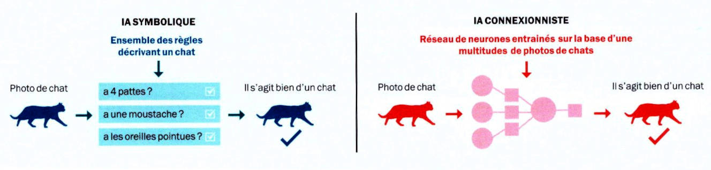

===

Mais une autre conception, très différente, de la machine intelligente a aussi pris forme au cours de l’histoire de l’informatique : au lieu d’essayer de la rendre intelligente en lui faisant ingérer des programmes, il serait préférable de la laisser apprendre toute seule à partir des données. La machine apprend directement un modèle des données, d’où le nom d’apprentissage artificiel (machine learning) donné à ces méthodes.

C'est là le fondement de la méthode dite "connexionniste".

Là où le modèle symbolique s’appuie sur de la logique formelle et l’exploitation de connaissances existantes pour résoudre des problèmes (inspiration = logique aristotélienne), l'approche connexionniste se veut plus empirique, basée sur l’observation et l’exploitation des sens, sur des méthodes statistiques, sur la reconnaissance de formes.

Ce qu'il est important de retenir ici, c'est le changement profond d'approche et de paradigme, parfaitement résumé par l'informaticien Luc Julia dans son ouvrage *L’intelligence artificielle n’existe pas* paru en 2019 aux Éditions First : ce n’est pas l’intelligence qui caractérise les systèmes d’IA d’aujourd’hui, mais leur capacité de reconnaissance grâce à l’apprentissage machine.
L'apprentissage profond (*deep learning*) est une approche possible du *machine learning*, à laquelle on doit les récents progrès de l'IA. Il s'agit d'une approche dite "connexionniste", inspirée de la structure et du fonctionnement des réseaux de neurones biologiques. 

§§§§§§§§§§§§§§§§§§§§§§§§§§§§§§§§§§§§§§§§§§§§§

Cette méthode, dite par apprentissage, repose sur une technologie appelée les "réseaux de neurones". L'approche connexionniste a été formulée dès 1943 par Warren McCulloch et Walter Pitts, mais elle était restée marginale en raison de limitations techniques. Le développement de machines plus rapides et puissantes ces dernières années, mais surtout l'accumulation de données (ce que l'on appelle aussi le _big data_) a changé la donne. 

<!-- .element: style="width:55%;float:right;margin-right:-1em; font-size:1.7rem; text-align:justify" -->

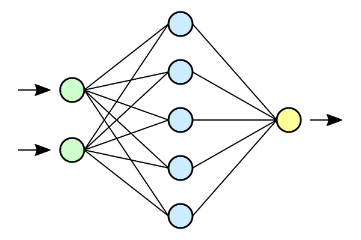
<!-- .element: style="width:40%;float:left;margin-right:-1em;" -->

§§§§§§§§§§§§§§§§§§§§§§§§§§§§§§§§§§§§§§§§§§§§§

#### Le modèle connexionniste provoque un changement de paradigme, en nous faisant passer d'une approche _modélisante_ à une approche statistique et probabiliste (fondées sur des modèles malgré tout : les llm)

===

<!--

si j'utilise chatGPT et que je lui dis pas content, il prend ça comme une donnée de renforcement.

Bouton like = donnée de renforcement.

embedding = vectorisation des mots. Positionnement d'un mot par rapport aux autres. Plus les mots sont proches, plus ils ont des chances d'avoir des significations similaires, ou de s'inscrire dans un même contexte sémantique (une même relation contextuelle). 

un réseau de neurone est capable de trouver les relations + compresser tt.

Transformer Attention is all you need.
Transformer = ajouter du poids aux éléments pertinents pour réduire le flou du gradient (= effondrement du sens).
Transformer introduit de l'info pertinente, en déterminant le degré d'importance (donc des biais?).

-->

Un générateur fondé sur un modèle place les mots les uns à la suite des autres, en choisissant le terme qui, statistiquement, a le plus de chance d'apparaître après celui qui le précède. Le modèle connexionniste est fondé sur une logique **probabiliste**, elle-même rendue possible par un principe de *vectorisation* de quantités massives de données (textuelles, graphiques, etc.).

§§§§§§§§§§§§§§§§§§§§§§§§§§§§§§§§§§§§§§§§§§§§§

### La vectorisation : vers une modélisation spatiale des termes (*vs* sens)

Il ne s'agit pas de "comprendre" (c'est-à-dire de saisir l'articulation entre référent/signifié/signifiant), mais de positionner les mots dans un espace et d'évaluer des distances. Plus des mots sont proches, plus on peut dire qu'ils signifient quelque chose de similaire.

<!-- .element: style="width:35%;float:left;margin-left:-1em; font-size:1.4rem; text-align:justify" -->

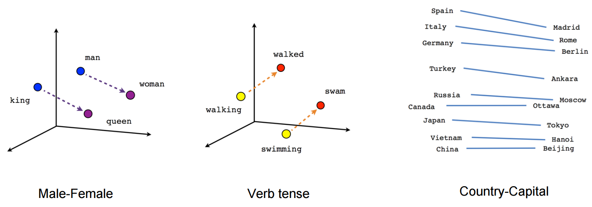<!-- .element: style="width:65%;float:right;margin-right:-1em;" -->

===

embedding = vectorisation des mots. Positionnement d'un mot par rapport aux autres. Plus les mots sont proches, plus ils ont des chances d'avoir des significations similaires, ou de s'inscrire dans un même contexte sémantique (une même relation contextuelle). 

Là où le système expert partait de l'essence d'un concept, et pouvait être capable de remonter la chaîne de décision et de description (via l'algo notamment), le llm ne sait pas ce qu'est le concept. Il repart du terme (par exemple un chat), et le place dans un environnement spatial dans lequel il sera entouré d'autres termes. 

Là où le système expert cherche à encoder le sens, le llm manipule de l'espace, de la dimension.

§§§§§§§§§§§§§§§§§§§§§§§§§§§§§§§§§§§§§§§§§§§§§

En conséquence, lorsque vous utilisez une IAG, vous lui posez une question ou vous lui donnez une instruction en vous inscrivant dans un régime de signification. La réponse de l'IAG, en revanche, s'appuiera sur des probabilités, soit sur un calcul de proximité entre des objets vectorisés.  

§§§§§§§§§§§§§§§§§§§§§§§§§§§§§§§§§§§§§§§§§§§§§

### Comment aimez-vous apprendre ?  

* Approche symbolique : vous préférez que l'on vous donne des consignes précises, après avoir suivi un cours magistral en amont vous présentant des règles de composition d'une dissertation, que vous allez ensuite vous-même appliquer.
* Approche connexionniste : vous préférez lire plusieurs exemples de dissertations, en tâchant de comprendre vous-mêmes comment elles fonctionnent pour les imiter.

§§§§§§§§§§§§§§§§§§§§§§§§§§§§§§§§§§§§§§§§§§§§§

## La problématique des outils fondés sur les IAG

Et si le problème n'était pas l'IAG, mais plutôt les entreprises qui produisent aujourd'hui les IAG les plus utilisées ?

§§§§§§§§§§§§§§§§§§§§§§§§§§§§§§§§§§§§§§§§§§§§§

### ChatGPT, l'IA générative de texte d'OpenAI

§§§§§§§§§§§§§§§§§§§§§§§§§§§§§§§§§§§§§§§§§§§§§

## ChatGPT ?

#### GPT (GPT3, GPT4, etc.)

* *Generative Pre-trained Transformer*
* un modèle géant de prédiction de texte entraîné par OpenAI sur 500 milliards de mots (pour GPT3) .
* un modèle encyclopédique
* = LLM (large language model)

<!-- .element: style="font-size:1.5rem; text-align:justify" -->

#### Chat (InstructGPT)

* Une interface conversationnelle
* Fonctionne à partir des requêtes de l'usager : "le prompt"

<!-- .element: style="font-size:1.5rem; text-align:justify" -->

===

GPT c’est Generative Pre-trained Transformer, un modèle géant de prédiction de texte entraîné par OpenAI sur 500 milliards de mots. GPT-3 est non seulement capable d’écrire correctement dans plusieurs langues mais c’est aussi un modèle encyclopédique qui intègre un grand nombre de références au monde réel (personnes, événements, connaissances scientifiques) qu’il restitue plus ou moins bien. GPT appartient à la famille des LLM, large language model, cad une catégorie de modèles entraînés à l’aide d’immenses quantités de données pour comprendre et générer des textes en langage naturel.

ChatGPT est aussi basé sur InstructGPT, un modèle conversationnel “d’apprentissage renforcé par retours humains”. Ce qui veut dire que pour bien faire fonctionner l'outil, il faut savoir l'interroger. 
C'est ce que l'on appelle l'art du prompt.

§§§§§§§§§§§§§§§§§§§§§§§§§§§§§§§§§§§§§§§§§§§§§

## Avec qui je "converse", lorsque j'échange avec ChatGPT ?

§§§§§§§§§§§§§§§§§§§§§§§§§§§§§§§§§§§§§§§§§§§§§

## [1] Un agent conversationnel intégré à une interface au design conçu pour masquer la technique

Avec ChatGPT, OpenAI a choisi de construire une IA qui **invisibilise** la technique. Cette stratégie est depuis longtemps pratiquée par les géants de la Tech : l'objectif est de designer des outils "faciles" à prendre en main, qui évite aux usagers de se poser trop de questions sur ce qu'ils renferment sous leur capot. L'invisibilisation de la technique, qui va de pair avec l'applification des systèmes informatiques depuis les années 2000, a rendu obsolète l'acquisition de compétences techniques et a généré une dépendance de plus en plus grande à des marques ou des services payants.  

<!-- .element: style="width:45%;float:left;margin-left:-1em; font-size:1.4rem; text-align:justify" -->

<!-- .element: style="width:45%;float:right;margin-right:-1em;" -->

§§§§§§§§§§§§§§§§§§§§§§§§§§§§§§§§§§§§§§§§§§§§§

<iframe width="560" height="315" src="https://www.youtube.com/embed/y0fzk6oRzPM?si=Nq5h7rIPTkpcktNE" title="YouTube video player" frameborder="0" allow="accelerometer; autoplay; clipboard-write; encrypted-media; gyroscope; picture-in-picture; web-share" referrerpolicy="strict-origin-when-cross-origin" allowfullscreen></iframe>

===

steve jobs, it works like magic.

§§§§§§§§§§§§§§§§§§§§§§§§§§§§§§§§§§§§§§§§§§§§§

<!-- .element: style="width:45%;float:right;margin-right:-1em;" -->

Non Steve, la magie, c'est ça (et c'est de la fiction).

<!-- .element: style="width:45%;float:left;margin-left:-1em; font-size:1.4rem; text-align:justify" -->

===

Non Steeve, la magie, c'est ça (et c'est de la fiction).

§§§§§§§§§§§§§§§§§§§§§§§§§§§§§§§§§§§§§§§§§§§§§
<!-- .slide: data-background-image="img/emulateurEliza-1.png" data-background-size="contain" -->

Source : [Émulateur d'Eliza](img/https://web.njit.edu/~ronkowit/eliza.html)

<!-- .element class="source"-->

===
le tout premier chatbot psychothérapeute (1966) conçu par Joseph Weizenbaum. Version Javascript par Michael Wallace et George Dunlop

§§§§§§§§§§§§§§§§§§§§§§§§§§§§§§§§§§§§§§§§§§§§§
<!-- .slide: data-background-image="img/supafriends-1.png" data-background-size="contain" -->

===

Aujourd'hui, construire des récits avec IA, c'est finalement d'abord construire des interfaces. On retrouve les enjeux de la plateformisation de écritures/lecture. 

§§§§§§§§§§§§§§§§§§§§§§§§§§§§§§§§§§§§§§§§§§§§§

### [2] Un LLM : un corpus de texte construit à partir du _big data_

>Quand nous posons une question à GPT-3 via l’interface ChatGPT nous dialoguons donc à la fois avec un mélange loin d’être chimiquement pur de l’un des plus vastes corpus de texte d’une humanité post-numérique mais aussi avec d’invisibles agencements de supervision qui n’ont rien à envier aux Pythies de Delphes. S’adresser à ChatGPT-3 c’est mettre à l’épreuve une immensité que l’on pense être suffisante pour détenir des réponses à chacune de nos questions. Entraînés que nous sommes depuis des années par l’habitus Google à considérer qu’il n’y a que des réponses. “Il n’y aura plus que des réponses“, prophétisait déjà Marguerite Duras. (Olivier Ertzscheid, ["C'est toi le chat"](https://www.educavox.fr/formation/analyse/olivier-ertzscheid-gpt-3-c-est-toi-le-chat))

<!-- .element: style="width:45%;float:left;margin-left:-1em; font-size:1.3rem; text-align:justify" -->

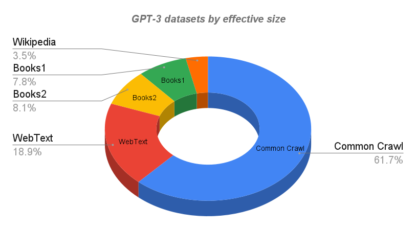<!-- .element: style="width:45%;float:right;margin-right:-1em;" -->

===

Mais alors à qui parlons-nous vraiment quand nous posons à ChatGPT nos questions ? La question est ici mal posée. En vérité, ce qu'il faudrait questionner c'est : A quel “corpus” adressons-nous nos questions en espérant et en idéalisant les réponses pouvant nous être apportées ? À quel modèle de langage nous adressons-nous ? 

>Quand nous posons une question à GPT-3 via l’interface ChatGPT nous dialoguons donc à la fois avec un mélange loin d’être chimiquement pur de l’un des plus vastes corpus de texte d’une humanité post-numérique mais aussi avec d’invisibles agencements de supervision qui n’ont rien à envier aux Pythies de Delphes. S’adresser à ChatGPT-3 c’est mettre à l’épreuve une immensité que l’on pense être suffisante pour détenir des réponses à chacune de nos questions. 

>Concrètement le modèle de langage GPT-3 utilise le corpus Common Crawl, une base de donnée “ouverte” qui récupère (crawle) des milliards de mots issus de pages web et de liens, de manière aléatoire, puis les analyse et les “modélise” à l’aide de l’algorithme BPE qui va, grosso modo permettre d’effectuer sur ce corpus une première opération de tokenisation permettant une analyse lexicale et sémantique des unités collectées. GPT-3 s’appuie aussi sur un autre corpus, WebText2, qui lui agrège de la même manière des milliards de mots à partir des URL envoyés sur Reddit avec un score minimum de 3. GPT-3 s’appuie également sur deux autres corpus (Books1 et Books2) ainsi que sur une extractions de pages Wikipedia. 

§§§§§§§§§§§§§§§§§§§§§§§§§§§§§§§§§§§§§§§§§§§§§

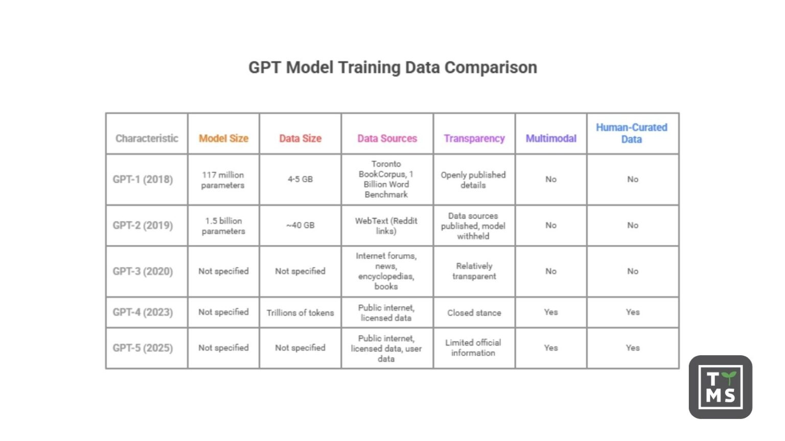

===

Origine des données d’entraînement des modèles comme GPT parfois floue : OpenAI ne publie pas la totalité des spécifications sur la construction de ses modèles. 

Voici les trois catégories principales de données selon OpenAI :

- Données accessibles publiquement sur Internet (=Pages web, documents publics, forums, textes publics libres d’accès -> Contenu librement disponible et ouvert.)

=> ce type de données peut poser pb en termes de données personnelles

- Données sous licence ou partenaires tiers (=Contenu fourni ou licencié par des partenaires ou des fournisseurs de données -> Contenu auquel OpenAI a légalement accès).

- Données fournies ou générées avec participation humaine (Interactions d’utilisateurs, annotations, réponses humaines pour l’entraînement -> Inclut étiquetage humain pour améliorer la qualité).

=> on va parler ici de données annotées, modèles entraînés, fin-tunning. La question des droits humains pose ici parfois problème (digital labour). Je renvoie aux travaux d'Antonio Casilli sur le sujet.

De manière générale, la neutralité de ces llm, en dépit de leur dimension "gigantesque" (big data), n'est pas assurée.

§§§§§§§§§§§§§§§§§§§§§§§§§§§§§§§§§§§§§§§§§§§§§

### Les biais des LLM et VML 

En informatique, on parle de "biais" lorsque le résultat donné par un outil (algorithme, IA, etc.) n'est pas neutre, loyale ou équitable, pour des raisons inconscientes ou délibérées de la part de ses auteurs/programmeurs.  Écouter l'émission ["Tags, déchets, bâtiments délabrés : quand l'IA reproduit les stéréotypes sur les banlieues", par Noémie Lair, France Inter, novembre 2023](https://www.radiofrance.fr/franceinter/tags-dechets-batiments-delabres-quand-l-ia-reproduit-les-stereotypes-sur-les-banlieues-3334839)

<!-- .element: style="width:45%;float:left;margin-left:-1em; font-size:1.3rem; text-align:justify" -->

<!-- .element: style="width:45%;float:right;margin-right:-1em;" -->

§§§§§§§§§§§§§§§§§§§§§§§§§§§§§§§§§§§§§§§§§§§§§

Un biais algorithmique peut se produire lorsque les **données** utilisées pour entraîner un algorithme d'apprentissage automatique reflètent un sous échantillon non représentatif et non exhaustif de la population générale, et donc potentiellement des caractéristiques ou des valeurs implicites des humains impliqués dans la collecte, la sélection, ou l'utilisation de ces données.

<!-- .element: style="font-size:1.7rem; text-align:justify" -->

===

Il est important de comprendre le statut ontologique problématique des données numériques, qui sont fondamentalement des éléments extraits du réel de manière arbitraire, mais qui ont tendance à se substituer au réel, ou du moins à en tenir lieu dans notre imaginaire.

§§§§§§§§§§§§§§§§§§§§§§§§§§§§§§§§§§§§§§§§§§§§§

Les biais des IA, qui reposent sur nos propres préjugés, entraînent des résultats faussés et des conséquences potentiellement néfastes, tout en entretenant ces préjugés, voire en les aggravant.

<!-- .element: style="font-size:1.7rem; text-align:justify" -->

Si la fiabilité d'un logiciel d'IAG peut être remise en cause, ce n'est pas tant parce qu'il comprend des biais (**toute technologie dispose de ses propres biais**), mais parce que ces biais sont cachés et invisibilisés (comme dans ChatGPT).

<!-- .element: style="font-size:1.7rem; text-align:justify" -->

En régime numérique, plus que dans tout autre système d'information, la fiabilité dépend de la vérifiabilité. 

<!-- .element: style="font-size:1.7rem; text-align:justify" -->

===

Si un système de reconnaissance faciale fonctionne moins bien sur un groupe d’individus que sur un autre, les personnes sous-représentées peuvent alors avoir des difficultés à déverrouiller leur téléphone ou à être correctement identifiées par le système de sécurité d’un aéroport. Les biais algorithmiques peuvent aussi favoriser la discrimination avec des résultats de prévision de récidive inégaux ou encore des calculs de limite de crédits partiaux.

§§§§§§§§§§§§§§§§§§§§§§§§§§§§§§§§§§§§§§§§§§§§§

>Le problème de ChatGPT, enfin, c’est qu’il assigne pêle-mêle des faits, des opinions, des
informations et des connaissances à des stratégies conversationnelles, se présentant
comme encyclopédiques alors même que le projet encyclopédique, de Diderot et d’Alembert jusqu’à Wikipédia, est précisément d’isoler, de hiérarchiser et d’exclure ce qui relève de l’opinion
pour ne garder que ce qui relève d’un consensus définitoire de connaissances vérifiables.

<!-- .element: style="font-size:1.2rem; text-align:justify" -->

Olivier Ertzscheid, ["Google, Wikipédia et ChatGPT. Les trois cavaliers de l’apocalypse (qui ne vient pas)"](https://affordance.framasoft.org/2025/02/google-wikipedia-et-chatgpt-les-trois-cavaliers-de-lapocalypse-qui-ne-vient-pas/), novembre 2024.

<!-- .element: style="font-size:1.2rem; text-align:right" -->

§§§§§§§§§§§§§§§§§§§§§§§§§§§§§§§§§§§§§§§§§§§§§

## Avec qui conversons-nous, lorsque nous parlons avec ChatGPT ?

>Nous conversons tout à la fois avec les milliers de travailleurs pauvres qui « modèrent » les
productions discursives de la bête, mais aussi avec l’ensemble des textes qui ont été produits aussi
bien par des individus lambda dans des forums de discussion Reddit ou sur Wikipédia que par des
poètes ou des grands auteurs des siècles passés et enfin avec tout un tas d’autres nous-mêmes et
les archives de leurs conversations, qui sont aussi le corpus de ce tonneau des Danaïdes de nos discursivités. Quand nous parlons à ChatGPT, nous parlons à l’humanité toute entière, mais il n’est ni certain que nous ayons quelque chose d’intéressant à lui dire, ni même probable qu’elle nous écoute encore.

<!-- .element: style="font-size:1.2rem; text-align:justify" -->

Olivier Ertzscheid, ["Un Chat(GPT) dans le moteur, et réciproquement", AOC.media, nov 2024](https://aoc.media/analyse/2024/11/12/un-chatgpt-dans-le-moteur-et-reciproquement/)

<!-- .element: style="font-size:1.2rem; text-align:right" -->

§§§§§§§§§§§§§§§§§§§§§§§§§§§§§§§§§§§§§§§§§§§§§

### Pourquoi ChatGPT n'est PAS un moteur de recherche ?

ChatGPT n’a aucune compréhension de votre question ni même de sa réponse, qui résulte d'un calcul statistique croisant le contexte de votre requête et les différentes données qu’il a à sa disposition.

§§§§§§§§§§§§§§§§§§§§§§§§§§§§§§§§§§§§§§§§§§§§§

### Un modèle probabiliste

>L’épistémologie de GPT est probabiliste : plus un énoncé est présent dans le corpus d’entraînement et plus il a de chance d’être correctement restitué. C’est ainsi que chatGPT affirmera généralement que Napoléon a perdu à Waterloo tant cette information a pu être ressassée dans le corpus d’origine. Seulement dès qu’un énoncé est rarement présent où dès que le prompt d’origine prend une direction imprévue, le modèle peut facilement se perdre dans une série d’hallucinations.

<!-- .element: style="font-size:1.5rem; text-align:justify" -->

Source : Pierre-Carl Langlais, ["ChatGPT : comment ça marche ?", *Sciences communes*, 2023](https://scoms.hypotheses.org/1059).

<!-- .element: style="font-size:1.2rem; text-align:right" -->

===

Un exemple de l’épistémologie probabiliste de chatGPT : sur une question standard de culture générale, la réponse est presque toujours exacte. Sur un sujet de niche, il se plante. Il fait même plus : il hallucine.

§§§§§§§§§§§§§§§§§§§§§§§§§§§§§§§§§§§§§§§§§§§§§

#### Recherche sur un exemple médiatisé : hallucination partielle (bibliographie)

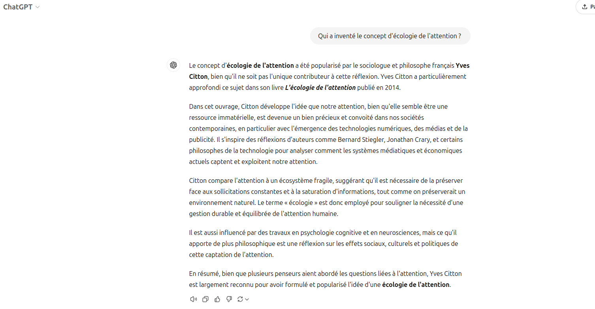<!-- .element: style="width:800px" -->

===

Exemple avec un concept très médiatisé : écologie de l'attention

Erreur sur le titre du livre. 

§§§§§§§§§§§§§§§§§§§§§§§§§§§§§§§§§§§§§§§§§§§§§

#### Recherche spécialisée : hallucination complète

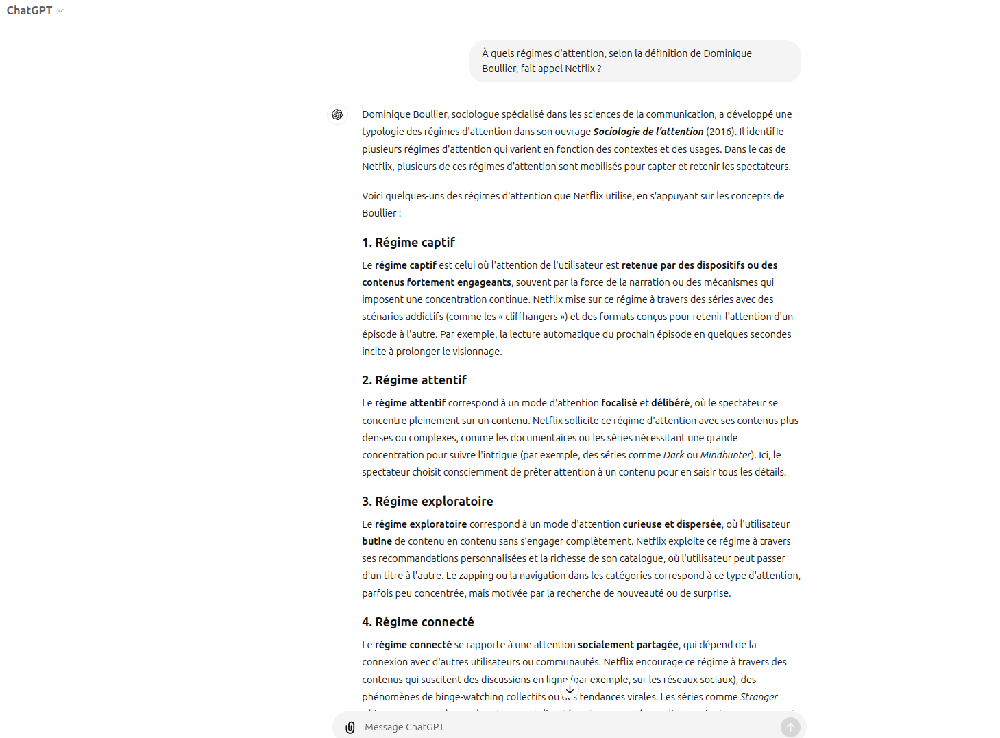<!-- .element: style="width:800px" -->

===

exemple avec une typologie de niche, celle de Boullier.

Livre = Sociologie du numérique, 2019, et pas celui cité.

§§§§§§§§§§§§§§§§§§§§§§§§§§§§§§§§§§§§§§§§§§§§§

## _ChatGPT search_, un moteur ~~de recherche~~ de réponse

* Un service qui nous propose une synthèse de certaines sources en fonction de notre requête
* Une liste de sources (critères de sélection non précisés)
* Pas de rémunération des sources
* Une logique de plus en plus prescriptive
* Quid de la compétence d'évaluation et d'esprit critique ?

<!-- .element: style="width:45%;float:left;margin-left:-1em; font-size:1.3rem; text-align:justify" -->

<!-- .element: style="width:45%;float:right;margin-right:-1em;" -->

===

­une explication conversationnelle remplacera une simple liste de résultats pour celui qui depuis longtemps déjà se positionne et se veut davantage un moteur de réponses qu’un outil de recherche.

§§§§§§§§§§§§§§§§§§§§§§§§§§§§§§§§§§§§§§§§§§§§§

## Les IAG dans le secteur des industries culturelles et créatives : une communauté divisée
* Les modèles entraînés respectent-ils le droit d'auteur? 
* L'IA est-elle un outil de création comme un autre, ou sert-elle une imposture ?
* En méliorant la productivité, dans quelle mesure les IAG menacent-elle les professionnels ?
* Le recours à l'IAG vaut-il vraiment le coup (engagement : enjeux éthiques & écologiques) ?

===

- authenticité et autorité : comment évaluer les contenus produits à l'aide de l'IA ?
- Transparence de l'IA : quel accès aux modèles de données d'entraînement et au code ?
- IA et travail : l'IA va-t-elle remplacer ou assister les travailleurs qualifiés ?
- écologie : peut-on maîtriser et encadrer les dépenses énergétiques liées à l'IA ?
- IA et cadre légal : comment faire évoluer le droit pour intégrer les mutations provoquées par l'IA ? 

* Des inquiétudes sérieuses sur l'origine des données
* Une opportunité d'automatiser des tâches répétitives
* Des corps de métiers plus fragilisés que d'autres (illustrateurs, traducteurs)
* Des expériences de création assumées

§§§§§§§§§§§§§§§§§§§§§§§§§§§§§§§§§§§§§§§§§§§§§

## Les industries éditoriales & littéraires

===

Dans l'ensemble, une communauté plutôt méfiante, même si on assiste à des "buzz" autour de certaines oeuvres. 
Concrètement, pas de grands succès sur des oeuvres générées par IA. 
Un IA qui va intégrer par contre des outils d'édition : 
- révision de texte
- gestion des plannings
- communication 

Globalement, une industrie qui apprécie une forme d'artisanat et qui se montre assez réfractaire. 

Cas particulier : illustrateurs.

§§§§§§§§§§§§§§§§§§§§§§§§§§§§§§§§§§§§§§§§§§§§§

### Cas no1 : *Mathis et la forêt des possibles*

Collaborateur scientifique à l’Université de Genève (Suisse), le philosophe Jiri Benovsky est spécialiste en métaphysique, en philosophie de l’esprit et en esthétique. Mathis et la Forêt des possibles est son premier album jeunesse. Alors qu’il n’est pas illustrateur, il l’a réalisé par l’usage d’une intelligence artificielle (I.A.) dédiée à l’illustration. C’est une expérience artistique et technologique qui s’inscrit pour Jiri Benovsky dans la continuité de son travail philosophique innovant sur les voies de l’esprit humain à l’ère du numérique. 

<!-- .element: style="width:45%;float:left;margin-left:-1em; font-size:1.4rem; text-align:justify" -->

<!-- .element: style="width:45%;float:right;margin-right:-1em;" -->

===

Cas no1 : *Mathis et la forêt des possibles*
Collaboration entre les PUR et la maison d'édition Locus Solus

Album jeunesse.
Projet de recherche-création : l'auteur revient sur sa démarche (explicitée dès la couverture), dans une longue postface.

§§§§§§§§§§§§§§§§§§§§§§§§§§§§§§§§§§§§§§§§§§§§§

#### Cas no2 : *Jésus*

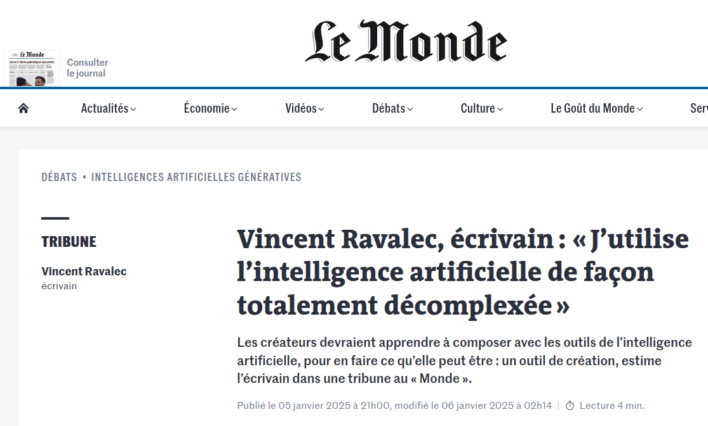

===

Utilisant les dernières découvertes archéologiques et les acquis de l’exégèse biblique, Jean-Christian Petitfils reconstitue le plus exactement possible cette vie du « Jésus de l’histoire » qui permet de mieux comprendre le « Christ de la foi ».

Ce livre, destiné à un large public, est la version courte de l’ouvrage de référence du même auteur, paru en 2011. Mis en page et présenté sous forme de « récit graphique » par Vincent Ravalec, il a l’originalité d’être la première vie de Jésus illustrée par l’intelligence artificielle.

BDD : que des tableaux de la renaissance

§§§§§§§§§§§§§§§§§§§§§§§§§§§§§§§§§§§§§§§§§§§§§

Mon sentiment est que nous sommes face à un moment important. Il serait judicieux pour les artistes de s’emparer des potentialités hallucinantes permises par notre civilisation (qui a commencé le jour où l’un de nos ancêtres a trouvé plus pratique de tailler un silex pour s’en faire un outil plutôt que de servir uniquement de sa main, et ma foi, cela a donné ce que nous sommes, pour le pire comme le meilleur). 

<!-- .element: style="width:45%;float:left;margin-left:-1em; font-size:1.4rem; text-align:justify" -->

<!-- .element: style="width:45%;float:right;margin-right:-1em;" -->

===

§§§§§§§§§§§§§§§§§§§§§§§§§§§§§§§§§§§§§§§§§§§§§
<!-- .slide: data-background-video="img/la-place-de-lia-dans-la-creation_tJIhroM5.mp4" data-background-size="contain" -->

§§§§§§§§§§§§§§§§§§§§§§§§§§§§§§§§§§§§§§§§§§§§§

#### Un bon prompteur peut-il remplacer un illustrateur ?

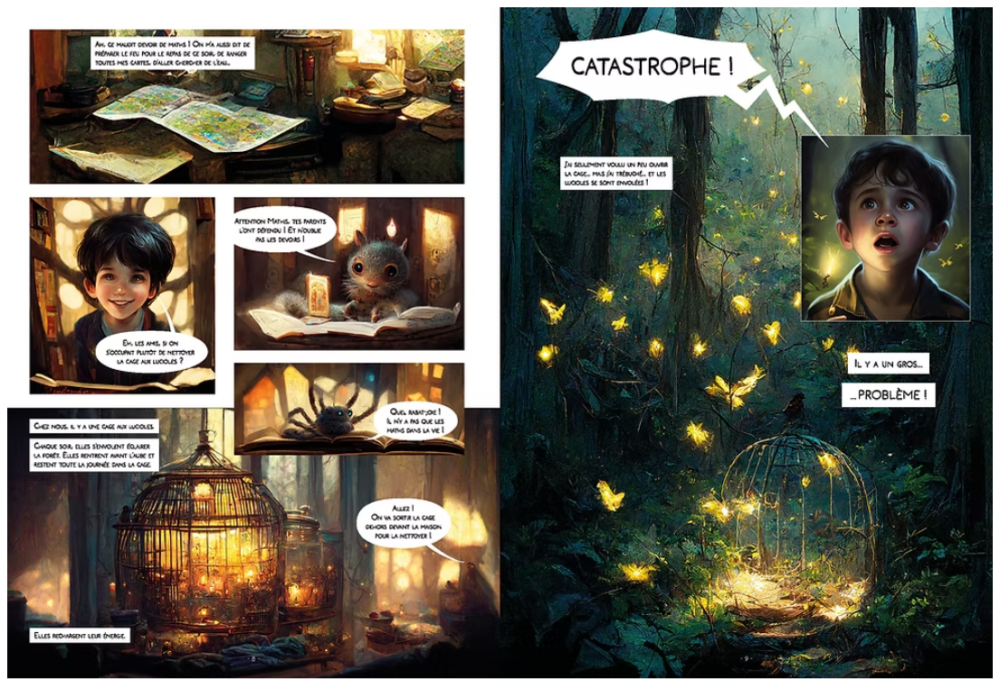

===

>Alors qu’il n’est pas illustrateur, il l’a réalisé par l’usage d’une intelligence artificielle (I.A.) dédiée à l’illustration. C’est une expérience artistique et technologique qui s’inscrit pour Jiri Benovsky dans la continuité de son travail philosophique innovant sur les voies de l’esprit humain à l’ère du numérique. 

Tout est dit : qu'est-ce que c'est que le geste de création ?  

Tension dans l'histoire de la création, entre une approche technique de l'art qui voit le talent comme la maîtrise d'outils et de savoirs faire, et une approche "esthétisante" qui verrait le talent comme un don.

Du côté de l'approche esthétisante : Dans l'histoire, plusieurs approches : poète inspiré Homère etc. 
Puis, émergence du génie créateur au 18e. Écrivain génie, poète maudit, etc. 

Du côté de la technique : aristote et la Tragédie, les Beaux-arts en peinture, etc.

Évidemment, je crée ici une dichotomie, mais on a sans doute souvent un peu des deux (technique, et talent), et un peu plus : questions contextuelles : un bon éditeur, un bon mécène, une stratégie de com. etc.

Tout cela pour dire que ce qui va relever de l'art du prompt renvoie à un ce vieux débat, sur les conditions et les compétences pour mériter le statut d'artiste.

Le prompt ne pourrait être qu'un problème conceptuel (on se l'est déjà posée avec l'art contemporain quand Duchamp signait un pissotière), mais s'y ajoute la question des données.

§§§§§§§§§§§§§§§§§§§§§§§§§§§§§§§§§§§§§§§§§§§§§
<!-- .slide: data-background-video="img/la-place-de-lia-dans-la-creation_bpFiqGVU.mp4" data-background-size="contain" -->

§§§§§§§§§§§§§§§§§§§§§§§§§§§§§§§§§§§§§§§§§§§§§

### La problématique des données & des modèles entraînés
S'il est vrai que l'on a toujours travaillé de manière outillée, est-ce qu'une IA est un outil comme un autre ? Concrètement, les LLM ou VLM utilisés par les IAG ont été entraînés avec des données protégées par le droit d’auteur. OPenAI le reconnaît lui-même dans une série de publications sur le sujet. 

===

S'il est vrai que l'on a toujours travaillé de manière outillée, est-ce qu'une IA est un outils comme un autre ?

Une IAG, de par son modèle, se nourrit des création préexistantes. 

D,où viennent les données du modèle.
Une IA générative a besoin de modèle : les LLM, dans le cas de la génération de texte, ou les modèles de diffusion pour génération image à partir de texte.

Ces modèles entraînés sont entraînés sur les données numériques. Les vôtres, mais également certaines données produites par des créateurs, et qui sont sous le droit de la propriété intellectuelle. 

Du côté des artistes et créateurs, on craint donc l'accaparement de la propriété intellectuelle, baffouée par les modèles. 

§§§§§§§§§§§§§§§§§§§§§§§§§§§§§§§§§§§§§§§§§§§§§

#### Constituer et entraîner un VML : un geste technique, un geste auctorial ?
* Constituer son modèle et l'entraîner : la réalité des pionniers
* Le développement vers des outils grand public menace de faire disparaître la technicité

===

Les modèles vision-langage (VLM) sont des modèles d’intelligence artificielle (IA) qui associent des capacités de vision par ordinateur et de traitement automatique du langage naturel (NLP).

Les VLM apprennent à mapper les relations entre les données textuelles et les données visuelles telles que les images ou les vidéos, ce qui permet à ces modèles de générer du texte à partir d’entrées visuelles ou de comprendre des prompts en langage naturel dans le contexte d’informations visuelles.

§§§§§§§§§§§§§§§§§§§§§§§§§§§§§§§§§§§§§§§§§§§§§

>En l’état actuel, c’est tout le modèle économique de la création qui est en danger. Si la propriété intellectuelle peut se voir accaparée, comme c’est le cas aujourd’hui, à travers les intelligences artificielles génératrices de contenus, le préjudice est totalement hors de proportion puisqu’il remet en cause la valeur même de la propriété intellectuelle. Les propriétaires de certaines bases de données ou le PDG de Stable Diffusion exposent d’ailleurs clairement leur objectif de nuire au modèle de la propriété intellectuelle.

<!-- .element: style="font-size:1.5rem; text-align:justify" -->

>Frédéric Maupomé,auteur et scénariste de BD. Responsable de la Commission IA de la Ligue des auteurs professionnels

<!-- .element: style="font-size:1.5rem; text-align:justify" -->

===

Pour Frédéric Maupomé, "Les IA n’inventent rien : il leur faut plagier la création humaine, en s’inspirant de centaines de millions d’images et métadonnées aspirées automatiquement sur internet."

§§§§§§§§§§§§§§§§§§§§§§§§§§§§§§§§§§§§§§§§§§§§§

### Un droit à l'_opt out_ peu efficace

>Un calvaire ! C'est image par image, il faut prouver qu'on est l'ayant droit, recommencer parfois à chaque copie présente dans la base, (ex. Have i been trained). Et recommencer pour chaque base... Sans preuve d'effet (et l'opt-out n'est pas rétroactif), si on est dans la base,c'est trop tard. Les restrictions mises en place par les entreprise d'IA (par exemple on ne peut pas demander d'image dans le style de Steve mc curry à stable diffusion, il y a un filtre sur son nom) sont facilement contournées (par exemple en écrivant mal les noms).

>Positionnement de la Ligue des auteurs professionnels

<!-- .element: style="font-size:1.5rem; text-align:justify" -->

===

Dans le domaine de l’intelligence artificielle (IA), l’opt-out désigne la possibilité pour une personne, une organisation ou un créateur de refuser que ses données, œuvres ou contenus soient utilisés pour l’entraînement, l’évaluation ou le fonctionnement d’un modèle d’IA.

Autrement dit, c’est le droit de dire “non” à l’utilisation de ses données par les systèmes d’IA.

§§§§§§§§§§§§§§§§§§§§§§§§§§§§§§§§§§§§§§§§§§§§§

### Vers une nouvelle manière de raconter et d'imaginer des histoires ?

<!-- .element: style="width:400px" -->

===

Dans l'exemple SupaFriends, on n'a même pas besoin d'accéder au LLM pour constater que le vrai problème du biais se joue au niveau de l'interface.

§§§§§§§§§§§§§§§§§§§§§§§§§§§§§§§§§§§§§§§§§§§§§

## Atelier 

Du programme au prompt&nbsp;: comprendre les stratégies de génération de récits à l’heure des LLM

<!-- .element: style="width:200px" -->

===

Comparer 3 bots : 
- supafriends
- ThierryGPT

§§§§§§§§§§§§§§§§§§§§§§§§§§§§§§§§§§§§§§§§§§§§§

### Au-delà des industries culturelles et créatives...
* Des enjeux éthiques : entraînement des données et *digital labour*
* Des enjeux politiques : nouveaux monopoles, vectofascisme
* Des enjeux écologiques : coût d'entraînement des modèles (calcul, stockage)

<!-- .element: style="font-size:1.5rem; text-align:justify" -->

===

>**Fabrication de chat GPT** (entrainement) : Estimation de 500t d’eCO2 (280 aller-retours entre Paris et NYC en avion)  

>**Utilisation de chat GPT** (appel API) : 25t eCO2 par jour (~13 aller-retours entre Paris et NYC en avion)

§§§§§§§§§§§§§§§§§§§§§§§§§§§§§§§§§§§§§§§§§§§§§

### L'IA Act: un premier pas en faveur de la régulation

>Puisqu’il sera impossible de garantir l’absence de discrimination sous tous les angles, des choix seront nécessaires, et des seuils de tolérance devront être définis. Se pose alors la question : quel est le niveau acceptable d’erreurs et de quel type d’erreurs parle-t-on ? Ce qui revient à se demander : quel est le niveau « acceptable » de risque de discrimination ?

>Mélanie Gornet et Winston Maxwell, "Intelligence artificielle: normes techniques et droits fondamentaux, un mélange risqué", *The Conversation*, 2022.

<!-- .element: style="width:45%;float:left;margin-left:-1em; font-size:1.4rem; text-align:justify" -->

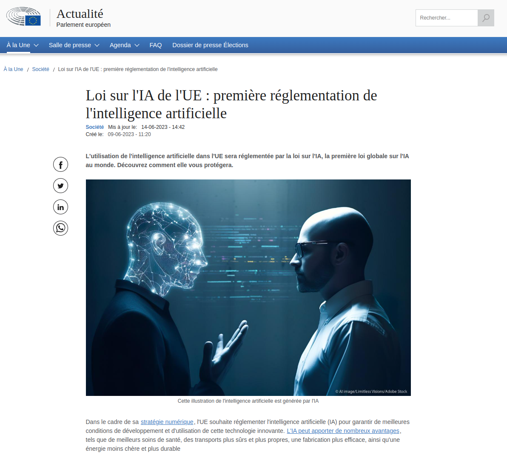<!-- .element: style="width:45%;float:right;margin-right:-1em;" -->

===

En juin 2023, Le Parlement européen a adopté l’AI Act (pour Artificial Intelligence Act), un texte de régulation des intelligences artificielles. L’idée est de proposer « un cadre réglementaire pour la mise au marché avec le triptyque sécurité, santé, droits fondamentaux, résume Arnaud Latil, maître de conférences en droit public à Sorbonne Université. L’Union européenne [UE], comme ce qu’elle a fait auparavant avec le règlement général sur la protection des données, utilise avec l’AI Act la doctrine dite de l’“approche par les risques” ».

L’AI Act a donc été construit sur une approche « par les risques » : l’intelligence artificielle y est régulée en fonction de ses usages, jugés plus ou moins dangereux. le règlement adopté par le Parlement classe les systèmes d’intelligence artificielle (IA) selon un niveau de risque allant de « minime » à « inacceptable ». Les interdictions y sont rares : elles concernent les usages contraires aux valeurs européennes, comme les « systèmes de crédit social » ou de vidéosurveillance de masse utilisés en Chine. 

L'AI act génère déjà bcp de critiques. 

§§§§§§§§§§§§§§§§§§§§§§§§§§§§§§§§§§§§§§§§§§§§§

### Conclusion

Au-delà des effets de fascination - largement influencés par notre imaginaire fictionnel de la machine - nous commençons tout juste à prendre la mesure des effets de l'IA sur la création, la créativité, et les conditions de travail dans les industries culturelles. Si tout le monde s'accorde sur le besoin de réguler, les leviers à (dés)activer font largement débat. Assistant ou remplaçant, l'outil d'IA doit en tous les cas être bien compris et transparent afin que d'en faire un usage bien conscient. Le véritable coût économique, social et écologique de la dernière génération d'IA reste encore inconnu, et l'on peut justement s'interroger sur les développements futur de cette technologie : un autre hiver de l'IA est-il à prévoir ? Ou sommes-nous définitivement entrés dans un changement de paradigme ?

<!-- .element: style="font-size:1.5rem; text-align:justify" -->

§§§§§§§§§§§§§§§§§§§§§§§§§§§§§§§§§§§§§§§§§§§§§

### À méditer pour conclure...

>Pascal disait : je n’ai pas eu le temps de faire plus court (la citation exacte est « Je n’ai fait [cette lettre] plus longue que parce que je n’ai pas eu le loisir de la faire plus courte »). Ce qui frappe et questionne aujourd’hui, je le redis, c’est l’immensité des moyens technologiques mobilisés au service de toujours davantage de réductions (dont certains ad absurdum) : il s’agit de toujours davantage résumer, synthétiser, ramasser ; tout en prétendant faire toujours plus « pour nous » et le faire à notre place. Longtemps les technologies nous ont placé en situation de pilotage, avant de nous reléguer au rang de co-pilote, puis en nous laissant co-pilote mais en supprimant le pilote au profit d’une seule fonction de pilotage automatique, et nous voilà désormais simplement, inexorablement, irrévocablement … passagers. Passagers par ailleurs exposés à la permanence d’un contrôle identitaire, et passagers sans autre bagage que l’acceptation naïve d’imaginer que nous pourrions encore être maîtres du choix de notre destination.

<!-- .element: style="font-size:1.5rem; text-align:justify" -->

Olivier Ertzscheid, ["C'est toi le chat"](https://www.educavox.fr/formation/analyse/olivier-ertzscheid-gpt-3-c-est-toi-le-chat)

<!-- .element: style="font-size:1.5rem; text-align:right" -->
