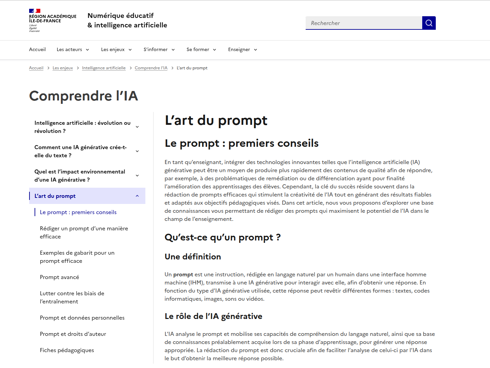
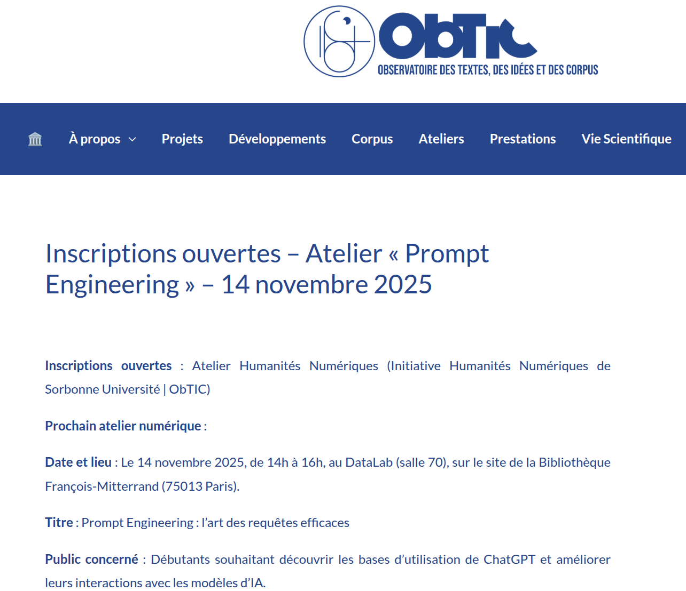
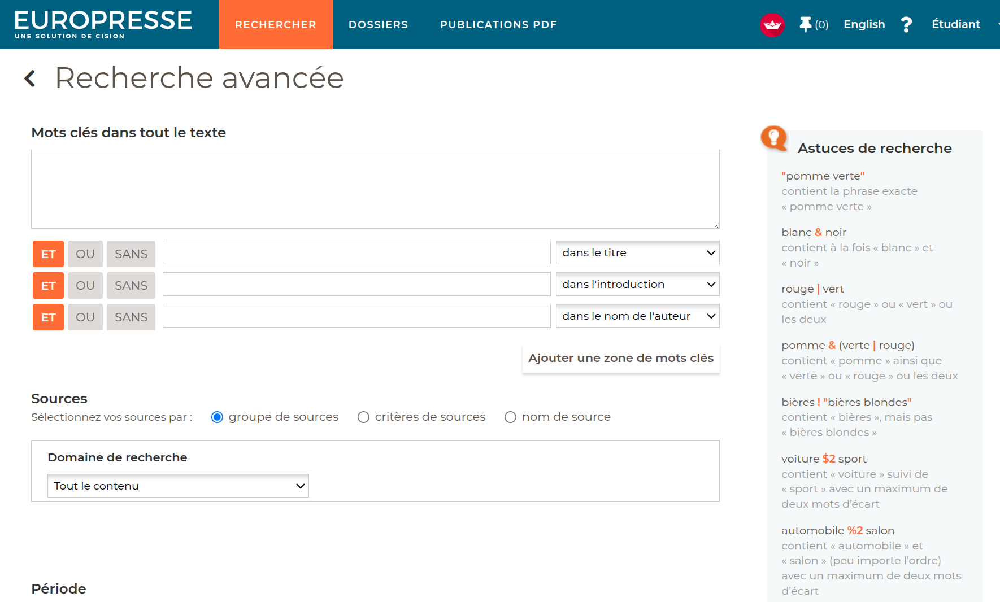
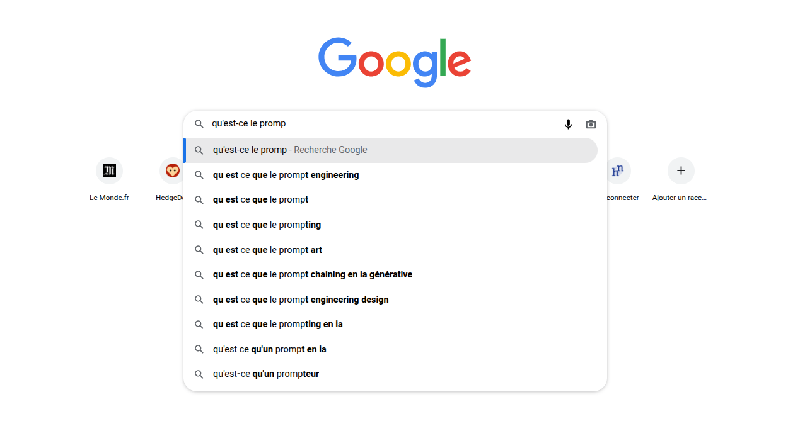
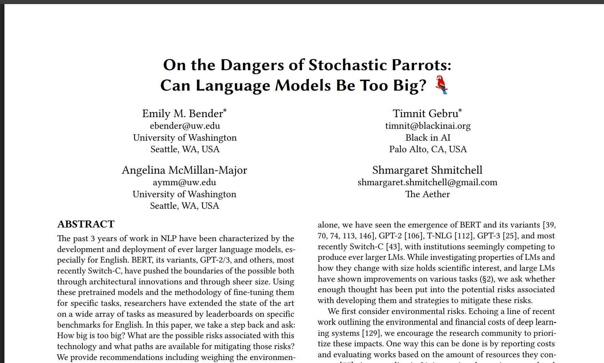
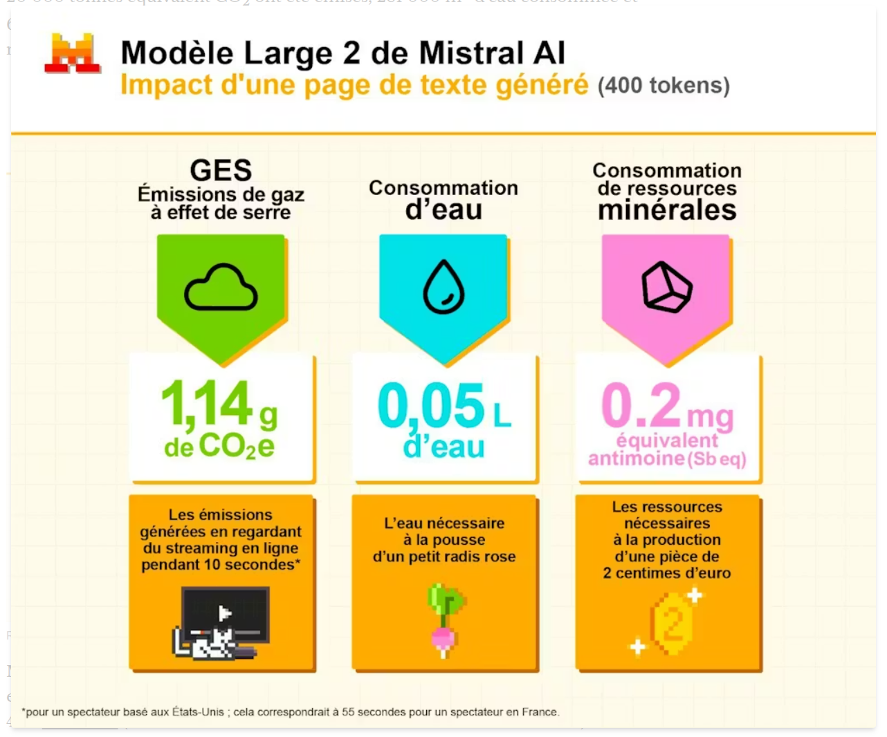

## Prompter l'écriture et la création

### Enjeux épistémologiques, éthiques, communicationnels

<!-- .element: style="width:400px" -->

§§§§§§§§§§§§§§§§§§§§§§§§§§§§§§§§§§§§§§§§§§§§§

### De l'"art du prompt" eu "prompt engineering" : une compétence clé pour la maîtrise des IAG ? 

<!-- .element: style="width:45%;float:left;margin-right:-1em;" -->

<!-- .element: style="width:45%;float:right;margin-right:-1em;" -->

§§§§§§§§§§§§§§§§§§§§§§§§§§§§§§§§§§§§§§§§§§§§§

### Prompt ? 

> De l’anglais, « prompt », inciter, entraîner, inciter à dire quelque chose... 

>Le prompt est une liste d’instructions rédigées (en général) en langage naturel par un être humain et transmis à une IA afin d’obtenir, de sa part, une réponse : un texte, une image, une vidéo.

§§§§§§§§§§§§§§§§§§§§§§§§§§§§§§§§§§§§§§§§§§§§§

* Des demandes simples, sur le modèles des requêtes à un moteur de recherche comme Google
* Une suite d'instructions plus ou moins complexes et détaillées
* Une conversation destinée à affiner des résultats

§§§§§§§§§§§§§§§§§§§§§§§§§§§§§§§§§§§§§§§§§§§§§

### Effacer l'impression de la technique : les mutations de la recherche numérique

Le prompt n'est que la dernière évolution d'une mutation progressive de nos procédures de recherche dans des bases de données numériques. L'informatisation de l'information (catalogues de bibliothèques, Web, etc.) a posé depuis la seconde moitié du XXe siècle des défis majeurs en terme de _cherchabilité_ et de _trouvabilité_. 

<!-- .element: style="font-size:1.4rem; text-align:justify" -->

===
Base de données: ensemble de centaines de milliers de références. Comment s'y retrouver ? Comment mener des recherches efficaces ? Comment trouver ? 

§§§§§§§§§§§§§§§§§§§§§§§§§§§§§§§§§§§§§§§§§§§§§

Les recherches modélisées avec les opérateurs booléens

<!-- .element: style="width:55%;float:right;margin-right:-1em;" -->

>(moteurs de recherche OR Google OR Bing) AND (éducation OR apprentissage) NOT (publicité OR marketing)

<!-- .element: style="width:45%;float:left;margin-left:-1em; font-size:1.3rem; text-align:justify" -->

===

Opérateurs Booléens : Les opérateurs booléens sont des mots utilisés pour établir des relations logiques entre des termes de recherche dans des bases de données et des moteurs de recherche. Ils permettent de préciser et d'affiner les résultats d'une recherche. Les principaux opérateurs sont :

AND : Retrouve des documents contenant tous les termes spécifiés. Par exemple, "chat AND chien" affichera uniquement les documents contenant à la fois "chat" et "chien".

OR : Retrouve des documents contenant au moins un des termes spécifiés. Par exemple, "chat OR chien" affichera les documents contenant "chat", "chien", ou les deux.

NOT : Exclut des documents contenant un terme spécifique. Par exemple, "chat NOT chien" affichera les documents contenant "chat" mais pas "chien".

Explication de la requête

- (moteurs de recherche OR Google OR Bing) : on cherche des documents qui parlent des moteurs de recherche en général, ou spécifiquement de Google ou Bing.
- AND (éducation OR apprentissage) : Cela précise que tu veux uniquement des documents qui traitent de l'éducation ou de l'apprentissage en lien avec les moteurs de recherche.
- NOT (publicité OR marketing) : Cela exclut les documents qui parlent de publicité ou de marketing, afin de te concentrer sur des aspects éducatifs.Résultat attenduCette requête te permettra de trouver des articles, des études ou des ressources qui examinent comment les moteurs de recherche influencent l'éducation et l'apprentissage, tout en évitant ceux qui se concentrent sur les aspects commerciaux.

Ces compétences en recherche documentaires étaient encore enseignées il y a 10 ans dans n'importe quel cursus de licence. Elles permettent de sensibiliser à la logique informatique.

George Boole (1815-1864) était un mathématicien et logicien britannique qui a développé une forme d'algèbre, maintenant connue sous le nom d'algèbre booléenne. Cette algèbre repose sur des valeurs binaires (vrai ou faux) et utilise les mêmes principes que les opérateurs mentionnés ci-dessus. Les travaux de Boole ont été fondamentaux pour le développement de la logique moderne et ont influencé les systèmes de recherche documentaire en permettant l'utilisation de ces opérateurs pour structurer les requêtes de manière logique et systématique.

§§§§§§§§§§§§§§§§§§§§§§§§§§§§§§§§§§§§§§§§§§§§§

Les requêtes pré-enregistrées de Google

<!-- .element: style="width:55%;float:right;margin-right:-1em;" -->

L'essor des moteurs de recherche comme Google a facilité l'accès à l'information, mais cela a également conduit à une diminution des compétences traditionnelles en recherche documentaire.

<!-- .element: style="width:45%;float:left;margin-left:-1em; font-size:1.3rem; text-align:justify" -->

===

Le développement des moteurs de recherche grand public, comme Google, a proposé un premier éloignement avec cette compétence documentaire. 

Google présente une interface simple, sans les multiples paramètres, et nous engage à poser uniquement les mots-clés de notre question, sans générer de filtres. 

Peu à peu, Google a même ajouté une fonctionnalité de saisie automatique et des suggestions basées sur des recherches populaires diminuent la nécessité de savoir comment structurer une requête efficace.

Google a construit des algorithmes avancés analysent le contexte et l'intention derrière les requêtes, ce qui signifie que les utilisateurs obtiennent souvent des résultats pertinents sans avoir à formuler des recherches complexes.

Les suggestions de requêtes sur Google sont le résultat d'une combinaison d'algorithmes de prédiction, d'historique personnalisé, d'analyses des tendances, d'une compréhension contextuelle et d'apprentissage automatique. Cela permet à Google d'offrir une expérience de recherche plus fluide et pertinente.

§§§§§§§§§§§§§§§§§§§§§§§§§§§§§§§§§§§§§§§§§§§§§

Les prompts : de la recherche à la génération d'informations 

>La science du « prompt » vient ainsi en partie d’une illusion, celle de pouvoir correctement contrôler un modèle à plusieurs milliers de paramètres. Or les modèles d’IA génératives fonctionnent comme des «&nbsp;boîtes noires&nbsp;» : lorsque nous entrons un prompt, nous ne pouvons pas être certains de ce que la machine va nous retourner.

<!-- .element: style="font-size:1.4rem; text-align:justify" -->

>Adrien Tallent, « "L’envers des mots" : Prompt », *The Conversation*, 2024.

<!-- .element: style="font-size:1.4rem; text-align:right" -->

===

La particularité des IAG et des outils comme ChatGPT, c'est qu'ils instaurent un degré supplémentaire de simplicité dans la "requête", en effaçant tout enjeu de modélisation de la requête.

L'IAG engage une conversation comme on pourrait le faire avec un documentaliste ou un libraire, mais presque en pire, car on n'est pas dans une conversation spécialisée.

Derrière cette apparente discussion, la réponse à un prompt est statistique : le modèle d’IA générative prédit ce que pourrait être la réponse la plus plausible au regard de sa base d’entraînement et la génère. Cette caractéristique a inspiré la critique adressée notamment par la chercheuse Emily Bender aux ancêtres de ChatGPT qui ne seraient dès lors que des « perroquets stochastiques » (cad aléatoire). 

§§§§§§§§§§§§§§§§§§§§§§§§§§§§§§§§§§§§§§§§§§§§§

Le prompt : les illusions d'une recherche en langage naturel

<!-- .element: style="width:45%;float:right;margin-right:-1em;" -->

>We have to account for the fact that our perception of natural language text, regardless of how it was generated, is mediated by our own linguistic competence and our predisposition to interpret communicative acts as conveying coherent meaning and intent, whether or not they do [89, 140]. The problem is, if one side of the communication does not have meaning, then the comprehension of the implicit meaning is an illusion arising from our singular human understanding of language (independent of the model).

<!-- .element: style="width:45%;float:left;margin-left:-1em; font-size:1.3rem; text-align:justify" -->

===

Dernière étape d'un jeu de l'imitation qui nous fait plonger dans l'illusion de la compréhension. 

>Nous devons tenir compte du fait que notre perception d’un texte en langage naturel, quelle que soit la manière dont il a été généré, est influencée par notre propre compétence linguistique et par notre tendance à interpréter les actes de communication comme véhiculant un sens et une intention cohérents, qu’ils le fassent ou non [89, 140]. Le problème est que, si l’un des aspects de la communication n’a pas de sens, alors la compréhension du sens implicite est une illusion découlant de notre compréhension humaine singulière du langage (indépendamment du modèle).

§§§§§§§§§§§§§§§§§§§§§§§§§§§§§§§§§§§§§§§§§§§§§

### Le _prompt art_ en débat

<iframe width="860" height="615" src="https://www.youtube.com/embed/fs4ZMcPOHT4?si=ieTRsL3qcvtrzz8c" title="YouTube video player" frameborder="0" allow="accelerometer; autoplay; clipboard-write; encrypted-media; gyroscope; picture-in-picture; web-share" referrerpolicy="strict-origin-when-cross-origin" allowfullscreen></iframe>

§§§§§§§§§§§§§§§§§§§§§§§§§§§§§§§§§§§§§§§§§§§§§

#### Un bon prompteur fait-il de nous un bon créateur ?

§§§§§§§§§§§§§§§§§§§§§§§§§§§§§§§§§§§§§§§§§§§§§

<!-- .element: style="width:55%;float:right;margin-right:-1em;" -->

>Alors qu’il n’est pas illustrateur, il l’a réalisé par l’usage d’une intelligence artificielle (I.A.) dédiée à l’illustration. C’est une expérience artistique et technologique qui s’inscrit pour Jiri Benovsky dans la continuité de son travail philosophique innovant sur les voies de l’esprit humain à l’ère du numérique. 

<!-- .element: style="width:45%;float:left;margin-left:-1em; font-size:1.3rem; text-align:justify" -->

===

Collaborateur scientifique à l’Université de Genève (Suisse), le philosophe Jiri Benovsky est spécialiste en métaphysique, en philosophie de l’esprit et en esthétique. Mathis et la Forêt des possibles est son premier album jeunesse. Alors qu’il n’est pas illustrateur, il l’a réalisé par l’usage d’une intelligence artificielle (I.A.) dédiée à l’illustration. C’est une expérience artistique et technologique qui s’inscrit pour Jiri Benovsky dans la continuité de son travail philosophique innovant sur les voies de l’esprit humain à l’ère du numérique. 

Collaboration entre les PUR et la maison d'édition Locus Solus

Tout est dit : qu'est-ce que c'est que le geste de création ?  

Tension dans l'histoire de la création, entre une approche technique de l'art qui voit le talent comme la maîtrise d'outils et de savoirs faire, et une approche "esthétisante" qui verrait le talent comme un don.

Du côté de l'approche esthétisante : Dans l'histoire, plusieurs approches : poète inspiré Homère etc. 
Puis, émergence du génie créateur au 18e. Écrivain génie, poète maudit, etc. 

Du côté de la technique : aristote et la Tragédie, les Beaux-arts en peinture, etc.

Évidemment, je crée ici une dichotomie, mais on a sans doute souvent un peu des deux (technique, et talent), et un peu plus : questions contextuelles : un bon éditeur, un bon mécène, une stratégie de com. etc.

Tout cela pour dire que ce qui va relever de l'art du prompt renvoie à un ce vieux débat, sur les conditions et les compétences pour mériter le statut d'artiste.

Le prompt ne pourrait être qu'un problème conceptuel (on se l'est déjà posée avec l'art contemporain quand Duchamp signait un pissotière), mais s'y ajoute la question des données.

§§§§§§§§§§§§§§§§§§§§§§§§§§§§§§§§§§§§§§§§§§§§§

>Cette affaire n'est pas sans rappeler l'avènement de la photographie. Il a fallu beaucoup de temps pour que la photographie soit considérée comme un art. [...] Trop simple, trop facile, trop automatisée la photogrpahie ! Seule la peinture, un art exigeant et difficile à maîtriser, mérite ses lettres de noblesse. Voilà l'idée qui sous-tend ces objections : l'art, c'est de l'effort. La scultupre, de l'art. Une statue sortie tout droit d'une imprimante 3D, pas de l'art. [...] Et les productions faites avec les IA, c'est le comble, le pire : un logiciel fait carrément à notre place !

<!-- .element: style="width:45%;float:left;margin-left:-1em; font-size:1.3rem; text-align:justify" -->

<!-- .element: style="width:45%;float:right;margin-right:-1em;" -->

===

Projet de recherche-création : l'auteur revient sur sa démarche (explicitée dès la couverture), dans une longue postface.

§§§§§§§§§§§§§§§§§§§§§§§§§§§§§§§§§§§§§§§§§§§§§

### Le risque d'essentialiser l'IA

>Ainsi, les IA nous privent de vivre des expériences optimales en faisant le travail et l'effort à notre place. Voilà, c'est en cela qu'elles sont parfaitement détestables. Elles rendent les choses trop faciles. Elles nous privent du plaisir de l'effort. 

>Jiri Benovsky, *Mathis ou la Forêt des possibles*

<!-- .element: style="font-size:1.4rem; text-align:right" -->

§§§§§§§§§§§§§§§§§§§§§§§§§§§§§§§§§§§§§§§§§§§§§

### La réalité des Data Workers

>L’implication humaine est nécessaire autant pour des raisons techniques que commerciales. Les intelligences artificielles, on le verra, se basent largement sur des procédés d’apprentissage automatique que l’on appelle « supervisé » : les machines apprennent à interpréter les informations et à réaliser des actions au fil des interactions avec l’accompagnement de « professeurs » humains. Ces derniers proposent les exemples de processus cognitifs que les systèmes intelligents apprennent à reproduire. C’est un temps de formation, d’entraînement de logiciels encore gauches. Mais cet apprentissage ne s’interrompt jamais.

<!-- .element: style="font-size:1.4rem; text-align:justify" -->

>Antonio Casilli, *En attendant les robots : enquête sur le travail du clic*, 2019.

<!-- .element: style="font-size:1.4rem; text-align:right" -->

===

Dans son livre enquête *En attendant les robots : enquête sur le travail du clic*, qui paraît jeudi 3 janvier aux éditions du Seuil et que Le Monde a pu lire en exclusivité, le sociologue Antonio Casilli montre au contraire que ces avancées numériques ne fonctionnent pas sans digital labor, un travail humain invisibilisé et précarisé à grande échelle. En exposant les différentes facettes de ce que l’on appelle aussi le « travail du clic » – des internautes qui alimentent gratuitement les réseaux sociaux aux travailleurs des « fermes à clic » en passant par les prestataires de l’économie « ubérisée » –, Antonio Casilli démystifie l’illusion du tout automatique. Il rappelle aussi que ces nouvelles formes de travail, exercées par des millions de personnes dans le monde, sont un enjeu majeur de l’économie du XXIe siècle.

§§§§§§§§§§§§§§§§§§§§§§§§§§§§§§§§§§§§§§§§§§§§§

>Ce qui aujourd’hui attire notre attention n’est pas le geste expert des informaticiens qui conçoivent les systèmes ou des ingénieurs qui mettent en place l’IA forte, mais bien les milliards (oui, des milliards…) de petites mains qui, au jour le jour, actionnent la marionnette de l’automation faible. C’est un travail humble et discret, qui fait de nous, contemporains, à la fois les dresseurs, les manouvriers et les agents d’entretien de ces équipements. La complexité, l’étendue et la variété des tâches numériques nécessaires pour permettre le fonctionnement des assistants virtuels font du digital labor un objet d’étude incontournable. Mais dès lors que les intelligences artificielles ne sont pas complètement automatisées, le doute surgit qu’elles puissent ne pas l’être du tout.

<!-- .element: style="font-size:1.4rem; text-align:justify" -->

>Antonio Casilli, *En attendant les robots : enquête sur le travail du clic*, 2019.

<!-- .element: style="font-size:1.4rem; text-align:right" -->

===

§§§§§§§§§§§§§§§§§§§§§§§§§§§§§§§§§§§§§§§§§§§§§

### "L'IA et l'homo sapiens"

>C'est à nous de nous adapter. S'il devient "trop facile" de créer des illustrations et dessins pour une bande dessinée grâce à l'usage de ces nouvelles technologies, alors la valeur de cette création doit se trouver ailleurs. 

>Jiri Benovsky, *Mathis ou la Forêt des possibles*

<!-- .element: style="font-size:1.4rem; text-align:right" -->

§§§§§§§§§§§§§§§§§§§§§§§§§§§§§§§§§§§§§§§§§§§§§

#### *Jésus*, Vincent Ravallec

<!-- .element: style="width:45%;float:right;margin-right:-1em;" -->
<!-- .element: style="width:35%;float:left;margin-right:-1em;" -->

§§§§§§§§§§§§§§§§§§§§§§§§§§§§§§§§§§§§§§§§§§§§§

===

Utilisant les dernières découvertes archéologiques et les acquis de l’exégèse biblique, Jean-Christian Petitfils reconstitue le plus exactement possible cette vie du « Jésus de l’histoire » qui permet de mieux comprendre le « Christ de la foi ».

Ce livre, destiné à un large public, est la version courte de l’ouvrage de référence du même auteur, paru en 2011. Mis en page et présenté sous forme de « récit graphique » par Vincent Ravalec, il a l’originalité d’être la première vie de Jésus illustrée par l’intelligence artificielle.

BDD : que des tableaux de la renaissance

§§§§§§§§§§§§§§§§§§§§§§§§§§§§§§§§§§§§§§§§§§§§§

Mon sentiment est que nous sommes face à un moment important. Il serait judicieux pour les artistes de s’emparer des potentialités hallucinantes permises par notre civilisation (qui a commencé le jour où l’un de nos ancêtres a trouvé plus pratique de tailler un silex pour s’en faire un outil plutôt que de servir uniquement de sa main, et ma foi, cela a donné ce que nous sommes, pour le pire comme le meilleur). 

<!-- .element: style="width:45%;float:left;margin-left:-1em; font-size:1.4rem; text-align:justify" -->

<!-- .element: style="width:45%;float:right;margin-right:-1em;" -->

===

§§§§§§§§§§§§§§§§§§§§§§§§§§§§§§§§§§§§§§§§§§§§§
<!-- .slide: data-background-video="img/la-place-de-lia-dans-la-creation_tJIhroM5.mp4" data-background-size="contain" -->

§§§§§§§§§§§§§§§§§§§§§§§§§§§§§§§§§§§§§§§§§§§§§

### La problématique des données & des modèles entraînés
S'il est vrai que l'on a toujours travaillé de manière outillée, est-ce qu'une IA est un outil comme un autre ? Concrètement, les LLM ou VLM utilisés par les IAG ont été entraînés avec des données protégées par le droit d’auteur. OPenAI le reconnaît lui-même dans une série de publications sur le sujet. 

===

S'il est vrai que l'on a toujours travaillé de manière outillée, est-ce qu'une IA est un outils comme un autre ?

Une IAG, de par son modèle, se nourrit des création préexistantes. 

D,où viennent les données du modèle.
Une IA générative a besoin de modèle : les LLM, dans le cas de la génération de texte, ou les modèles de diffusion pour génération image à partir de texte.

Ces modèles entraînés sont entraînés sur les données numériques. Les vôtres, mais également certaines données produites par des créateurs, et qui sont sous le droit de la propriété intellectuelle. 

Du côté des artistes et créateurs, on craint donc l'accaparement de la propriété intellectuelle, baffouée par les modèles. 

§§§§§§§§§§§§§§§§§§§§§§§§§§§§§§§§§§§§§§§§§§§§§

#### Constituer et entraîner un VML : un geste technique, un geste auctorial ?
* Constituer son modèle et l'entraîner : la réalité des pionniers
* Le développement vers des outils grand public menace de faire disparaître la technicité

===

Les modèles vision-langage (VLM) sont des modèles d’intelligence artificielle (IA) qui associent des capacités de vision par ordinateur et de traitement automatique du langage naturel (NLP).

Les VLM apprennent à mapper les relations entre les données textuelles et les données visuelles telles que les images ou les vidéos, ce qui permet à ces modèles de générer du texte à partir d’entrées visuelles ou de comprendre des prompts en langage naturel dans le contexte d’informations visuelles.

§§§§§§§§§§§§§§§§§§§§§§§§§§§§§§§§§§§§§§§§§§§§§
<!-- .slide: data-background-video="img/la-place-de-lia-dans-la-creation_bpFiqGVU.mp4" data-background-size="contain" -->

§§§§§§§§§§§§§§§§§§§§§§§§§§§§§§§§§§§§§§§§§§§§§

>En l’état actuel, c’est tout le modèle économique de la création qui est en danger. Si la propriété intellectuelle peut se voir accaparée, comme c’est le cas aujourd’hui, à travers les intelligences artificielles génératrices de contenus, le préjudice est totalement hors de proportion puisqu’il remet en cause la valeur même de la propriété intellectuelle. Les propriétaires de certaines bases de données ou le PDG de Stable Diffusion exposent d’ailleurs clairement leur objectif de nuire au modèle de la propriété intellectuelle.

<!-- .element: style="font-size:1.5rem; text-align:justify" -->

>Frédéric Maupomé,auteur et scénariste de BD. Responsable de la Commission IA de la Ligue des auteurs professionnels

<!-- .element: style="font-size:1.5rem; text-align:justify" -->

===

Pour Frédéric Maupomé, "Les IA n’inventent rien : il leur faut plagier la création humaine, en s’inspirant de centaines de millions d’images et métadonnées aspirées automatiquement sur internet."

§§§§§§§§§§§§§§§§§§§§§§§§§§§§§§§§§§§§§§§§§§§§§

### Un droit à l'_opt out_ peu efficace

>Un calvaire ! C'est image par image, il faut prouver qu'on est l'ayant droit, recommencer parfois à chaque copie présente dans la base, (ex. Have i been trained). Et recommencer pour chaque base... Sans preuve d'effet (et l'opt-out n'est pas rétroactif), si on est dans la base,c'est trop tard. Les restrictions mises en place par les entreprise d'IA (par exemple on ne peut pas demander d'image dans le style de Steve mc curry à stable diffusion, il y a un filtre sur son nom) sont facilement contournées (par exemple en écrivant mal les noms).

>Positionnement de la Ligue des auteurs professionnels

<!-- .element: style="font-size:1.5rem; text-align:justify" -->

===

Dans le domaine de l’intelligence artificielle (IA), l’opt-out désigne la possibilité pour une personne, une organisation ou un créateur de refuser que ses données, œuvres ou contenus soient utilisés pour l’entraînement, l’évaluation ou le fonctionnement d’un modèle d’IA.

Autrement dit, c’est le droit de dire “non” à l’utilisation de ses données par les systèmes d’IA.

§§§§§§§§§§§§§§§§§§§§§§§§§§§§§§§§§§§§§§§§§§§§§

### Vers une nouvelle manière de raconter et d'imaginer des histoires ?

<!-- .element: style="width:400px" -->

===

Dans l'exemple SupaFriends, on n'a même pas besoin d'accéder au LLM pour constater que le vrai problème du biais se joue au niveau de l'interface.

§§§§§§§§§§§§§§§§§§§§§§§§§§§§§§§§§§§§§§§§§§§§§

## Atelier 

Du programme au prompt&nbsp;: comprendre les stratégies de génération de récits à l’heure des LLM

<!-- .element: style="width:200px" -->

===

Comparer 3 bots : 
- supafriends
- ThierryGPT

§§§§§§§§§§§§§§§§§§§§§§§§§§§§§§§§§§§§§§§§§§§§§

### Au-delà des industries culturelles et créatives...
* Des enjeux éthiques : entraînement des données et *digital labour*
* Des enjeux politiques : nouveaux monopoles, vectofascisme
* Des enjeux écologiques : coût d'entraînement des modèles (calcul, stockage)

<!-- .element: style="font-size:1.5rem; text-align:justify" -->

===

>**Fabrication de chat GPT** (entrainement) : Estimation de 500t d’eCO2 (280 aller-retours entre Paris et NYC en avion)  

>**Utilisation de chat GPT** (appel API) : 25t eCO2 par jour (~13 aller-retours entre Paris et NYC en avion)

§§§§§§§§§§§§§§§§§§§§§§§§§§§§§§§§§§§§§§§§§§§§§

<!-- .element: style="width:45%;float:right;margin-right:-1em;" -->

 En juillet 2025, OpenAI annonçait que ChatGPT recevait 18 milliards de « prompts » (instructions écrites par les utilisateurs) par semaine, pour 700 millions d’utilisateurs – soit 10 % de la population mondiale.

 <!-- .element: style="width:45%;float:left;margin-left:-1em; font-size:1.4rem; text-align:justify" -->

===

 En juillet 2025, OpenAI annonçait que ChatGPT recevait 18 milliards de « prompts » (instructions écrites par les utilisateurs) par semaine, pour 700 millions d’utilisateurs – soit 10 % de la population mondiale.

  Mais tous ont une empreinte écologique considérable qui continue d’augmenter de façon exponentielle, portée par la démultiplication des usages. Certains experts, dont ceux du think tank spécialisé The Shift Project, sonnent l’alerte : cette croissance n’est pas soutenable.

  Google a racheté en 2024 l’équivalent de la production d’électricité annuelle de l’Irlande

  https://liora.io/fine-tuning-tout-savoir

§§§§§§§§§§§§§§§§§§§§§§§§§§§§§§§§§§§§§§§§§§§§§

### L'IA Act: un premier pas en faveur de la régulation

L’AI Act a donc été construit sur une approche « par les risques » : l’intelligence artificielle y est régulée en fonction de ses usages, jugés plus ou moins dangereux. le règlement adopté par le Parlement classe les systèmes d’intelligence artificielle (IA) selon un niveau de risque allant de « minime » à « inacceptable ». Les interdictions y sont rares : elles concernent les usages contraires aux valeurs européennes, comme les « systèmes de crédit social » ou de vidéosurveillance de masse utilisés en Chine. 

<!-- .element: style="width:45%;float:left;margin-left:-1em; font-size:1.4rem; text-align:justify" -->

<!-- .element: style="width:45%;float:right;margin-right:-1em;" -->

===

En juin 2023, Le Parlement européen a adopté l’AI Act (pour Artificial Intelligence Act), un texte de régulation des intelligences artificielles. L’idée est de proposer « un cadre réglementaire pour la mise au marché avec le triptyque sécurité, santé, droits fondamentaux, résume Arnaud Latil, maître de conférences en droit public à Sorbonne Université. L’Union européenne [UE], comme ce qu’elle a fait auparavant avec le règlement général sur la protection des données, utilise avec l’AI Act la doctrine dite de l’“approche par les risques” ».

L’AI Act a donc été construit sur une approche « par les risques » : l’intelligence artificielle y est régulée en fonction de ses usages, jugés plus ou moins dangereux. le règlement adopté par le Parlement classe les systèmes d’intelligence artificielle (IA) selon un niveau de risque allant de « minime » à « inacceptable ». Les interdictions y sont rares : elles concernent les usages contraires aux valeurs européennes, comme les « systèmes de crédit social » ou de vidéosurveillance de masse utilisés en Chine. 

L'AI act génère déjà bcp de critiques. 

§§§§§§§§§§§§§§§§§§§§§§§§§§§§§§§§§§§§§§§§§§§§§

### Conclusion

Au-delà des effets de fascination - largement influencés par notre imaginaire fictionnel de la machine - nous commençons tout juste à prendre la mesure des effets de l'IA sur la création, la créativité, et les conditions de travail dans les industries culturelles. Si tout le monde s'accorde sur le besoin de réguler, les leviers à (dés)activer font largement débat. Assistant ou remplaçant, l'outil d'IA doit en tous les cas être bien compris et transparent afin que d'en faire un usage bien conscient. Le véritable coût économique, social et écologique de la dernière génération d'IA reste encore inconnu, et l'on peut justement s'interroger sur les développements futur de cette technologie : un autre hiver de l'IA est-il à prévoir ? Ou sommes-nous définitivement entrés dans un changement de paradigme ?

<!-- .element: style="font-size:1.5rem; text-align:justify" -->

§§§§§§§§§§§§§§§§§§§§§§§§§§§§§§§§§§§§§§§§§§§§§

### À méditer pour conclure...

>Pascal disait : je n’ai pas eu le temps de faire plus court (la citation exacte est « Je n’ai fait [cette lettre] plus longue que parce que je n’ai pas eu le loisir de la faire plus courte »). Ce qui frappe et questionne aujourd’hui, je le redis, c’est l’immensité des moyens technologiques mobilisés au service de toujours davantage de réductions (dont certains ad absurdum) : il s’agit de toujours davantage résumer, synthétiser, ramasser ; tout en prétendant faire toujours plus « pour nous » et le faire à notre place. Longtemps les technologies nous ont placé en situation de pilotage, avant de nous reléguer au rang de co-pilote, puis en nous laissant co-pilote mais en supprimant le pilote au profit d’une seule fonction de pilotage automatique, et nous voilà désormais simplement, inexorablement, irrévocablement … passagers. Passagers par ailleurs exposés à la permanence d’un contrôle identitaire, et passagers sans autre bagage que l’acceptation naïve d’imaginer que nous pourrions encore être maîtres du choix de notre destination.

<!-- .element: style="font-size:1.5rem; text-align:justify" -->

Olivier Ertzscheid, ["C'est toi le chat"](https://www.educavox.fr/formation/analyse/olivier-ertzscheid-gpt-3-c-est-toi-le-chat)

<!-- .element: style="font-size:1.5rem; text-align:right" -->
