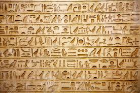
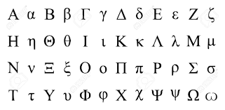
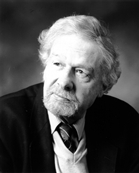
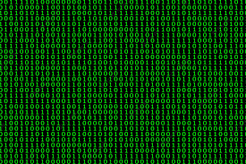
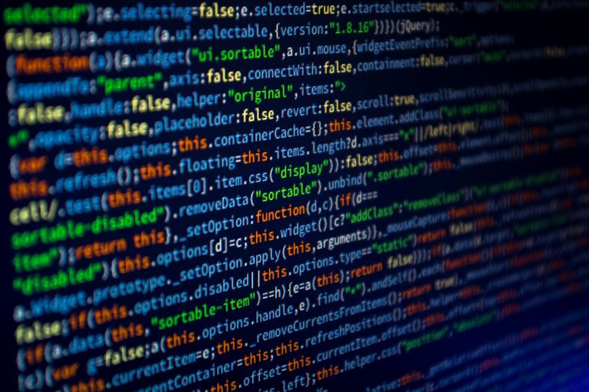
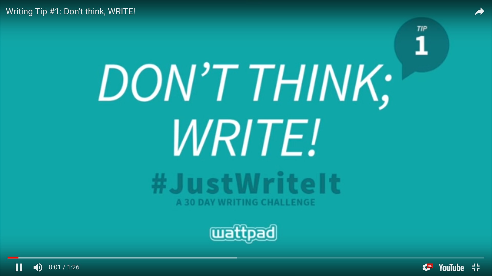

## Écrire avec des outils numériques 

### Initiation à la notion de code informatique

===

La littérature et l'édition numérique impliquent la maîtrise, au moins partielle et théorique, de ce que l'on appelle le code informatique. 

Cette séance a quatre objectifs : 
- comprendre ce qu'est le code informatique d'un point de vue technique
- comprendre en quoi il fait évoluer notre conception de l'écriture à l'époque numérique
- discuter les enjeux liées à la compétence informatique par rapport aux compétences éditoriales et littéraires
- présenter certaines approches poétiques et théoriques portées par quelques écrivains contemporains (qui ne font pas toutes et tous le même usage du code).

§§§§§§§§§§§§§§§§§§§§§§§§§§§§§§§§§§§§§§§§§§§§§

### Une littérature "Électronique"

* Une écriture littéraire *pré-web* qui questionne l'automatisation et le rapport à l'outil 
* Formes/genres : des générateurs, des hypertextes
* Supports externes (Disquettes, DVD, etc.)

===

La "Littérature numérique" est une expression assez récente (années 2000), qui a été précédée d'une autre notion, celle de "littérature électronique", en vogue dès les années 1970. 

De manière concommitante à l'apparition des premiers ordinateurs, des premiers développeurs cherchent en effet à exploiter le potentiel des outils informatiques pour éditer et même créer des textes littéraires. Ces premières oeuvres sont de deux sortes : 
- il y a d'un côté des générateurs, qui travaillent le fantasme d'une écriture qui se produirait toute seule, et dont nous reparlerons à l'occasion des cours consacrés aux IAG contemporaines.
- il y a les premiers hypertextes de fiction, qui sont des récits que l'on "Joue", un peu sur le modèles des livres dont vous êtes le héros, mais en version électronique

§§§§§§§§§§§§§§§§§§§§§§§§§§§§§§§§§§§§§§§§§§§§§
<!-- .slide: data-background-image="img/magne.jpg" data-background-size="contain"-->

===

Exemple de générateur avec bernard Magné, par ailleurs chercheur en littérature (narratologue : ce qui n'est pas un hasard = volonté de modéliser l'écriture littéraire, les récits de fiction). 

Mémoires d’un (mauvais) coucheur génère des maximes en utilisant une phrase à trous extrêmement simple ([fragment 1] je me suis couché comme [fragment 2]) et deux banques de citations tirées de divers ouvrages littéraires, l’une pour le [fragment 1], l’autre pour le [fragment 2].

§§§§§§§§§§§§§§§§§§§§§§§§§§§§§§§§§§§§§§§§§§§§§
<!-- .slide: data-background-image="img/nt2-09-ce01-1024x768-afternoon.jpg" data-background-size="contain"-->

===

Afternoon, a Story est un hypertexte de fiction réalisé par Michael Joyce à l’aide du logiciel Storyspace. Considéré comme une œuvre fondatrice dans le domaine de la littérature hypermédiatique, Afternoon raconte l’histoire d’un homme, Peter, qui croit avoir été témoin du décès de son fils et de son ex-femme dans un accident de voiture en se rendant au travail un bon matin. Narré en grande partie à la première personne par Peter lui-même, le récit permet au lecteur de suivre le narrateur dans sa descente au cœur de la mémoire et de l’incertitude pendant cet instant-charnière (un après-midi) au cours duquel l’identité réelle des victimes de la tragédie routière demeure un mystère.

§§§§§§§§§§§§§§§§§§§§§§§§§§§§§§§§§§§§§§§§§§§§§
<!-- .slide: data-background-image="img/nt2-09-ce02-1024x768-afternoon.jpg" data-background-size="contain"-->

===

Pour naviguer dans l’œuvre, le lecteur peut passer d’une lexie à l’autre en appuyant sur la touche RETOUR de son clavier, utiliser les hyperliens cachés dans le texte (les mots ne sont pas surlignés ni mis en évidence d’aucune manière – le lecteur est plutôt invité à se fier à son instinct), répondre aux questions dispersées dans le texte à l’aide des boutons Y (Yes) et N (No), taper différents mots interrogatifs dans le champ de saisie prévu à cet effet au bas de l’écran, utiliser la touche de retour en arrière, placer des signets, consulter l’historique de sa session de lecture pour revenir à un point précis, ou encore explorer directement les liens offerts à partir d’une lexie en particulier en utilisant le bouton Links. Une option fournie par Storyspace permet aussi au lecteur de créer des notes en marge de chacune des lexies. Ces notes peuvent être consultées en cas de retour en arrière pendant toute la durée de la session de lecture.

§§§§§§§§§§§§§§§§§§§§§§§§§§§§§§§§§§§§§§§§§§§§§

### Une littérature indissociable de la technique

>In the contemporary era, both print and electronic texts are deeply interpenetrated by code. Digital technologies are now so thoroughly integrated with commercial printing processes that print is more properly considered a particular output form of electronic text than an entirely separate medium. Nevertheless, electronic text remains distinct from print in that it literally cannot be accessed until it is performed by properly executed code. 

Katherine Hayles, « Electronic literature: What is it? », 2007, article en ligne : https://eliterature.org/pad/elp.html.

<!-- .element: class="source" -->

===

Dans un texte théorique fondateur du champ des études hypermédiatiques, Katherine Hayles définit la littérature électronique par sa capacité à être performée par la machine.

>À l'ère contemporaine, les textes imprimés et électroniques sont profondément imprégnés de code. Les technologies numériques sont désormais si étroitement intégrées aux processus d'impression commerciale que l'impression est davantage considérée comme une forme particulière de sortie de texte électronique que comme un support entièrement distinct. Néanmoins, le texte électronique reste distinct de l'impression dans la mesure où il n'est littéralement accessible qu'après avoir été exécuté par un code correctement exécuté.

§§§§§§§§§§§§§§§§§§§§§§§§§§§§§§§§§§§§§§§§§§§§§

>The immediacy of code to the text’s performance is fundamental to understanding electronic literature, especially to appreciating its specificity as a literary and technical production. Major genres in the canon of electronic literature emerge not only from different ways in which the user experiences them but also from the structure and specificity of the underlying code. Not surprisingly, then, some genres have come to be known by the software used to create and perform them.

Katherine Hayles, « Electronic literature: What is it? », 2007, article en ligne : https://eliterature.org/pad/elp.html.

<!-- .element: class="source" -->

===

>Le lien direct entre le code et la performance du texte est fondamental pour comprendre la littérature électronique, en particulier pour apprécier sa spécificité en tant que production littéraire et technique. Les principaux genres du canon de la littérature électronique émergent non seulement des différentes façons dont l'utilisateur les expérimente, mais aussi de la structure et de la spécificité du code sous-jacent. Il n'est donc pas surprenant que certains genres soient désormais connus sous le nom du logiciel utilisé pour les créer et les exécuter.

Cette position, cette définition établit un lien direct entre la compétence en écriture informatique et en écriture littéraire. Hayles place au premier plan la dimension technique et dispositive de l’œuvre numérique.

Il s'agit d'un positionnement radical qui va d'ailleurs faire débat chez les écrivains et lecteurs, notamment avec l'essor du Web et des premiers CMS. On reviendra plus tard sur l'histoire de la littérature web, mais pour faire court : pas besoin de savoir écrire un programme en python pour publier quelques vers de poésie sur Instagram.

§§§§§§§§§§§§§§§§§§§§§§§§§§§§§§§§§§§§§§§§§§§§§

## *“Si t’es pas codeur t’es pas auteur”...*

"Pour écrire un codex [numérique], l’auteur doit produire non seulement du texte et des liens, mais aussi du code informatique, un code qui fait partie intégrante de l’œuvre."  Thierry Crouzet, 2011.<!-- .element: style="width:50%;float:right; text-align: left; font-size: 0.6em; margin-right:-1em;" -->

<!-- .element: style="width:45%;float:left;margin-left:-1em; font-size:1.4rem; text-align:justify" -->

===

Exemple de débat : 
Dans un billet de blogue au titre percutant — « si t’es pas codeur, t’es pas auteur », publié en 2011 — l’écrivain Thierry Crouzet dessinait lui aussi une relation conditionnelle entre les compétences informatiques de l’écrivain et son statut d’auteur.

"Pour écrire un codex, l’auteur doit produire non seulement du texte et des liens, mais aussi du code informatique, un code qui fait partie intégrante de l’œuvre."

§§§§§§§§§§§§§§§§§§§§§§§§§§§§§§§§§§§§§§§§§§§§§

<!-- .slide: data-background-image="img/crouzetAuteurCodeur.png" data-background-size="contain"-->
<!-- .slide: class="hover"-->

>
**“On m’a répondu  «&nbsp;T’es pas boulanger, t’es pas auteur&nbsp;»”**
 Thierry Crouzet, 2011.

<!-- .element: style="font-size:1.8rem" -->

===

La formule était volontairement provocatrice, et elle suscitera d’ailleurs des réactions assez vives — de l’aveu même de l’intéressé : « On m’a répondu “T’es pas boulanger, t’es pas auteur” ».

§§§§§§§§§§§§§§§§§§§§§§§§§§§§§§§§§§§§§§§§§§§§§
<!-- .slide: data-background-image="img/crouzetAuteurCodeur.png" data-background-size="contain"-->
<!-- .slide: class="hover"-->

## Problématiques
* Quelles doivent être les compétences d'écriture de l'écrivain et de l'éditeur à l'époque numérique ?
* Faut-il écrire du code pour être un écrivain/éditeur numérique ?
* Quel rapport entre littérarité et littératie numérique ? Comment s'évalue l'écriture numérique ?

===

Les mots de Crouzet font écho à un débat, à une problématique forte au sein du champ littéraire numérique : 
* Quelles doivent être les compétences d'écriture de l'écrivain et a fortiori de l'éditeur pour publier "numériquement" ?
* Faut-il nécessairement savoir écrire du code pour être un écrivain/éditeur numérique ?
* Quel rapport entre littérarité et littératie numérique ? Peut-on évaluer un "style" de code ?

§§§§§§§§§§§§§§§§§§§§§§§§§§§§§§§§§§§§§§§§§§§§§

## Écritures [numériques]
* L'écriture = une technique d'inscription et d'enregistrement de la langue
* L'écriture = une technique de maîtrise de la langue (le style)
* "Bien écrire", "mal écrire"

===

L'écriture est une technique, parmis les plus anciennes de l'humanité. 

L'écriture est polysémique et porte un certain nombre de connotations : on "Écrit bien ou mal" = renvoie à notre graphie, mais également à notre manière de manier la langue. 
L'écriture, en littérature, s'évalue : c'est la question du style. Les études littéraires se sont focalisées sur l'analyse du style. Je voudrais revenir avec vous sur le sens premier de la technique d'écriture : l'écriture comme maîtrse d'un ensemble d'outils de représentation et d'enregistrement de la langue.

L'acte d'écrire = déterminé par nos outils. Écrire détermine notre pensée, notre potentiel d'expression, qu'il soit scientifique ou poétique.

§§§§§§§§§§§§§§§§§§§§§§§§§§§§§§§§§§§§§§§§§§§§§

## L'invention de l'écriture : retour sur une mutation épigénétique

* première technologie humaine, à l'origine de toutes les autres
* 4000 - 3500 av JC = écritures picto-idéographique
* 3200 av JC = hiéroglyphes

<!-- .element: style="width:50%;float:right; text-align: left; font-size: 0.6em; margin-right:-1em;" -->

<!-- .element: style="width:45%;float:left;margin-left:-1em; font-size:1.4rem; text-align:justify" -->

===

Entre 4000 et 3500 ans avant notre ère, l’homme invente l’écriture. Nous avons du mal à l’envisager comme cela, mais il faut considérer l’écriture est l’une de nos premières technologies.

Les premières formes d’écriture sont localisées en Mésopotamie, au IVe millénaire avant J.-C., où l’on invente une écriture picto-idéographique (images simplifiées qui désignent êtres et choses) fondatrice du cunéiforme.

Évidemment, l’une des formes d’écriture ancienne les plus connues sont les hiéroglyphes, originaires d’Égypte, qui sont pourtant beaucoup plus tardifs (3200 ans).

§§§§§§§§§§§§§§§§§§§§§§§§§§§§§§§§§§§§§§§§§§§§§

* 1000 av JC = écriture alphabétique (un code abstrait)

===
L’écriture alphabétique est quant à elle encore plus récente, puisqu’elle a été inventée 1000 ans avant notre ère.

L’écriture est l’une de nos premières technologies, et à bien des égards, celle qui a permis toutes les autres car elle est allée de pair avec l’inscription et la diffusion des savoirs.  

L'écriture alphabétique est un code : phénomène d'abstraction.

§§§§§§§§§§§§§§§§§§§§§§§§§§§§§§§§§§§§§§§§§§§§§

## Une "raison" graphique
* Jack Goody *La Raison graphique* (*The Domestication of the Savage Mind*, 1977)
* Approche anthropologique
* Une technique qui a suscité des mutations humaines profondes

<!-- .element: style="width:60%;float:right; text-align: left; font-size: 0.6em; margin-right:-1em;" -->

<!-- .element: style="width:40%;float:left;margin-left:-1em; font-size:1.4rem; text-align:justify" -->

===

Jack Goody, anthropologue anglais (né en 1919) en fait l’une des plus importantes inventions de l’humanité. Sa thèse est exposée entre autres dans *La Raison graphique* (*The Domestication of the Savage Mind*, 1977) et se résume en 3 temps :

§§§§§§§§§§§§§§§§§§§§§§§§§§§§§§§§§§§§§§§§§§§§§
<!-- .slide: data-background-image="img/ecritureSainte.jpeg" data-background-size="contain" -->
<!-- .slide: class="hover" -->

1. L'écriture est l’un des premiers moyens d’archivage des informations
2. L'écriture est donc aussi à l’origine d’un travail d’organisation du savoir en catégories
3. L’écriture a permis le développement de la pensée logique, de l’abstraction et finalement de la science

===
1. L'écriture est l’un des premiers moyens d’archivage des informations

L'écriture traduit certes une préoccupation de la transmission des savoirs, des traditions, des cultures.

Mais elle a d’abord servi des fonctions pratiques : il s’agissait surtout de transmettre des comptes, des décisions de droit, etc.

La plupart des tablettes cunéiformes que l'on a retrouvées sont en fait des tickets de caisse...

Mais très rapidement, elle a permis la transcription et la transmission d’un savoir et d’une culture accumulés auparavant au sein de la tradition orale.

L’une des plus anciennes oeuvres littéraires qui nous aient été transmises est l’épopée de Gilgamesh. Cette épopée relate l'histoire de Gilgamesh, roi et tyran de la ville d'Uruk en Mésopotamie, qui va chercher à atteindre l’immortalité.

- 2. L'écriture est donc aussi à l’origine d’un travail d’organisation du savoir en catégories.
« Dispositif spatial de triage de l'information », l'écriture permet, si on peut se permettre l'expression, une forme de "stockage visuel".

L'écriture va rapidemment donner lieu à un principe d'organisation des données par différents moyens de représentation graphique (listes, tableaux, inventaires, registres, etc.).

Ces représentations graphiques issues de l'écriture favorisent non seulement l'enregistrement mais aussi la réorganisation de l'information : c'est-dire la curation des informations.

Ainsi et surtout,
- 3. L’écriture a permis le développement de la pensée logique, de l’abstraction et finalement de la science.

L'écriture s'affranchit des contextes de l'énonciation - de l'oralité, ce qui encourage l'abstraction et surtout la décontextualisation du savoir.

Vous le savez bien vous-mêmes, dans vos travaux écrits, vous avez tendance à adopter un raisonnement qui n'est pas le même qu'à l'oral : déformation française = le tripartisme !

Le texte écrit va favoriser la construction d'une connaissance systématique. L'écrit rend visible la contradiction, il permet de confronter et de recouper les informations. C'est aussi l'émergence du scepticisme critique, du doute philosophique, bref d'un savoir scientifique.

§§§§§§§§§§§§§§§§§§§§§§§§§§§§§§§§§§§§§§§§§§§§§
<!-- .slide: data-background-image="img/images.png" -->
<!-- .slide: class="hover"-->

## L'écriture numérique : vers une mutation de la "raison graphique" et de la connaissance ?
Les changements technologiques des techniques d'écriture à l'ère de la remédiation numérique ont un impact sur nos modèles épistémologiques, nos connaissances et nos arts. 

§§§§§§§§§§§§§§§§§§§§§§§§§§§§§§§§§§§§§§§§§§§§§

Mais, au fait, c'est quoi exactement du "code informatique"?

§§§§§§§§§§§§§§§§§§§§§§§§§§§§§§§§§§§§§§§§§§§§§

<!-- .element: style="width:60%;float:left;margin-right:-1em;" -->

"Love Letters" est un programme dont le code est écrit en langage python2 par Nick Montfort en 2018 (update 2025), à partir d'une oeuvre de Christoper Strachey (1953, langage inconnu).<!-- .element: style="width:40%;float:right; text-align: left; font-size: 0.6em; margin-right:-1em;" -->

===

Difficulté : il existe de très, très nombreux langages de programmation, tout comme il existe de nombreuses langues dans le monde. 

§§§§§§§§§§§§§§§§§§§§§§§§§§§§§§§§§§§§§§§§§§§§§

### Regardons sous le capot... 

<!-- .element: style="width:40%;float:left;margin-right:-1em;" -->

<!-- .element: style="width:60%;float:right;margin-right:-1em;width:400px;" -->

===

Certains langages de programmation ont même déjà disparu ! Ils ne sont plus utilisés par la communauté. Dans l'exemple ci-dessous, nous avons un émulateur, c'est-à-dire une reconstitution en Python de ce qui passe pour la toute première oeuvre de littérature numérique. 

Les langages de programmation, comme les langues, sont vivants : ils peuvent faire l'objet de discussions et de négociation au sein de la communauté pour ajouter des éléments. 

Programme, code, langage ? 

§§§§§§§§§§§§§§§§§§§§§§§§§§§§§§§§§§§§§§§§§§§§§

Programme, code, langage ? 

Un programme désigne un ensemble de code exécutable, rédigé dans un langage de programmation déterminé, avec son propre alphabet, son vocabulaire et ses règles de syntaxe.

===

Si on devait faire une analogie : le programme renvoie à une oeuvre, c'est du code exécutable dans son ensemble (ici les love letters, mais on pourrait dire *Les misérables*), le code renvoie à l'ensemble des éléments rédigé dans le programme (par analogie, le texte et les paragraphes). Et cette rédaction s'est opérée selon les règles syntaxiques = le langage informatique (qui correspondrait un peu à notre grammaire béscherelle).

§§§§§§§§§§§§§§§§§§§§§§§§§§§§§§§§§§§§§§§§§§§§§

Informatique ?

Information + automatique

Informatique = un calcul complexe dont l'exécution est délégué à une machine   
Ordinateur = machine à calculer

<!-- .element: style="font-size:1.7rem; text-align:center" -->

===

Mais n'allons pas trop vite en besogne et revenons aux bases : l'informatique. 

Informatique est un mot-valise = Information + Automatique

L’informatique, pour le dire simplement, est un calcul
que nous confions à une machine. Votre ordinateur est, de ce point de vue, une calculette hyper puissante. Sa langue est celle du bit : fondamentalement, elle ne comprend rien d'autre que des 1 et des 0. Elle ne "parle" pas ou ne "lit" pas le langage naturel, qui est notre langue. Elle réalise des calculs à partir de notre système de langue encodé en 0 et 1 pour être appréhendable par l,ordinateur. 

§§§§§§§§§§§§§§§§§§§§§§§§§§§§§§§§§§§§§§§§§§§§§

### Calcul 
- quelle unité de mesure ? 
- peut-on tout calculer ?

### Machine 
- quels outils ? 
- comment mécaniser et automatiser ? 

===

Cette définition liminaire nous pose déjà deux nouveux concepts : 
- la notion de calcul : avec quoi, quelle unité de mesure, va-t-on calculer? 
- qu'est-ce qui est calculable ? PB de la modélisation en informatique, et aujourd'hui de l'intelligence artificielle (comment calcule-t-on le langage)

La notion de machine :
- renvoie à la question des outils mobilisés, et tout d'abord à la question du hardware.

§§§§§§§§§§§§§§§§§§§§§§§§§§§§§§§§§§§§§§§§§§§§§

### Le calcul...

<!-- .element: style="width:60%;float:left;margin-right:-1em;" -->

L'informatique est une technologie basée sur des micros signaux électriques On/Off, que l'on interprète comme des 0 et 1. Ces 0/1 peuvent être combinés pour exprimer des symboles, typiquement un alphabet. Cet alphabet nous permet d'écrire en langage naturel ou en langage informatique, des suites de symboles que l'ordinateur saura interpréter en 0/1, et ainsi saura manipuler (calculer), stocker (dans des disques, ou des cartes mémoires), et bien-sûr afficher en retour sur un écran pour les rendre lisibles à l'humain.<!-- .element: style="width:40%;float:right; text-align: left; font-size: 0.6em; margin-right:-1em;" -->

===

Qu'est-ce que la machine calcule exactement ? L'informatique est une technologie basée sur des micros signaux électriques On/Off, que l'on interprète comme des 0 et 1.

Ces 0/1 peuvent être combinés pour exprimer des symboles, typiquement un alphabet.

Cet alphabet nous permet d'écrire en langage naturel ou en langage informatique, des suites de symboles que l'ordinateur (ou en fait toute technologie numérique) saura interpréter en 0/1, et ainsi saura manipuler (calculer), stocker (dans des disques, ou des cartes mémoires), et bien-sûr afficher en retour sur un écran pour les rendre lisibles à l'humain.

Donc l'enjeu ici, vous le comprenez, c'est que les inscriptions deviennent manipulables, parfois calculable, réplicable à l'identique. Et cela change évidemment tout. L'écriture devient numérique !

À retenir : à la base de l'informatique, il y a donc une série de signaux électriques qui sont le résultat d'un phénomène physique, qui relève de ce que l'on appelle le "hardware".

§§§§§§§§§§§§§§§§§§§§§§§§§§§§§§§§§§§§§§§§§§§§§

### ... et la machine

* des constructions de l'esprit (histoire conceptuelle autant que technique)
* des réalisations industrielles (processus de mécanisation et d'automatisation)
* des produits de consommation courante (à défaut d'une consommation "raisonnée")

===

Première leçon : l'histoire des techniques est d'abord une histoire conceptuelle, et pas seulement une histoire des machines. 
Les premières machines informatiques sont des créations de l'esprit, avant d'être des objets manipulables. Les grandes inventions techniques, y compris informatiques, y compris des technologies qui nous semblent contemporaines, ont d'abord été modélisés dans des textes.

Que vous songiez à Léonard de Vinci : un artiste, un philosophe, et un inventeur.

C'est un peu pareil chez les pionniers de l'informatique : l'ordinateur, les hypertexte, les IA, sont d'abord des constructions théoriques qui ont été dans un second temps mises en application -- avec parfois des variantes, des ajustements. Ainsi l'IA est-elle encore loin des modèles théoriques qui l'ont conceptualisées dans les années 50-60. 

La deuxième chose, c'est que nos machines sont des produits industriels, qui s'inscrivent en cela dans une longue histoire de la mécanication et de l'automatisation progressives de certaines tâches, notamment des tâches de calcul, mais également de production de données -- dont l'invention de l'imprimerie, par exemple, relève également.

Cet ancrage industriel implique une certaine orientation dans les développements techniques : des états ont financé la recherche et l'innovation pour répondre à des besoins bien spécifiques, surtout pour garantir une certaine puissance voire un contrôle :
    - développement amélioration des communications
    - applications militaire

Mais ce que cet état "industriel" suppose surtout, c'est l'importance croissante, et aujourd'hui problématique, d'industries, donc de compagnies privées, qui ont peu à peu construit un monopole d'abord autour de la production matérielle informatique, mais également logicielle. Dans le domaine de l,édition et de la transmission des contenus littéraires, cette question est particulièrement sensible.

Enfin, les produits hardware sont devenus des objets de consommation courante, et à cet égard d'une consommation souvent peu réfléchie et encore moins raisonnée.

§§§§§§§§§§§§§§§§§§§§§§§§§§§§§§§§§§§§§§§§§§§§§

## Les enjeux des écritures numériques 
* Enjeux d'écriture : maîtriser l'écrit
* Enjeux de lecture : accéder à l'ensemble des écrits
* Enjeux de littératie : comprendre ce que l'on écrit

§§§§§§§§§§§§§§§§§§§§§§§§§§§§§§§§§§§§§§§§§§§§§

## Expérience : inspecter une page web pour en comprendre la structure

Ouvrez une page dans votre navigateur : par exemple, la page d'accueil de la faculté des lettres de SU.

<!-- .element: style="font-size:1.7rem; text-align:justify" -->

Depuis votre pavé tactile ou votre souris : clic gauche + inspecter
(Raccourcis clavier sur la plupart des ordinateurs : ctrl+maj+c ou encore F12)

<!-- .element: style="font-size:1.7rem; text-align:justify" -->

Vous venez tout juste de plonger dans la couche de code du site web.

<!-- .element: style="font-size:1.7rem; text-align:justify" -->

§§§§§§§§§§§§§§§§§§§§§§§§§§§§§§§§§§§§§§§§§§§§§
<!-- .slide: data-background-image="img/sorbonneUcode.png" data-background-size="contain" -->

===

Voici le résultat : vous êtes en face du code de la page.

Dans la partie haute, vous allez retrouver le HTML (on reviendra sur ces noms de langage). Que contient-il ? 

Tout le texte que l'on trouve sur la page, mais structuré : intuitivement, vous savez ce qu'est un texte structuré, car vous structurez vos textes depuis des années, avec une intro, des parties, des conclusions. 
La structuration du texte, en informatique, renvoie à la même chose : il s'agit d'organiser les éléments textuels en les décrivant, de manière à expliquer à la machine quelle est la fonction des parties du texte sur le document.

N'hésitez pas à dérouler l'architecture de la page, afin d'essayer d'accéder au texte que vous voyez affiché sur la page. Comme vous pouvez le constater, on est ici sur une architecture assez complexe. 

Parmi les balises HTML les plus simples : 
- h pour header
- p pour paragraphe, 
- li pour liste

etc.

Plus bas, c'est le CSS qui apparaît : la CSS est le langage qui va permettre de donner un style à cette architecture.

Si vous le souhaitez, depuis votre console, vous pouvez jouer à modifier certains éléments, notamment les éléments graphiques !

§§§§§§§§§§§§§§§§§§§§§§§§§§§§§§§§§§§§§§§§§§§§§
<!-- .slide: data-background-image="img/SorbonneU-pink.png" data-background-size="contain" -->

===

Ici, j'ai mis la fac des lettres en rose.

Mais on peut aussi changer plus de contenus, pour continuer à jouer, y compris dans la partie HTML.

§§§§§§§§§§§§§§§§§§§§§§§§§§§§§§§§§§§§§§§§§§§§§
<!-- .slide: data-background-image="img/changeSU-nicorn.png" data-background-size="contain" -->

====

Ici, j'ai simplement changé un lien vers une autre image.

§§§§§§§§§§§§§§§§§§§§§§§§§§§§§§§§§§§§§§§§§§§§§
<!-- .slide: data-background-video="img/SU-licorne.mp4" data-background-size="contain" -->

§§§§§§§§§§§§§§§§§§§§§§§§§§§§§§§§§§§§§§§§§§§§§

## Les écritures numériques : une réalité plurielle et multicouche
* L'écriture numérique doit être déclinée au pluriel : elle est toujours le résultat d'une stratification
* Produire un document (textuel, visuel, sonore), revient à opérer un choix technique, derrière lequel se cache également un choix épistémologique, philosophique ou esthétique.

<!-- .element: style="font-size:1.7rem; text-align:justify" -->

§§§§§§§§§§§§§§§§§§§§§§§§§§§§§§§§§§§§§§§§§§§§§

### Serge Bouchardon et Victor Petit, ou les trois "niveaux" de l'écriture numérique

>Le livre a une réalité physique ou matérielle (le papier, l’encre) et une réalité symbolique ou culturelle (la langue, les signes à interpréter). Mais pour comprendre le fonctionnement du numérique il faut comprendre l’articulation, non pas de deux, mais de trois niveaux : il y a ce qu’écrit la machine, il y a ce qu’écrit le programmeur de cette machine, il y a ce qu’écrit l’utilisateur de cette machine. Lire un document numérique quelconque, c’est lire ces trois niveaux, quoique seul le dernier soit visible. ([Bouchardon et Petit, 2017](http://www.costech.utc.fr/CahiersCOSTECH/spip.php?article69))

<!-- .element: style="font-size:1.7rem; text-align:justify" -->

§§§§§§§§§§§§§§§§§§§§§§§§§§§§§§§§§§§§§§§§§§§§§

### Niveau 1 : le code binaire, la technique comme matière

> Le premier niveau de l’écriture numérique est d’abord théorique et repose sur la discrétisation et la manipulation d’unités formelles privées de sens (les 0 et les 1 ou n’importe quelles autres unités logiques formelles constituant un alphabet de manipulation). Tout contenu numérique peut être réduit en codage binaire, dont la signification éventuelle est arbitraire et indépendante de la manipulation formelle. ([Bouchardon et Petit, 2017](http://www.costech.utc.fr/CahiersCOSTECH/spip.php?article69))

<!-- .element: style="font-size:1.6rem;width:50%;float:left;margin-right:-1em;" -->

<!-- .element: style="width:40%;float:right;margin-right:-1em;" -->

§§§§§§§§§§§§§§§§§§§§§§§§§§§§§§§§§§§§§§§§§§§§§

### Niveau 2 : le code informatique, la technique comme code
>Le deuxième niveau est celui du potentiel fonctionnel proposé par les applications, ce n’est plus le niveau de l’implémentation matérielle, mais le niveau du logiciel, celui de la manifestation, celui des formats d’écriture et des fonctions d’écriture. Comment nommer ce deuxième niveau de l’écriture numérique ? Nous proposons de l’appeler écriture pour les machines, soit l’écriture informatique ou l’écriture du code. ([Bouchardon et Petit, 2017](http://www.costech.utc.fr/CahiersCOSTECH/spip.php?article69))

<!-- .element: style="font-size:1.6rem;width:50%;float:left;margin-right:-1em;" -->

<!-- .element: style="width:40%;float:right;margin-right:-1em;" -->

§§§§§§§§§§§§§§§§§§§§§§§§§§§§§§§§§§§§§§§§§§§§§

### Niveau 3 : l'interface, la technique comme art

>Ce troisième niveau est celui des utilisateurs du numérique, qui interprètent des formes sémiotiques et les manipulent, c’est le niveau de l’interaction (avec le niveau 1 via le niveau 2). Ce troisième niveau étant le plus usuel, nous pouvons le nommer écriture avec les machines. Mais tout l’enjeu de l’écriture numérique du troisième niveau est de ne pas oublier les deux autres niveaux, qui ne sont pas directement visibles mais qui rendent visible. ([Bouchardon et Petit, 2017](http://www.costech.utc.fr/CahiersCOSTECH/spip.php?article69))

<!-- .element: style="font-size:1.6rem;width:50%;float:left;margin-right:-1em;" -->

<!-- .element: style="width:40%;float:right;margin-right:-1em;" -->

§§§§§§§§§§§§§§§§§§§§§§§§§§§§§§§§§§§§§§§§§§§§§

>Du fait de ces trois niveaux, il existe une tension propre à l’écriture numérique. S’il y a tension, c’est d’abord parce que l’écriture numérique réunit deux mondes jusqu’alors disjoints : le monde de l’écriture et le monde de la machine. [...] Pour ne parler ici que de la tension entre écriture et lecture, il est clair que la manipulation des signes et la dissémination des traces propres à l’écriture numérique entraînent ceci de particulier que non seulement écrire c’est lire, mais que lire c’est écrire. Avant d’être l’industrialisation de l’écriture, le web est l’industrialisation de la lecture. ([Bouchardon et Petit, 2017](http://www.costech.utc.fr/CahiersCOSTECH/spip.php?article69))

<!-- .element: style="font-size:1.7rem; text-align:justify" -->

§§§§§§§§§§§§§§§§§§§§§§§§§§§§§§§§§§§§§§§§§§§§§

### Lire-écrire // copier-coller : une écriture manipulable

>Plus que d’être du lisible, l’essence de l’écriture numérique est d’être du manipulable : tout peut devenir une unité de manipulation, le tout comme chaque partie ou ensemble de parties. La distinction entre partie et tout est d’ailleurs problématique dans le cas du numérique, car comme le rappelle Lev Manovich, les médias numériques possèdent une structure modulaire. ([Bouchardon et Petit, 2017](http://www.costech.utc.fr/CahiersCOSTECH/spip.php?article69))

<!-- .element: style="font-size:1.7rem; text-align:justify" -->

===
Manipulabilité du texte : nous sommes tous des copieurs-colleurs.

Avec un même contenu textuels, le texte peut prendre une série de formes très différentes : on peut jouer sur des formats, sur du graphisme, etc. etc.

Un écriture, autrement dit, plus fluide que jamais.

Ce type d'écriture produirait des changements sur notre manière même de penser, de réfléchir.
Mutation technique + épistémologique et même épigénétique : notre capacité à nous concentrer, notre manière de concevoir et d'agencer le monde n'est pas la même que celle de nos grands-parents.

§§§§§§§§§§§§§§§§§§§§§§§§§§§§§§§§§§§§§§§§§§§§§

### Une écriture de plus en plus contrainte par les interfaces ? 

===

Cette stratification de l'écriture numérique, et sa dissimulation derrière des interfaces qui masquent la technique au nom d'une "facilitation" de l'écriture est d'une encapacitation des publics (cf. ici la campagne de pub wattpad : "Don't think, just write"), est souvent critiquée par des théoriciens et praticiens des écritures numériques, au nom d'une certaine transparence et de la littératie numérique. 

§§§§§§§§§§§§§§§§§§§§§§§§§§§§§§§§§§§§§§§§§§§§§

### Une éloignement progressif du hardware au profit du software...
>Aujourd'hui, ces raisons économiques impérieuses ont fait définitivement disparaître la modestie d'Alan Turing qui, à l'âge de pierre de l'histoire des ordinateurs, préférait lire les productions des machines en nombre binaires que décimaux. Au contraire, ce que l'on indûment la philosophie d'une communauté, elle-même appelée communauté informatique, met tout en oeuvre pour dissimuler le hardware derrière le logiciel, les signifiants électroniques derrière des interfaces homme-machine.

>Friedrich Kittler, *Mode protégé*, 1991 (2015).

===

§§§§§§§§§§§§§§§§§§§§§§§§§§§§§§§§§§§§§§§§§§§§§

### ... et une marchandisation de l'écriture

>Comme il est devenu possible d'importer des programmes d'un système à un autre, il est devenu économiquement attractif (au moins aux yeux de certains) de cacher le code de votre programme.

>Lawrence Lessig, *Culture libre*, 2004.

§§§§§§§§§§§§§§§§§§§§§§§§§§§§§§§§§§§§§§§§§§§§§

### La bataille des éditeurs WYSIWYM vs WYSIWYG

<!-- .element: style="width:45%;float:left;margin-left:-1em;" -->

<!-- .element: style="width:45%;float:right;margin-right:-1em;" -->

§§§§§§§§§§§§§§§§§§§§§§§§§§§§§§§§§§§§§§§§§§§§§

## Approches littéraires

Comment les écrivains appréhendent-ils cette nouvelle condition de l'écriture?

===

Comment les écrivains appréhendent-ils cette nouvelle condition de l'écriture?

§§§§§§§§§§§§§§§§§§§§§§§§§§§§§§§§§§§§§§§§§§§§§

### Les critical code studies: lire le code, une compétence extra-informatique

>L'exploration du code n'est jamais une activité neutre, libre d'une épistémologie ou d'une vision du monde : plutôt, elle se prête à la force interprétative des théories critiques, lesquelles peuvent être adoptées et adaptées pour produire des perspectives nouvelles et approfondies.

Mak Marino, *critical code studies*, MIT Press, 2020.

===

Dans les études littéraires, une approche se démarque : les critical code studies.

§§§§§§§§§§§§§§§§§§§§§§§§§§§§§§§§§§§§§§§§§§§§§
<!-- .slide: data-background-image="img/nuits.png" data-background-size="contain"  -->

Source image : [_Nuits 48_ Joachim Séné](http://jsene.net/fragments-chutes-et-consequences/spip.php?article845)

<!-- .element: class="source" -->

===
> la série Nuits… qui ne sont lisibles que de nuit, le site étant réglé pour n’afficher qu’un avertissement priant l’internaute de revenir après le coucher du soleil s’il y accède trop tôt dans la journée : « Désolé, la nuit n’est pas encore tombée ici et les Nuits sont désormais illisibles de jour…
Revenez dans quelques heures. »

Aujourd'hui, nuits est de toute façon soumis à la "patine numérique" = CSS qui fait s'effacer le texte

§§§§§§§§§§§§§§§§§§§§§§§§§§§§§§§§§§§§§§§§§§§§§
<!-- .slide: data-background-image="img/nuits-code.png" data-background-size="contain"  -->

Source image : [_Nuits 48_ Joachim Séné](http://jsene.net/fragments-chutes-et-consequences/spip.php?article845)

<!-- .element: class="source" -->

===
Inspecter le code pour relire le texte = palimpseste numérique !

§§§§§§§§§§§§§§§§§§§§§§§§§§§§§§§§§§§§§§§§§§§§§

## Une écriture sans écriture ? Kenneth Goldmisth
* *Uncreative Writing* (Columbia University press, 2011)
* Kenneth Goldsmith [ubu-web](http://www.ubu.com/) - professeur de création littéraire
* *L'écriture sans écriture*, traduction de François Bon aux éditions Jean Boîte (2018)

===

On note également qu'un paradigme de la création littéraire contemporaine remet en cause elle aussi la notion d'originalité et de propriété, en s'inspirant d'une conception de l'autorité propre aux développeurs -- qui sont des écrivains eux aussi, mais de "code".

En s'inspirant de la philosophie du hack (bricolage davantage que piraterie), Kenneth Goldmisth, prof de création littéraire à NY, développe une poétique et une esthétique de l'"Écriture sans écriture".

L’écriture sans écriture, c’est aussi le titre du cours de création littéraire que donne Goldsmith à l’Université de Pennsylvanie, un cours où les étudiants sont sommés de laisser l’originalité de côté afin de se donner la liberté nécessaire pour copier, piller, réutiliser et recontextualiser le langage.

Ubuweb = archive numérique qui fait toujours référence dans le domaine des productions d’avant-garde, textes, sons et images confondus

§§§§§§§§§§§§§§§§§§§§§§§§§§§§§§§§§§§§§§§§§§§§§

## Les expériences d'écriture sans écriture de Kenneth Goldmisth

* Choisir une image au hasard, en format .jpg
* Changer l'extension en .txt 
* Ouvrir le fichier ainsi obtenu puis éditer à l'intérieur
* Rebasculer l'image dans son format original
* Tenter de l'ouvrir à nouveau

<!-- .element: style="font-size:1.7rem; text-align:justify" -->

§§§§§§§§§§§§§§§§§§§§§§§§§§§§§§§§§§§§§§§§§§§§§
<!-- .slide: data-background-image="img/barthes2.jpg" data-background-size="contain" -->

§§§§§§§§§§§§§§§§§§§§§§§§§§§§§§§§§§§§§§§§§§§§§
<!-- .slide: data-background-image="img/barthesImageCode.png" data-background-size="contain" -->

§§§§§§§§§§§§§§§§§§§§§§§§§§§§§§§§§§§§§§§§§§§§§
<!-- .slide: data-background-image="img/barthesCoding.png" data-background-size="contain" -->

§§§§§§§§§§§§§§§§§§§§§§§§§§§§§§§§§§§§§§§§§§§§§
<!-- .slide: data-background-image="img/barthes2modif.jpg" data-background-size="contain" -->

§§§§§§§§§§§§§§§§§§§§§§§§§§§§§§§§§§§§§§§§§§§§§

## Autorité et originalité ?

* L'édition et la curation comme nouvelle forme de création

>« How I make my way through this thicket of information —how I manage it, how I parse it, how I organize and distribute it— is what distinguishes my writing from yours »

source : Kenneth Goldsmith, *L'écriture sans écriture*, Jean Boîte éditions

§§§§§§§§§§§§§§§§§§§§§§§§§§§§§§§§§§§§§§§§§§§§§

* L'écriture (littéraire) numérique : tout dans le concept ? Du "plaisir du texte" au plaisir du code ?

Source image : [_Nuits 48_ Joachim Séné](http://jsene.net/fragments-chutes-et-consequences/spip.php?article845)

<!-- .element: class="source" -->

===
PB : à qui s'adresse une telle oeuvre? l'écriture litt num serait-elle seulement conceptuelle ?

§§§§§§§§§§§§§§§§§§§§§§§§§§§§§§§§§§§§§§§§§§§§§

À suivre... 

===

