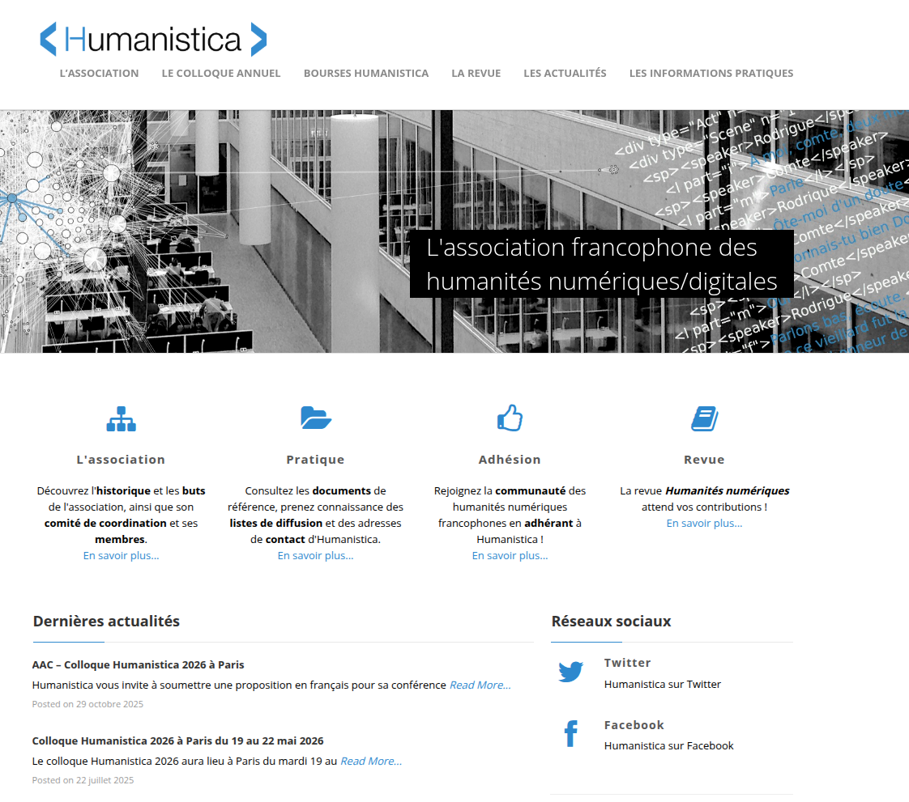
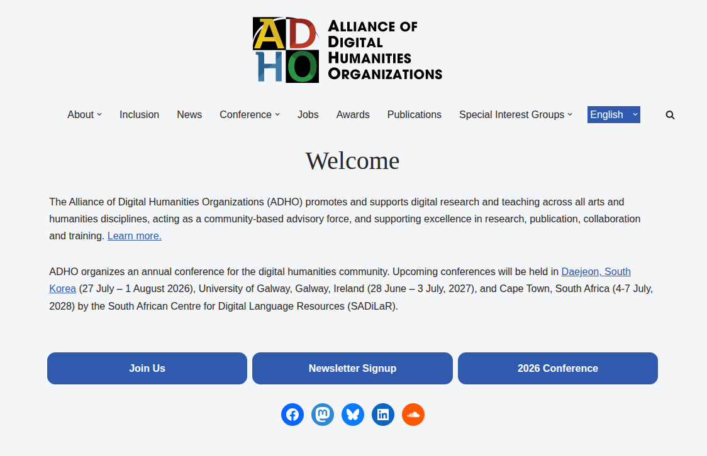
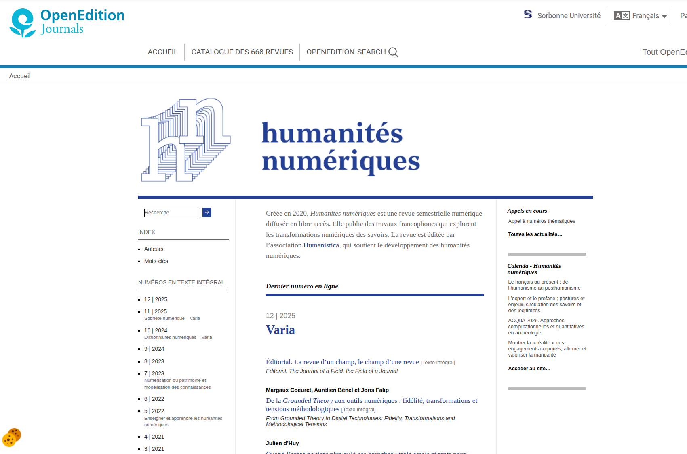
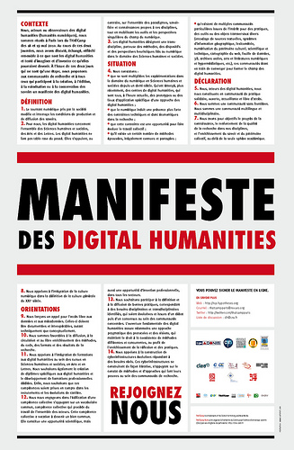
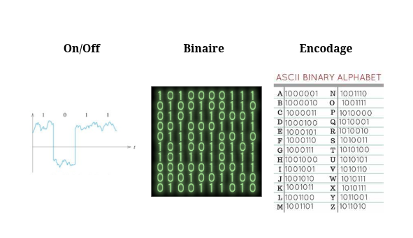

## Séminaire méthodologique  

## Humanités numériques

===

Présentation :
- chercheuse en littérature, dont le sujet et les objets de recherche relèvent de la littérature contemporaine et numérique (ce qui explique que mes exemples viendront svt de ce champ peu connu)
- chercheuse dont la méthodologie s'incrit dans le champ des HN (HN = méthode, pas une discipline). Plus spécifiquement : édition numérique, constitution de corpus/moissonnage, visualisation de données. Depuis peu, un peu de llm. École nord-américaine, canadienne (MVR + Sinclair). 
- Membre de l'asso Humanistica après CSDH. 
- Membre du Codir de la revue Humanités numériques

§§§§§§§§§§§§§§§§§§§§§§§§§§§§§§§§§§§§§§§§§§§§§

### Humanités numériques ? 

>L’utilisation de l’informatique en sciences humaines et sociales est pratiquée depuis maintenant plus de quarante ans. Plusieurs voies ont été explorées au cours de cette déjà assez longue histoire. La plus récente, qui prend le nom de digital humanities, désigne une intégration intense et à plu­sieurs niveaux des technologies numériques dans tous les processus de recherche, depuis la collecte de données jusqu’à la publication. 

>Pierre Mounier, *Manifeste des Humanités numériques*, 2010.

===

Il ne vous aura pas échappé que dans l'expression HN se trouve deux termes, Humanités et numériques, qui sont deux concepts autonomes que nous avons cherché à adjoindre. 
Le principe d'un concept, c'est d'exprimer une idée générale. Un concept est une représentation abstraite d'un objet ou d'un ensemble d'objets ayant des caractères communs.
De fait, les concepts font l'objet de définitions souvent discutées, discutables et évolutives. Les concepts sont déterminés par des facteurs multiples : ils sont déterminés par des disciplines, par des institutions, par des pratiques et des usages. Bref, ils sont toujours en négociation. Concept d'amour, concept de genre, concept de littérature. 

En tant que concepts, les Humanités d'une part et le numérique d'autre part, renvoient à des réalités historiques mais également institutionnelles et pratiques complexes. 

Dans le monde francophone, italien, espagnol, les humanités désignent généralement plus une tradition intellectuelle et même éthique de type humaniste d’inspiration érasmienne qu’un champ disciplinaire universitaire. Les humanités, ainsi, renvoient d'abord à un ensemble de courants de pensées et de disciplines : les lettres, la philo, les langues, l'histoire, l'histoire de l'art.

>Depuis plusieurs années, [ces disciplines] semblent en perte de vitesse dans un monde davantage dominé par les sciences et les techniques : disparition des heures d’enseignement consacrées aux langues anciennes et dévalorisation des filières littéraires dans l’enseignement secondaire, diminution des crédits de recherche pour les disciplines des sciences humaines et sociales, forte chute des ventes d’ouvrages de recherche en librairie ; les signes d’une désaffection pour la culture humaniste se sont multipliés.

Sarkozy en 2007 : « Vous avez le droit de faire littérature ancienne, mais le contribuable n'a pas forcément à payer vos études de littérature ancienne. »

D'un autre côté, nous avons donc l'adjectif "numérique", concept s'il en faut encore plus nébuleux, dans la mesure où il se réfère avant tout à une réalité technique très complexe et plurielle, mais également depuis 20 ans à une réalité culturelle (nous appartenons à une culture numérique) dont nous n'avons pas toujours bien conscience. 

Partant de là, à quoi renvoie l'expression humanités numériques ? 

Une définition un peu simpliste pourrait être de dire : on utilise l'informatique pour faire de la recherche, de manière plus rapide, plus efficace qu'avant car on va être informatiser, cad automatisé. 

Pourtant, les HN encouragent à dépasser la dimension strictement applicative des technologies numériques pour interroger la fonction et l’effet de l’outil dans ses différents champs d’application.

§§§§§§§§§§§§§§§§§§§§§§§§§§§§§§§§§§§§§§§§§§§§§

<!-- .element: style="width:50%;float:left;margin-left:-1em; font-size:1.4rem; text-align:justify" -->

<!-- .element: style="width:50%;float:right;margin-left:-1em; font-size:1.4rem; text-align:justify" -->

===

Humanistica / ADHO

§§§§§§§§§§§§§§§§§§§§§§§§§§§§§§§§§§§§§§§§§§§§§

===

Revue HN

§§§§§§§§§§§§§§§§§§§§§§§§§§§§§§§§§§§§§§§§§§§§§

#### Manifeste des humanités numériques (2010)

1. Le tournant numérique pris par la société modifie et interroge les conditions de production et de diffusion des savoirs.

2. Pour nous, les digital humanities concernent l’ensemble des Sciences humaines et sociales, des Arts et des Lettres. Les digital humanities ne font pas table rase du passé. Elles s’appuient, au contraire, sur l’ensemble des paradigmes, savoir-faire et connais­sances propres à ces disciplines, tout en mobilisant les outils et les perspectives singulières du champ du numérique.

3. Les digital humanities désignent une transdiscipline, porteuse des méthodes, des dispositifs et des perspectives heuristiques liés au numérique dans le domaine des Sciences humaines et sociales.

<!-- .element: style="width:50%;float:right; text-align: left; font-size: 0.6em; margin-right:-1em;" -->

<!-- .element: style="width:40%;float:left;margin-left:-1em; font-size:1.4rem; text-align:justify" -->

===

En 2010, un collectif de chercheur s'est réuni dans afin de rédiger un "Manifeste des humanités numériques", qui a fait l'objet de nombreuses traductions en plusieurs langues. 

Je voudrais lire avec vous la première partie du manifeste qui définit en 3 points le concept de HN. 

§§§§§§§§§§§§§§§§§§§§§§§§§§§§§§§§§§§§§§§§§§§§§

* Un questionnement épistémologique

>Le tournant numérique pris par la société modifie et interroge les conditions de production et de diffusion des savoirs.

>(Manifeste des humanités numériques, 2010)

===

La plus importante définition des humanités numériques est la première. "Le tournant numérique pris par la société modifie et interroge les conditions de production et de diffusion des savoirs." Faires des HN, c'est faire de l'épistémologie. 

Épistémologie = science des sciences. Comment construit-on la connaissance aujourd'hui, en régime numérique ? 

§§§§§§§§§§§§§§§§§§§§§§§§§§§§§§§§§§§§§§§§§§§§§

Un modèle épistémique désigne un semble de règles par lesquelles notre connaissance se construit, se transmet, et obtient une légitimité. Un modèle épistémique, c'est donc un modèle de connaissance : plus précisément, c'est la façon dont on conçoit ce qu'est la connaissance -- ce que le mot "connaissance" veut dire, le statut que l'on accorde à la connaissance, qui a le droit, qui est digne de cette connaissance, etc.

===

Nos technologies et notre culture numérique accompagnent une transformation épistémique. 

Un modèle épistémique désigne un semble de règles par lesquelles notre connaissance se construit, se transmet, et obtient une légitimité. Un modèle épistémique, c'est donc un modèle de connaissance : plus précisément, c'est la façon dont on conçoit ce qu'est la connaissance -- ce que le mot "connaissance" veut dire, le statut que l'on accorde à la connaissance, qui a le droit, qui est digne de cette connaissance, etc.

- la façon de produire des savoirs change
- la façon de transmettre ces savoir change également
- la valeur conceptuelle, symbolique, économique des savoir change à son tour
- la Science évolue, et avec elle notre conception même de la science.

Mener une réflexion épistémologique, c'est considérer que notre travail de recherche va plus loin que la production d'un mémoire, d'un article ou d'un ouvrage. Le "livrable" de la recherche n'est pas une fin en soi, c'est un élément parmis d'autres d'un engagement : engagement "philosophique", éthique, social et sociétal, voire politique ? Il n'est pas de bon ton de parler d'engagement politique aujourd'hui dans un contexte où l'on demande de plus en plus aux chercheur de ne pas s'engager (devoir de neutralité, contre lequel s'érige une notion de liberté académique). 

Pourtant, il serait naïf de croire que nous ne portons pas un engagement, que nous ne sous situons par lorsque nous faisons de la recherche ! Cela ne signifie pas pour autant que nous militons (= chercher absolument à convaincre). Mais nous adoptons une posture critique vis-à-vis des doxas établies. 

La recherche, c'est toujours cette ligne de crète entre scepticisme (chercher à déconstruire, à recouper/vérifier 10 fois, à nuancer) et inventer, imaginer ou idéaliser une idée qui n'est pas encore admise.   

§§§§§§§§§§§§§§§§§§§§§§§§§§§§§§§§§§§§§§§§§§§§§

## Les défis des humanités numériques 
### (et des études littéraires & SHS en général)

>Le premier défi est celui du rapport à la technique. L’informatique est en effet un objet ambigu, à la fois discipline scientifique (c’est un sous-domaine des mathématiques) et technologie relevant de l’ingénierie. C’est pour l’essentiel sous ce dernier aspect qu’elle est mobilisée au sein des humanités : historiens, philologues, géographes et linguistes se mettent à utiliser des machines pour effectuer différentes opérations de calcul sur leur objet d’étude. [...] Mais l’objectif de ces opérations est-il simplement d’obtenir des résultats plus rapides, plus étendus, plus fiables ? 

[Pierre Mounier, *Les humanités numériques*, Éditions de le maison des sciences de l'homme, 2018](https://books.openedition.org/editionsmsh/12030)

===

De ce point de vue, les HN comprennent un certain nombre de risque épistémologiques, ou du moins de défis épistémologiques. 

Selon Mounier, 

>Le premier défi est celui du rapport à la technique. L’informatique est en effet un objet ambigu, à la fois discipline scientifique (c’est un sous-domaine des mathématiques) et technologie relevant de l’ingénierie. C’est pour l’essentiel sous ce dernier aspect qu’elle est mobilisée au sein des humanités : historiens, philologues, géographes et linguistes se mettent à utiliser des machines pour effectuer différentes opérations de calcul sur leur objet d’étude. [...] Mais l’objectif de ces opérations est-il simplement d’obtenir des résultats plus rapides, plus étendus, plus fiables ? 

La question du rapport à la technique est essentiel : pourquoi avoir recours à des techniques informatiques ?

§§§§§§§§§§§§§§§§§§§§§§§§§§§§§§§§§§§§§§§§§§§§§

Informatique ?

Information + automatique

Informatique = un calcul complexe dont l'exécution est délégué à une machine   
Ordinateur = machine à calculer

<!-- .element: style="font-size:1.7rem; text-align:center" -->

===

Mais n'allons pas trop vite en besogne et revenons aux bases : l'informatique. 

Informatique est un mot-valise = Information + Automatique

L’informatique, pour le dire simplement, est un calcul
que nous confions à une machine. Votre ordinateur est, de ce point de vue, une calculette hyper puissante. Sa langue est celle du bit : fondamentalement, elle ne comprend rien d'autre que des 1 et des 0. Elle ne "parle" pas ou ne "lit" pas le langage naturel, qui est notre langue. Elle réalise des calculs à partir de notre système de langue encodé en 0 et 1 pour être appréhendable par l'ordinateur. 

§§§§§§§§§§§§§§§§§§§§§§§§§§§§§§§§§§§§§§§§§§§§§

### Calcul 
- quelle unité de mesure ? 
- peut-on tout calculer ?

### Machine 
- quels outils ? 
- comment mécaniser et automatiser ? 

===

Cette définition liminaire nous pose déjà deux nouveux concepts : 
- la notion de calcul : avec quoi, quelle unité de mesure, va-t-on calculer? 
- qu'est-ce qui est calculable ? PB de la modélisation en informatique, et aujourd'hui de l'intelligence artificielle (comment calcule-t-on le langage)

La notion de machine :
- renvoie à la question des outils mobilisés, et tout d'abord à la question du hardware.

§§§§§§§§§§§§§§§§§§§§§§§§§§§§§§§§§§§§§§§§§§§§§

### Le calcul...

<!-- .element: style="width:60%;float:left;margin-right:-1em;" -->

L'informatique est une technologie basée sur des micros signaux électriques On/Off, que l'on interprète comme des 0 et 1. Ces 0/1 peuvent être combinés pour exprimer des symboles, typiquement un alphabet. Cet alphabet nous permet d'écrire en langage naturel ou en langage informatique, des suites de symboles que l'ordinateur saura interpréter en 0/1, et ainsi saura manipuler (calculer), stocker (dans des disques, ou des cartes mémoires), et bien-sûr afficher en retour sur un écran pour les rendre lisibles à l'humain.<!-- .element: style="width:40%;float:right; text-align: left; font-size: 0.6em; margin-right:-1em;" -->

===

Qu'est-ce que la machine calcule exactement ? L'informatique est une technologie basée sur des micros signaux électriques On/Off, que l'on interprète comme des 0 et 1.

Ces 0/1 peuvent être combinés pour exprimer des symboles, typiquement un alphabet.

Cet alphabet nous permet d'écrire en langage naturel ou en langage informatique, des suites de symboles que l'ordinateur (ou en fait toute technologie numérique) saura interpréter en 0/1, et ainsi saura manipuler (calculer), stocker (dans des disques, ou des cartes mémoires), et bien-sûr afficher en retour sur un écran pour les rendre lisibles à l'humain.

Donc l'enjeu ici, vous le comprenez, c'est que les inscriptions deviennent manipulables, parfois calculable, réplicable à l'identique. Et cela change évidemment tout. L'écriture devient numérique !

À retenir : à la base de l'informatique, il y a donc une série de signaux électriques qui sont le résultat d'un phénomène physique, qui relève de ce que l'on appelle le "hardware".

§§§§§§§§§§§§§§§§§§§§§§§§§§§§§§§§§§§§§§§§§§§§§

### ... et la machine

* des constructions de l'esprit (histoire conceptuelle autant que technique)
* des réalisations industrielles (processus de mécanisation et d'automatisation)
* des produits de consommation courante (à défaut d'une consommation "raisonnée")

===

Première leçon : l'histoire des techniques est d'abord une histoire conceptuelle, et pas seulement une histoire des machines. 
Les premières machines informatiques sont des créations de l'esprit, avant d'être des objets manipulables. Les grandes inventions techniques, y compris informatiques, y compris des technologies qui nous semblent contemporaines, ont d'abord été modélisés dans des textes.

Que vous songiez à Léonard de Vinci : un artiste, un philosophe, et un inventeur.

C'est un peu pareil chez les pionniers de l'informatique : l'ordinateur, les hypertexte, les IA, sont d'abord des constructions théoriques qui ont été dans un second temps mises en application -- avec parfois des variantes, des ajustements. Ainsi l'IA est-elle encore loin des modèles théoriques qui l'ont conceptualisées dans les années 50-60. 

La deuxième chose, c'est que nos machines sont des produits industriels, qui s'inscrivent en cela dans une longue histoire de la mécanication et de l'automatisation progressives de certaines tâches, notamment des tâches de calcul, mais également de production de données -- dont l'invention de l'imprimerie, par exemple, relève également.

Cet ancrage industriel implique une certaine orientation dans les développements techniques : des états ont financé la recherche et l'innovation pour répondre à des besoins bien spécifiques, surtout pour garantir une certaine puissance voire un contrôle :
    - développement amélioration des communications
    - applications militaire

Mais ce que cet état "industriel" suppose surtout, c'est l'importance croissante, et aujourd'hui problématique, d'industries, donc de compagnies privées, qui ont peu à peu construit un monopole d'abord autour de la production matérielle informatique, mais également logicielle. Dans le domaine de l,édition et de la transmission des contenus littéraires, cette question est particulièrement sensible.

Enfin, les produits hardware sont devenus des objets de consommation courante, et à cet égard d'une consommation souvent peu réfléchie et encore moins raisonnée.

§§§§§§§§§§§§§§§§§§§§§§§§§§§§§§§§§§§§§§§§§§§§§

### Des machines de modélisation

>« Computers are essentially modeling machines, not knowledge jukeboxes »

(Mc Carthy, 2008 : chap. 19, p. 2).

===

Ce que nous pouvons retenir ici, c'est qu'il ne s'agit pas seulement de dire "comment on peut être plus efficaces avec des ordinateurs". Ce type de raisonnement masqurait totalement le rôle effectif de l’ordinateur. Rôle qui ne réside pas dans des opérations numériques mais bien dans une médiation épistémique, à savoir : être une machine modélisante qui intervient entre un sujet cognitif et le monde :

« Computers are essentially modeling machines, not knowledge jukeboxes »

 L’ordinateur devient un outil de perception et un instrument de pensée.

§§§§§§§§§§§§§§§§§§§§§§§§§§§§§§§§§§§§§§§§§§§§§

>Le second défi est directement politique : le développement des humanités numériques s’accompagne de transformations très profondes dans la manière d'organiser la vie académique. [...] Alors que le monde du travail a globalement basculé dans des modes d’organisation post-tayloriens, y compris au sein d’administrations publiques soumises aux règles du *new public management*, le champ académique des études en humanités, assis sur les traditions longues de l’Université, a largement maintenu jusqu’ici sa spécificité et son autonomie en marge du mouvement global. Les humanités numériques portent avec elles de nouveaux modèles d’organisation de la recherche qui mettent à mal cette tradition. Jusqu’à un certain point, elles proposent un contre-modèle académique qui n’est pas sans rapport avec les mouvements de contre-culture dont l’émergence est historiquement et géographiquement située en Californie.

[Pierre Mounier, *Les humanités numériques*, Éditions de le maison des sciences de l'homme, 2018](https://books.openedition.org/editionsmsh/12030)

===

D'où un second défi.

Travail en HN = travailler avec des équipes pluridisciplinaires, dans lesquelles figurent des ingénieurs. 
Question du partage du travail. 

Idéalement, les HN ne doivent pas donner lieu à une hiérarchisation ni à un dispatch du travail entre les "scientifiques" et les "techniciens". Importance de monter en compétence, mais également de travailler avec des outils que l'on maîtrise déjà. 

Les HN doivent également proposer une réflexion sur l'éthique de la recherche : comment pensons-nous ? Avec qui? Pourquoi ? 

§§§§§§§§§§§§§§§§§§§§§§§§§§§§§§§§§§§§§§§§§§§§§

### Des humanités numériques "littéraires"

Dans le champ des études littéraires, les humanités numériques couvrent des pratiques variées : 
- édition de textes anciens
- visualisation et analyse de corpus (*distant reading*, etc.)
- collecte et constitution de corpus numériques
- llm (modèles de langage)

===

nos concepts : corpus, oeuvre, auteur

introduction de nouvelles methodologies pour analyser et etudier les textes. 

§§§§§§§§§§§§§§§§§§§§§§§§§§§§§§§§§§§§§§§§§§§§§

### Du texte à la donnée : une reconfiguration du concept de "corpus" en termes quantitatif

===

Mise en donnée du monde, et de nos objets littéraires.

Numerisation

Structurer le texte : baliser les elements editoriaux cad mettre en donnees, mais selon quel modele : modelisation est une question epistemologique

dun traitement manuel : edition numerique a un
traitement automatise de sources numerisees. Permet de traiter de grands nombres de sources. Creation de toujours plus de donnees.

avec le maching learning, mouvement vers des donnees moins structurees, car les algoritmes sont en mesure dextraire automatiquement de linformation que lon traitait et structurait manuellement auparavant.

Vers du quantitatif : numerisation dun grand nbr d oeuvre
Big data de la littérature. 
Plus de qualitatif : structuration tres fine dune oeuvre, -augmentation- du corpus en y ajoutant de la donnee

§§§§§§§§§§§§§§§§§§§§§§§§§§§§§§§§§§§§§§§§§§§§§

### Le *distant reading* : une nouvelle herméneutique 

===

zoom out: traitement des donnees a pour 
objectif de synthesiser lìnformation, en proposer une synthese sous forme de representation ou visualisation. 

nouveau paradigme critique

Moretti + Sinclair & Rockwell + Drucker

§§§§§§§§§§§§§§§§§§§§§§§§§§§§§§§§§§§§§§§§§§§§§

### Édition et éditorialisation des données : une reconfiguration de l'oeuvre

===

Ouverture, processualité. 
MVR
Brown

Créer de la donnée, la relier. 

§§§§§§§§§§§§§§§§§§§§§§§§§§§§§§§§§§§§§§§§§§§§§

### Nos données de recherche

===

§§§§§§§§§§§§§§§§§§§§§§§§§§§§§§§§§§§§§§§§§§§§§

### Objectifs du cours : mener collectivement une épistémologie des humanités numériques "littéraires"

Comment nos outils numériques font-il évoluer nos méthodologies de recherche, d'écriture, de lecture, d'annotation, ainsi que nos concepts littéraires ? 

===

§§§§§§§§§§§§§§§§§§§§§§§§§§§§§§§§§§§§§§§§§§§§§

### Organisation du cours 
* Une réflexion théorique sur l'informatique et les méthodes de recherche
* Une exploration de nos "pratiques discrètes" (Müller) de la recherche en contexte numérique
* Découverte et initiation à quelques outils et notions informatiques
* Témoignages autour de projets de recherche mobilisant une méthodologie en humanités numériques

§§§§§§§§§§§§§§§§§§§§§§§§§§§§§§§§§§§§§§§§§§§§§

=> vers une meilleure littératie numérique
=> vers des pratiques "alternatives" de la recherche

§§§§§§§§§§§§§§§§§§§§§§§§§§§§§§§§§§§§§§§§§§§§§

## Brainstorm

Quelles sont les compétences scientifiques que vous développez dans une formation en recherche littéraire ? 

===

Écrire, recherche documentaire, conceptualisation, modélisation ? 

§§§§§§§§§§§§§§§§§§§§§§§§§§§§§§§§§§§§§§§§§§§§§

## Quels sont les outils que vous mobilisez pour réaliser votre travail de recherche ? 

§§§§§§§§§§§§§§§§§§§§§§§§§§§§§§§§§§§§§§§§§§§§§

## De quoi voulez-vous parler dans ce cours ? 

§§§§§§§§§§§§§§§§§§§§§§§§§§§§§§§§§§§§§§§§§§§§§

